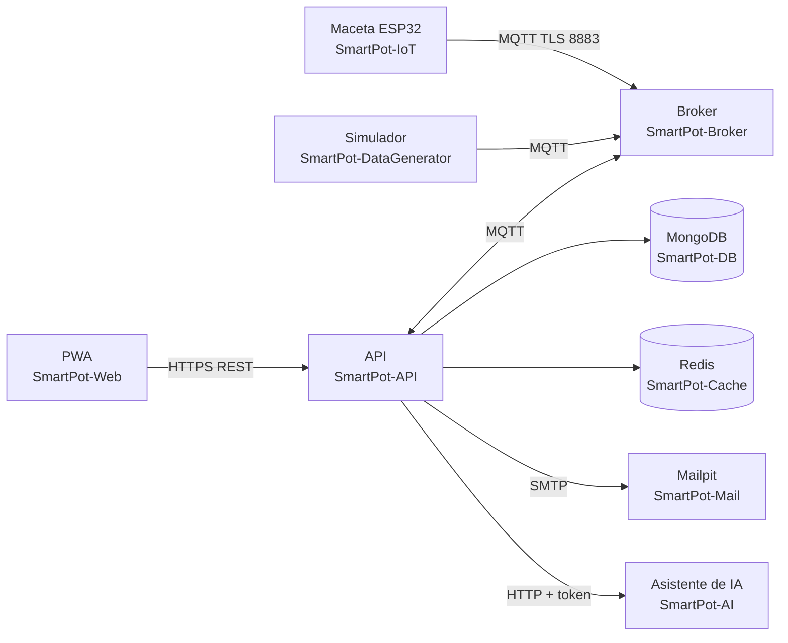

# SmartPot · Entornos, Despliegue y Documentación

[](https://github.com/SmartPotTech/.github/actions/workflows/qa.yml)
[](https://github.com/SmartPotTech/.github/actions/workflows/deploy.yml)

Repositorio central de **SmartPot**, la plataforma de monitoreo y automatización de cultivos hidropónicos publicada en [smartpot.app](https://smartpot.app). Reúne lo que no pertenece a un solo servicio: los entornos de Docker y Kubernetes, el despliegue a producción, la batería de QA, la documentación técnica y los archivos de comunidad de la organización.

## Contenido

```text
.github/
├── .github/
│   ├── workflows/
│   │   ├── deploy.yml          # Despliegue reutilizable que llaman todos los servicios
│   │   └── qa.yml              # Pruebas de todos los repositorios y prueba de extremo a extremo
│   ├── ISSUE_TEMPLATE/         # Plantillas de issues de la organización
│   └── PULL_REQUEST_TEMPLATE.md
├── docker/
│   ├── demo/                   # SmartPot completo con un comando y datos de ejemplo
│   ├── dev/                    # Compila cada servicio desde los repositorios locales
│   └── production/             # Compose, variables, nginx y respaldos del servidor
├── kubernetes/                 # Manifiesto para clústeres locales
├── docs/                       # Documentación técnica en Markdown, diagramas, DOCX y PDF
├── scripts/e2e.py              # Prueba de extremo a extremo sobre la demo
├── profile/README.md           # Presentación pública de la organización
├── CONTRIBUTING.md
├── SECURITY.md
└── CODE_OF_CONDUCT.md
```

## Arquitectura



La maceta publica sus lecturas en `smartpot/v1/{cropId}/telemetry`; la API las guarda, pide al asistente de IA un diagnóstico (sistema experto, lógica difusa, modelos de aprendizaje automático y un agente reactivo) y, si el cultivo tiene el modo automático, envía comandos a los actuadores por `smartpot/v1/{cropId}/commands`. La PWA muestra todo en tiempo real y se instala en el teléfono.

## Empezar

| Quiero... | Guía |
| --- | --- |
| Ver SmartPot funcionando en mi equipo | [`docker/demo`](docker/README.md) |
| Programar en un servicio | [`docker/dev`](docker/dev/README.md) |
| Desplegar en un servidor | [`docker/production`](docker/production/README.md) |
| Probar en Kubernetes | [`kubernetes`](kubernetes/README.md) |
| Entender el sistema | [`docs`](docs/README.md) |

## QA

El workflow [`qa.yml`](.github/workflows/qa.yml) se ejecuta en cada cambio de este repositorio, cada lunes y a mano:

| Trabajo | Qué valida |
| --- | --- |
| API | Pruebas unitarias y de controladores con Maven |
| Web | Lint, tipos, pruebas con Vitest y build de producción |
| SmartPot-AI, -DataGenerator, -IoT | Ruff y pytest |
| SmartPot-Broker, -DB, -Cache, -Mail | Imagen endurecida y pruebas de humo (autenticación, ACL por maceta, TLS, validadores de MongoDB) |
| End-to-End | Compila las ocho imágenes, levanta la demo y recorre registro, cultivo, telemetría MQTT, comando con confirmación, asistente y borrado de la cuenta |

## Despliegue

Cada servicio publica su imagen en `ghcr.io/smartpottech` y llama a [`deploy.yml`](.github/workflows/deploy.yml), que actualiza el servidor por SSH con el `compose.yaml` de producción. Los detalles, los secrets necesarios y la configuración de nginx están en [`docker/production`](docker/production/README.md).

## Licencia

Este proyecto está bajo la licencia MIT. Consulta el archivo [LICENSE](LICENSE) para más detalles.
