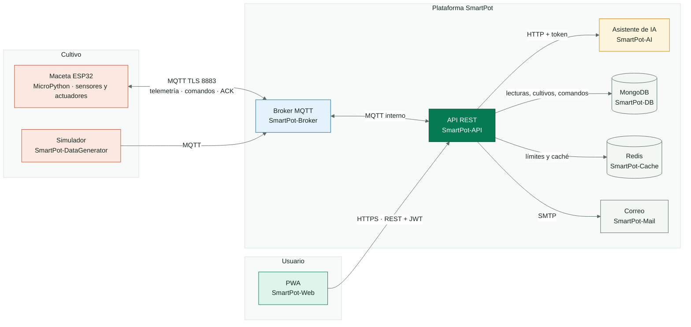
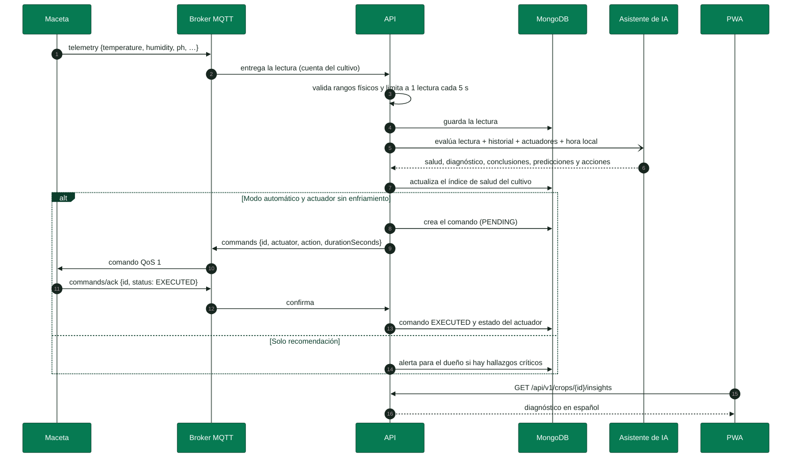
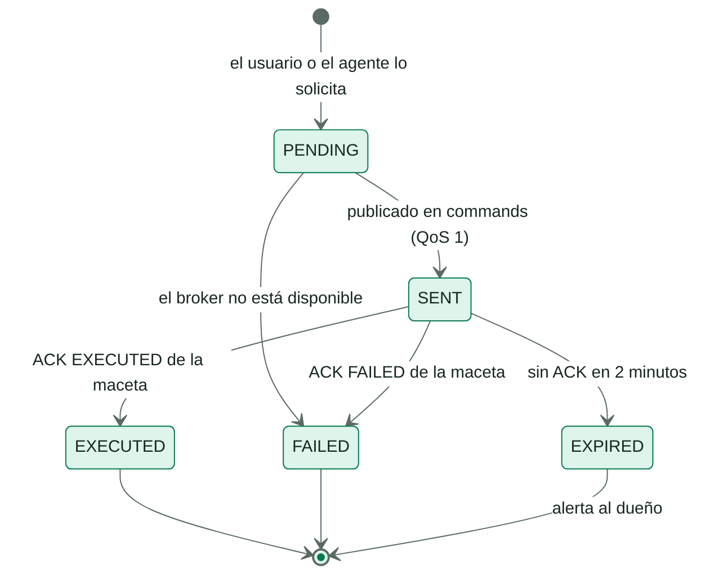
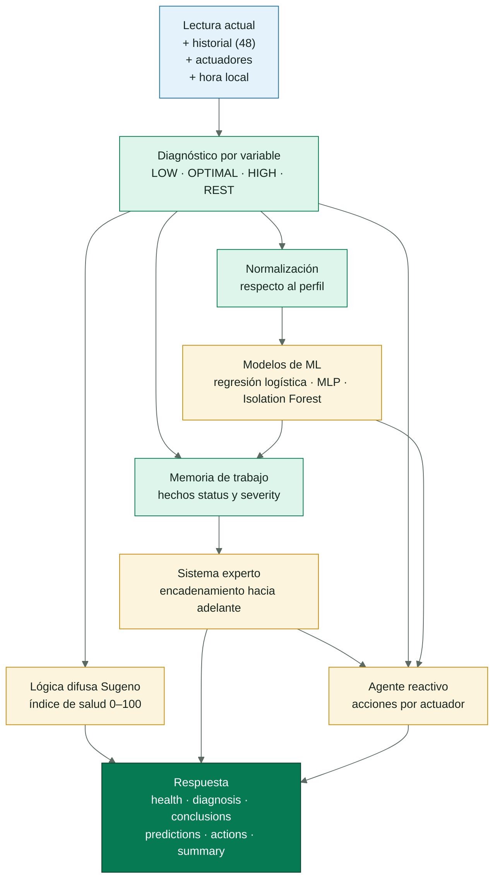
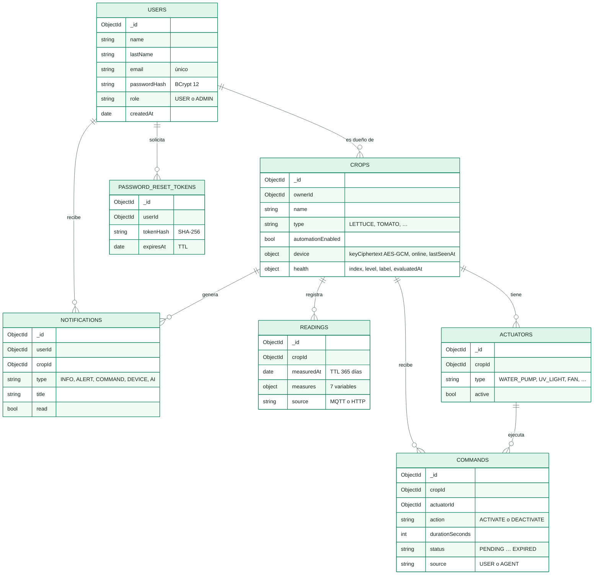
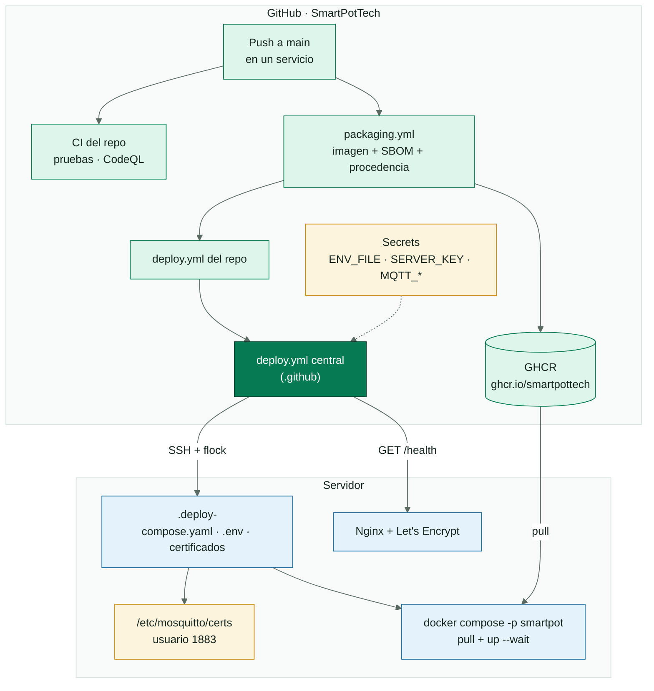
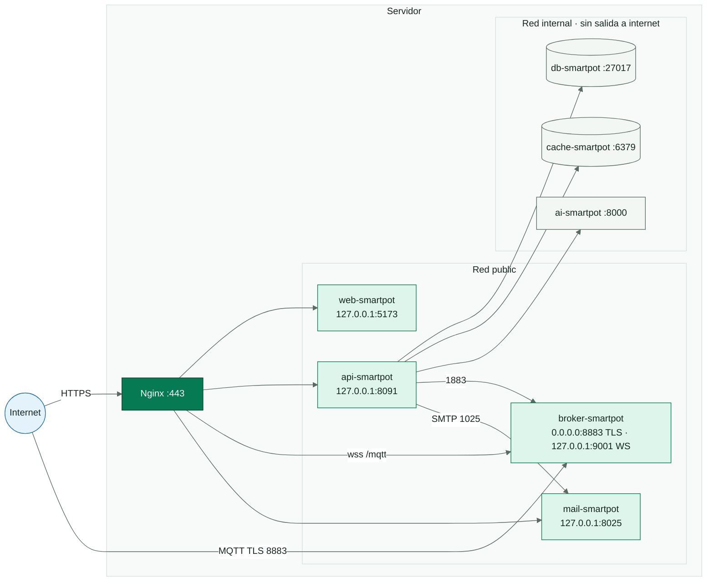
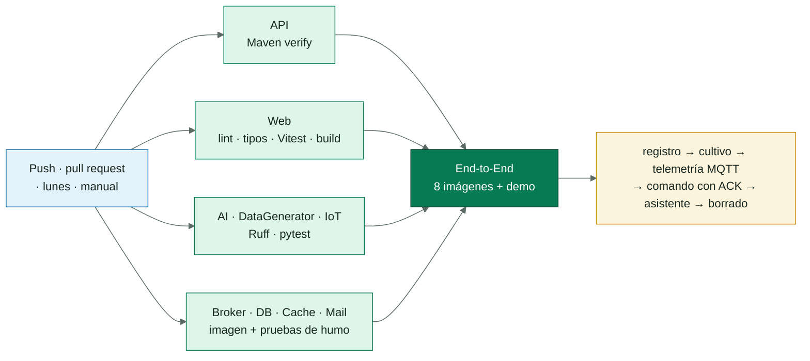

<!-- portada
eyebrow: Documentación técnica
titulo: Plataforma SmartPot
acento: SmartPot
subtitulo: Monitoreo y automatización de cultivos hidropónicos
bajada: Arquitectura, contratos, asistente de IA, seguridad, despliegue y operación de la plataforma que conecta las macetas inteligentes con la aplicación de sus dueños.
documento: Documentación técnica
version: 1.0 · septiembre 2026
equipo: SmartPotTech
proyecto: smartpot.app
-->

# Plataforma SmartPot

## Ficha del documento

| Campo | Valor |
| --- | --- |
| Proyecto | SmartPot · [smartpot.app](https://smartpot.app) |
| Organización | SmartPotTech |
| Documento | Documentación técnica de la plataforma |
| Versión | 1.0 · septiembre 2026 |
| Alcance | PWA, API, asistente de IA, broker MQTT, firmware, simulador, datos, infraestructura y QA |
| Fuente de verdad | Los README de cada repositorio y la documentación interactiva de la API (`/docs`) prevalecen sobre este documento si hay diferencias |
| Mantenimiento | Este documento se genera desde `docs/SmartPot_Documentacion_Tecnica.md`; se actualiza con cada cambio de contrato o de infraestructura |

<!-- parte: PARTE I | Visión general -->

## 1. Introducción

### En palabras simples

SmartPot convierte una maceta hidropónica en un cultivo que se cuida casi solo. La maceta mide seis variables (temperatura, humedad del aire, luz, pH, nutrientes y humedad del sustrato) y las envía a internet cada pocos segundos. La plataforma las guarda, las compara con lo que necesita cada especie y le muestra al dueño, en su teléfono, cómo está su cultivo y qué hacer. Si el dueño lo permite, un **agente de IA** riega, enciende la luz o ventila por su cuenta.

### Qué cubre este documento

- La arquitectura de la plataforma y cómo viaja una lectura desde la maceta hasta la pantalla.
- Los contratos entre componentes: MQTT para las macetas y REST para la aplicación.
- El asistente de IA: base de conocimiento, sistema experto, lógica difusa, modelos de aprendizaje automático y agente reactivo.
- El modelo de datos, la aplicación web progresiva y el firmware.
- La seguridad, el despliegue, la batería de calidad y la operación diaria.

> [!NOTE]
> **Principio fundamental.** La maceta nunca habla con la API ni con la base de datos: solo publica y recibe mensajes en el broker MQTT, con una cuenta propia que únicamente accede a sus tópicos. Todo lo demás pasa por la API.

### Especies soportadas

| Especie | Tipo | Temperatura (°C) | Humedad (%) | Luz (lux) | pH | Nutrientes (ppm) | Sustrato (%) |
| --- | --- | --- | --- | --- | --- | --- | --- |
| Lechuga | `LETTUCE` | 15–22 | 50–70 | 300–1400 | 5.5–6.5 | 560–840 | 60–80 |
| Tomate | `TOMATO` | 20–28 | 60–80 | 600–1800 | 5.5–6.5 | 1400–2800 | 55–75 |
| Fresa | `STRAWBERRY` | 18–26 | 60–75 | 500–1600 | 5.5–6.2 | 700–980 | 60–80 |
| Albahaca | `BASIL` | 20–30 | 40–60 | 500–1600 | 5.5–6.5 | 700–1120 | 50–70 |
| Espinaca | `SPINACH` | 15–24 | 50–70 | 300–1400 | 6.0–7.0 | 1260–1610 | 60–80 |
| Pimentón | `PEPPER` | 21–29 | 50–70 | 600–1800 | 5.8–6.5 | 1400–2100 | 55–75 |

## 2. Arquitectura

### En palabras simples

SmartPot está hecho de piezas pequeñas, cada una con un solo trabajo y su propio repositorio. El **broker** es el cartero de las macetas, la **API** es el cerebro de negocio, el **asistente de IA** es el agrónomo y la **PWA** es la ventana del usuario. Las bases de datos y el asistente viven en una red interna sin salida a internet.

<!-- diagrama: SmartPot_01_Arquitectura | titulo=Arquitectura general de SmartPot -->

### 2.1 Componentes

| Componente | Repositorio | Tecnología | Responsabilidad |
| --- | --- | --- | --- |
| PWA | SmartPot-Web | React 19, TypeScript 6, Vite 8, Tailwind CSS 4 | Landing pública, panel de cultivos, asistente, control y alertas; instalable |
| API | SmartPot-API | Java 21, Spring Boot 4.1, Spring Security, Paho MQTT | REST con JWT, puente MQTT, cuentas de las macetas, comandos, agente de automatización |
| Asistente de IA | SmartPot-AI | Python 3.13, FastAPI, scikit-learn, uv | Diagnóstico, índice de salud, predicciones y acciones sugeridas |
| Broker | SmartPot-Broker | Eclipse Mosquitto 2.1 con seguridad dinámica | MQTT con TLS 1.2+ y WebSocket; una cuenta por maceta |
| Firmware | SmartPot-IoT | MicroPython 1.23 en ESP32, Wokwi | Sensores, pantalla, telemetría y actuadores |
| Simulador | SmartPot-DataGenerator | Python 3.13, paho-mqtt, uv | Macetas virtuales con un modelo físico simple para demos y QA |
| Base de datos | SmartPot-DB | MongoDB 8 | Colecciones con validadores `$jsonSchema`, índices y datos demo opcionales |
| Caché | SmartPot-Cache | Redis 8 | Límite de peticiones, enfriamiento del agente y caché de perfiles |
| Correo | SmartPot-Mail | Mailpit | SMTP autenticado y bandeja web protegida |
| Plataforma | .github | Docker Compose, Kubernetes, GitHub Actions | Entornos, despliegue central, QA y documentación |

### 2.2 Decisiones de arquitectura

| Decisión | Motivo |
| --- | --- |
| MQTT entre la maceta y la plataforma | Conexión persistente y liviana para un ESP32, con QoS 1, mensajes retenidos y última voluntad para saber si la maceta está en línea |
| Una cuenta MQTT por maceta (usuario = id del cultivo) | Una maceta comprometida no puede leer ni escribir los tópicos de otra |
| La IA como servicio interno aparte | Python es el ecosistema natural de los modelos; la API sigue funcionando si la IA no responde |
| MongoDB | Las lecturas son documentos con variables opcionales; el índice por cultivo y fecha resuelve las consultas del historial |
| Imágenes endurecidas por servicio en GHCR | Cada servicio se publica y despliega por separado con SBOM y atestación de procedencia |

## 3. Flujo de una lectura

### En palabras simples

Cuando la maceta mide, la lectura llega al broker, la API la guarda y le pregunta al asistente cómo va el cultivo. Si hay algo que corregir y el modo automático está activo, la API manda el comando a la maceta, que lo ejecuta y lo confirma.

### 3.1 Reglas del flujo

| Regla | Valor |
| --- | --- |
| Frecuencia de la maceta | Cada 30 s (firmware) o 15–60 s (simulador) |
| Lecturas guardadas por cultivo | Máximo una cada 5 s; las demás se descartan |
| Validación | Cada variable debe estar dentro del rango físico del sensor; si no, la lectura completa se descarta |
| Evaluación del asistente | Asíncrona; como máximo una vez cada 5 minutos por cultivo (1 minuto en la demo) |
| Historial enviado a la IA | Las últimas 48 lecturas |
| Enfriamiento del agente | 10 minutos por actuador entre acciones automáticas |
| Vencimiento de un comando | 2 minutos sin confirmación → `EXPIRED` y alerta al dueño |
| Maceta desconectada | El broker publica `offline` (última voluntad); la API marca el dispositivo y avisa |

<!-- diagrama: SmartPot_02_Secuencia_Lectura | titulo=Secuencia de una lectura con automatización | lamina=H -->

<!-- parte: PARTE II | Componentes -->

## 4. Contrato MQTT

### En palabras simples

Cada maceta tiene una "dirección" propia en el broker, `smartpot/v1/{cropId}`, y solo puede usar la suya. Por ahí publica lo que mide y recibe las órdenes.

### 4.1 Tópicos

| Tópico | Sentido | QoS | Carga |
| --- | --- | --- | --- |
| `smartpot/v1/{cropId}/telemetry` | Maceta → API | 0 | `{"temperature":24.5,"humidity":61,"brightness":710,"ph":6.1,"tds":820,"atmosphere":1012.8,"soilMoisture":55}` |
| `smartpot/v1/{cropId}/commands` | API → maceta | 1 | `{"id":"…","actuator":"WATER_PUMP","action":"ACTIVATE","durationSeconds":30}` |
| `smartpot/v1/{cropId}/commands/ack` | Maceta → API | 1 | `{"id":"…","status":"EXECUTED","message":"Bomba encendida"}` |
| `smartpot/v1/{cropId}/status` | Maceta, retenido y última voluntad | 1 | `online` / `offline` |

### 4.2 Conexión de la maceta

| Parámetro | Valor |
| --- | --- |
| Servidor | `mqtt.smartpot.app:8883`, MQTT sobre TLS 1.3 (mínimo 1.2) |
| Certificado | Firmado por la CA propia de SmartPot; la maceta lo verifica con `ca.crt`, que se distribuye con el firmware |
| Usuario | El id del cultivo |
| Contraseña | La clave del dispositivo: 24 bytes aleatorios en Base64 URL, mostrada una sola vez al crear el cultivo o al rotarla |
| Client id | `smartpot-<cropId>`; el broker rechaza ids vacíos |
| WebSocket | `wss://mqtt.smartpot.app/mqtt` para clientes web |

> [!IMPORTANT]
> **Rotación de la clave.** Rotar la clave desde la PWA cambia la contraseña en el broker y desconecta la sesión anterior en el acto. El firmware debe actualizarse con la clave nueva.

### 4.3 Permisos en el broker

La API administra el broker con el plugin de **seguridad dinámica** de Mosquitto. Al conectarse crea el rol `device` y vuelve a crear la cuenta de cada cultivo a partir de la base de datos, así que el broker no necesita respaldo propio.

| Rol | Permisos |
| --- | --- |
| `device` | Publicar en `smartpot/v1/%u/telemetry`, `…/commands/ack` y `…/status`; suscribirse a `smartpot/v1/%u/commands` (`%u` = su propio usuario) |
| `admin` (API) | Publicar y suscribirse en `smartpot/v1/#` y usar los comandos de control de la seguridad dinámica |
| Anónimo | Rechazado |

## 5. API REST

### En palabras simples

La API es la única puerta de la aplicación. Todo lo que el usuario ve o hace pasa por aquí, siempre con su sesión y solo sobre sus propios cultivos.

### 5.1 Rutas

Base: `https://api.smartpot.app`. Las rutas de negocio viven bajo `/api/v1` y usan `Authorization: Bearer <token>`. La documentación interactiva está en `/docs`.

| Método | Ruta | Acceso |
| --- | --- | --- |
| GET | `/health` | Público |
| POST | `/api/v1/auth/register`, `/login` | Público |
| POST | `/api/v1/auth/password/forgot`, `/password/reset` | Público |
| GET | `/api/v1/crop-profiles` | Público |
| GET, PUT, DELETE | `/api/v1/users/me` y PUT `/users/me/password` | Sesión |
| GET, POST | `/api/v1/crops` | Sesión |
| GET, PUT, DELETE | `/api/v1/crops/{id}` y PUT `/crops/{id}/automation` | Dueño |
| GET, POST | `/api/v1/crops/{id}/device` y `/device/key` | Dueño |
| GET, POST | `/api/v1/crops/{id}/readings`, `/latest`, `/summary`, `/export` | Dueño |
| GET, POST, DELETE | `/api/v1/crops/{id}/actuators` | Dueño |
| GET, POST | `/api/v1/crops/{id}/commands` | Dueño |
| GET | `/api/v1/crops/{id}/insights` | Dueño |
| GET, PUT, DELETE | `/api/v1/notifications`, `/unread-count`, `/{id}/read`, `/read-all` | Sesión |

### 5.2 Reglas de la API

| Regla | Valor |
| --- | --- |
| Sesión | JWT HS256 con vencimiento de 7 días; la PWA lo guarda en `sessionStorage` o, con "Mantener sesión iniciada", en `localStorage` |
| Contraseñas | 8 caracteres a 72 bytes, con mayúscula, minúscula y número; BCrypt de costo 12 |
| Dueño | Un cultivo de otra cuenta responde 404, igual que uno inexistente, para no revelar qué ids existen |
| Límite de peticiones | 300 por minuto por IP y 10 por minuto en `/api/v1/auth/*`; responde 429 con `Retry-After` |
| Cultivos por cuenta | Máximo 20 |
| Errores | JSON en español: `{"status","error","message","path","timestamp","fields"}`; `fields` detalla cada campo inválido |
| Recuperación de contraseña | Responde 202 aunque el correo no exista; el enlace vence en 30 minutos y el token se guarda como hash SHA-256 |

### 5.3 Ciclo de vida de un comando

<!-- diagrama: SmartPot_05_Estados_Comando | titulo=Estados de un comando -->

## 6. Asistente de IA

### En palabras simples

El asistente se comporta como un agrónomo que mira la última lectura y el historial reciente. Primero revisa variable por variable, después razona con reglas de experto, calcula un índice de salud de 0 a 100 y propone acciones concretas que la maceta puede ejecutar.

<!-- diagrama: SmartPot_03_Asistente_IA | titulo=Técnicas del asistente de IA -->

### 6.1 Diagnóstico por variable

Cada variable queda `LOW`, `OPTIMAL` o `HIGH` respecto al rango de la especie. La distancia al rango se mide en **tolerancias** (5 °C, 15 % de humedad, 300 lux, 0.8 de pH, 400 ppm y 15 % de sustrato); desde una tolerancia completa el hallazgo es **crítico**.

> [!TIP]
> **Descanso nocturno.** Entre las 22:00 y las 6:00 (hora de Colombia, configurable con `AI_TIMEZONE`) la luz baja no es un problema: la planta necesita su periodo de oscuridad. La variable queda como `REST`, no resta salud, la regla de crecimiento ahilado no se dispara y el agente apaga la luz de cultivo si quedó encendida.

### 6.2 Modelos de aprendizaje automático

Las variables se normalizan respecto al perfil (0 = mínimo ideal, 1 = máximo ideal), así un mismo modelo sirve para las seis especies. Se entrenan al arrancar con 4000 muestras sintéticas y semilla fija.

| Modelo | Técnica | Predice | Exactitud |
| --- | --- | --- | --- |
| Ventilación | Regresión logística | Probabilidad de que haga falta ventilar por calor y humedad | 89.5 % |
| Corrección de pH | Red neuronal MLP | Probabilidad de que haya que corregir el pH | 94.3 % |
| Lectura atípica | Isolation Forest + detección de saltos | Probabilidad de que la lectura sea anómala frente al historial | 100 % de detección en las pruebas |

### 6.3 Sistema experto

Un motor de encadenamiento hacia adelante dispara las reglas por prioridad, cada una una sola vez. Las conclusiones de primer nivel alimentan a las de segundo nivel.

| Regla | Se dispara cuando | Conclusión |
| --- | --- | --- |
| `heat_stress` | Temperatura alta y aire seco | Estrés térmico |
| `fungal_risk` | Humedad alta con temperatura templada o alta | Riesgo de hongos |
| `nutrient_lockout` | pH fuera de rango con nutrientes presentes | Bloqueo de nutrientes: corregir el pH primero |
| `root_rot_risk` | Sustrato encharcado y caliente | Riesgo de pudrición de raíz |
| `drought` | Sustrato críticamente seco | Sequía |
| `etiolation` | Poca luz de día con temperatura cálida | Crecimiento ahilado |
| `cold_stress` | Temperatura críticamente baja | Estrés por frío |
| `salt_stress` | Nutrientes críticamente altos | Exceso de sales |
| `ventilation_model` | El modelo estima ≥ 70 % de necesidad de ventilar | Recomendación de ventilar |
| `sensor_fault` | Lectura atípica y dos o más variables críticas | Posible falla de sensor: bloquea las acciones |
| `critical_state` | Dos o más variables críticas sin falla de sensor | Estado crítico |
| `compound_stress` | Estrés junto con riesgo o bloqueo | Estrés combinado |
| `night_rest` | Luz baja durante el descanso nocturno | Descanso nocturno |
| `ideal_conditions` | Todas las variables en rango o en descanso | Condiciones ideales |

### 6.4 Índice de salud con lógica difusa

Cada desviación pertenece en distinto grado a los conjuntos **ideal**, **aceptable**, **desviada** y **crítica** (funciones trapezoidales). La inferencia Sugeno de orden cero da la salud de cada variable (100, 75, 45 y 10 puntos por conjunto) y el índice global las pondera por importancia agronómica: pH 1.3, temperatura 1.2, sustrato 1.2, nutrientes 1.1, humedad 0.9 y luz 0.8. Una regla de peor caso limita el índice cuando una variable es crítica.

| Índice | Nivel | Etiqueta |
| --- | --- | --- |
| 85–100 | `EXCELLENT` | Excelente |
| 70–84 | `GOOD` | Saludable |
| 50–69 | `FAIR` | Aceptable |
| 30–49 | `POOR` | En riesgo |
| 0–29 | `CRITICAL` | Crítico |

### 6.5 Agente reactivo

El agente no guarda estado: convierte el diagnóstico en acciones solo para los actuadores que el cultivo tiene. La API aplica el enfriamiento y ejecuta únicamente si el modo automático está activo; si no, las acciones quedan como sugerencias en la PWA.

| Situación | Acción |
| --- | --- |
| Sustrato seco | `WATER_PUMP` 15 s (30 s si es crítico) |
| Poca luz de día | `UV_LIGHT` 15 minutos |
| Exceso de luz, o luz encendida de noche | Apagar `UV_LIGHT` |
| Calor, humedad alta o predicción de ventilación | `FAN` 10 minutos |
| Temperatura baja | Apagar `FAN` |
| Aire seco | `HUMIDIFIER` 5 minutos |
| pH alto | `PH_DOSER` 3 s |
| Nutrientes bajos sin bloqueo de pH | `NUTRIENT_DOSER` 3 s |
| Posible falla de sensor | Ninguna acción |

## 7. Modelo de datos

<!-- diagrama: SmartPot_04_Modelo_Datos | titulo=Colecciones de MongoDB -->

| Colección | Índices y vencimiento | Validación |
| --- | --- | --- |
| `users` | Correo único | Correo, hash, rol (`USER` o `ADMIN`) y fecha obligatorios |
| `crops` | Dueño + fecha de creación | Dueño, nombre, tipo del catálogo y modo automático obligatorios |
| `readings` | Cultivo + fecha descendente; TTL de 365 días | Cultivo, fecha y medidas obligatorios; origen `MQTT` o `HTTP` (los rangos físicos los valida la API) |
| `actuators` | Cultivo + tipo, único | Tipo dentro del catálogo |
| `commands` | Cultivo + fecha; estado + envío para vencer los pendientes; TTL de 180 días | Acción, estado y origen (`USER` o `AGENT`) del catálogo |
| `notifications` | Usuario + fecha; TTL de 90 días | Tipo `INFO`, `ALERT`, `COMMAND`, `DEVICE` o `AI` |
| `password_reset_tokens` | Hash único; TTL por `expiresAt` | Hash, usuario y vencimiento obligatorios |

La API se conecta con un usuario propio (`smartpot`) con permisos `readWrite` solo sobre su base; el usuario administrador de MongoDB no se usa en la aplicación.

## 8. Aplicación web

### En palabras simples

La PWA es lo que ve el usuario: una página pública que explica SmartPot y, tras ingresar, su panel de cultivos. Se instala como una app en Android, iOS y escritorio.

| Pantalla | Qué permite |
| --- | --- |
| Inicio público | Presentación, funciones, especies y preguntas frecuentes; indexable |
| Ingreso, registro y recuperación | Validaciones en español y "Mantener sesión iniciada" |
| Mis cultivos | Tarjetas con estado en línea, salud y últimas lecturas |
| Detalle · Resumen | Lecturas actuales frente al rango ideal y gráfico de 24 h con la banda ideal |
| Detalle · Asistente IA | Índice de salud, diagnóstico, conclusiones, predicciones y acciones ejecutables |
| Detalle · Control | Modo automático, actuadores y últimos comandos |
| Detalle · Historial | 6 h, 24 h o 7 días por variable y exportación CSV |
| Detalle · Dispositivo | Estado, datos de conexión MQTT, configuración para el firmware y rotación de la clave |
| Alertas y perfil | Notificaciones, datos personales, contraseña y borrado de la cuenta |

### 8.1 Identidad visual

| Token | Color | Uso |
| --- | --- | --- |
| `leaf-900` | `#0B3D2B` | Fondos de marca y color de tema de la PWA |
| `leaf-700` | `#067A52` | Acciones principales y cabeceras |
| `leaf-500` | `#00B074` | Verde de marca |
| `water-500` | `#2D9CDB` | Agua, información y la señal del logo |
| `sun-500` | `#F2B632` | Luz y advertencias |
| `clay-500` | `#D9734E` | La maceta y la temperatura |
| `danger-500` | `#D64545` | Errores |
| `ink` · `muted` · `line` · `surface` | `#17261F` · `#5B6B63` · `#D5E3DC` · `#F2F7F4` | Texto, bordes y superficies |

Tipografías: **Outfit** en títulos e **Inter** en el cuerpo, servidas desde la propia aplicación.

### 8.2 SEO y PWA

- Metadatos, URL canónica, Open Graph, Twitter Card y datos estructurados `Organization`, `WebSite`, `SoftwareApplication` y `FAQPage`, con contenido estático para rastreadores sin JavaScript.
- `robots.txt` y `sitemap.xml`; `/app` no se indexa.
- Manifiesto con íconos normales y adaptables, accesos directos y botón "Instalar app".
- Service worker que guarda el app shell y los recursos con hash; la API y la configuración nunca se guardan en caché.

## 9. Firmware y simulador

### 9.1 Maceta ESP32

| Componente | Pin | Escala |
| --- | --- | --- |
| DHT22 (temperatura y humedad) | GPIO 15 | °C y % |
| Luz | GPIO 34 | 0–2000 lux |
| pH | GPIO 35 | 0–14 |
| Nutrientes (TDS) | GPIO 32 | 0–3000 ppm |
| Humedad del sustrato | GPIO 33 | 0–100 % |
| Bomba de agua | GPIO 19 | `WATER_PUMP` |
| Luz de cultivo | GPIO 18 | `UV_LIGHT` |
| Ventilador | GPIO 5 | `FAN` |
| LCD 20×4 I2C | SCL 16 · SDA 17 | — |

El firmware sincroniza la hora por NTP, se conecta por TLS con `ca.crt`, publica cada 30 s y apaga cada actuador al cumplirse `durationSeconds`. La PWA genera el `config.py` de cada maceta.

### 9.2 Simulador

SmartPot-DataGenerator crea macetas virtuales (`SIMULATOR_DEVICES=cropId:clave:TIPO,…`) con un modelo físico simple: la luz y la temperatura siguen el día en la hora local (`SIMULATOR_UTC_OFFSET`, −5 por defecto), la bomba sube la humedad del sustrato, el ventilador enfría y seca el aire, y los dosificadores corrigen el pH y los nutrientes. Responde los comandos con su ACK como una maceta real. Se usa en la demo, en el entorno de desarrollo y en la prueba de extremo a extremo.

<!-- parte: PARTE III | Operación -->

## 10. Seguridad

### En palabras simples

Cada pieza tiene solo los permisos que necesita. Las contraseñas y claves nunca viajan ni se guardan en claro, las bases de datos no se ven desde internet y cada maceta solo puede tocar lo suyo.

| Área | Control |
| --- | --- |
| Autenticación | JWT HS256, BCrypt 12, límite de peticiones por IP y respuestas que no revelan si un correo existe |
| Autorización | Control de dueño en cada ruta de cultivo; 404 para recursos ajenos |
| Macetas | Cuenta MQTT por cultivo, ACL con `%u`, clave de 192 bits cifrada con AES-256-GCM y mostrada una sola vez |
| Transporte | HTTPS con HSTS; MQTT sobre TLS 1.2+ con CA propia; WebSocket seguro |
| Web | CSP estricta con `connect-src` limitado a la API, `X-Frame-Options: DENY`, `nosniff`, `Referrer-Policy` y `Permissions-Policy` |
| Servicio de IA | Solo en la red interna y con token de servicio comparado en tiempo constante |
| Contenedores | Solo lectura, sin capacidades de Linux, `no-new-privileges`, usuarios sin privilegios, límites de CPU y memoria |
| Red | Solo el broker (8883) escucha fuera de `127.0.0.1`; MongoDB, Redis y la IA en una red sin salida |
| Cadena de suministro | Dependabot, revisión de dependencias, CodeQL, SBOM y atestación de procedencia de cada imagen |
| Secretos | GitHub Secrets; el `.env` existe en el servidor solo durante el despliegue |

> [!NOTE]
> **Generación de secretos.** Las contraseñas, el secreto JWT, la llave AES y el token de la IA se derivan con HKDF-SHA512 a partir de ruido atmosférico de random.org mezclado con el generador criptográfico del sistema; ninguna de las dos fuentes por sí sola determina el resultado. Las llaves de los certificados usan la misma entropía.

## 11. Despliegue

### 11.1 Entornos

| Entorno | Carpeta | Imágenes | Uso |
| --- | --- | --- | --- |
| Demo | `docker/demo` | GHCR | SmartPot completo con datos de ejemplo y dos macetas simuladas |
| Desarrollo | `docker/dev` | Compiladas desde los repositorios locales | Programar con toda la plataforma |
| Producción | `docker/production` | GHCR con etiqueta configurable | Servidor con Nginx y HTTPS |
| Kubernetes | `kubernetes` | GHCR | Clústeres locales con Pod Security `restricted` |

### 11.2 Despliegue automático

<!-- diagrama: SmartPot_06_Despliegue | titulo=Despliegue continuo -->

Cada servicio publica su imagen en `ghcr.io/smartpottech` y llama al workflow central `deploy.yml`. El workflow valida el `ENV_FILE` (longitudes mínimas, llave AES de 32 bytes, variables por perfil), comprueba que el certificado del broker esté firmado por la CA y que la llave le corresponda, sube la configuración por SSH, instala los certificados con dueño `1883`, actualiza los contenedores y verifica `/health` desde internet. Los despliegues simultáneos esperan su turno con `flock`.

| Secret | Contenido |
| --- | --- |
| `SERVER_HOST`, `SERVER_PORT`, `SERVER_USER`, `SERVER_KNOWN_HOSTS` | Acceso SSH al servidor |
| `SERVER_KEY` | Llave privada SSH de despliegue |
| `DEPLOY_PATH` | Carpeta de producción en el servidor |
| `ENV_FILE` | `.env` completo de producción |
| `MQTT_CA_CERT`, `MQTT_SERVER_CERT`, `MQTT_SERVER_KEY` | Certificados del broker (opcionales) |

### 11.3 Red de producción

| Dominio | Destino |
| --- | --- |
| `smartpot.app` y `www.smartpot.app` | PWA (`www` redirige al dominio principal) |
| `api.smartpot.app` | API y `/docs` |
| `mqtt.smartpot.app:8883` | Broker con TLS directo |
| `mqtt.smartpot.app/mqtt` | WebSocket seguro a través de Nginx |
| `mail.smartpot.app` | Bandeja de Mailpit con usuario y contraseña |

<!-- diagrama: SmartPot_07_Redes | titulo=Redes y puertos en producción -->

## 12. Calidad

<!-- diagrama: SmartPot_08_QA | titulo=Workflow de QA -->

| Repositorio | Pruebas | Qué cubren |
| --- | --- | --- |
| SmartPot-API | 64 | Cifrado, JWT, contraseñas, MQTT, aprovisionamiento, comandos, cultivos, agente, caché, hora local para la IA y seguridad de los controladores |
| SmartPot-AI | 43 | Base de conocimiento, reglas, descanso nocturno, índice difuso, exactitud de los modelos, agente y contrato HTTP |
| SmartPot-Web | 29 | Cliente HTTP, sesión, validaciones, ingreso, componentes del cultivo, asistente y requisitos de SEO y PWA |
| SmartPot-DataGenerator | 13 | Modelo físico, zona horaria, contrato MQTT y comandos |
| SmartPot-IoT | 13 | Cliente MQTT, telemetría, comandos, actuadores y sensores con MicroPython simulado |
| SmartPot-Broker | 10 comprobaciones | Autenticación, ACL por maceta, client ids, anónimos y TLS |
| SmartPot-DB, -Cache, -Mail | Pruebas de humo | Validadores, permisos, datos demo, comandos deshabilitados de Redis y autenticación SMTP |
| End-to-End | 15 comprobaciones | Registro, cultivo, telemetría MQTT, clave incorrecta rechazada, comando con ACK, asistente y borrado |

## 13. Operación

| Tarea | Cómo |
| --- | --- |
| Estado | `GET https://api.smartpot.app/health` → base de datos, broker, caché e IA |
| Logs | `docker logs -f smartpot-api` (y `-broker`, `-ai`, `-web`) |
| Respaldo | `backup_smartpot.sh`: `mongodump` comprimido con 14 días de retención |
| Restauración | `mongorestore --drop --archive --gzip` sobre `smartpot-db` |
| Cambiar configuración | Editar el secret `ENV_FILE` y ejecutar **Deploy to Production** |
| Renovar el certificado del broker | Antes de 825 días: `generate-certs.sh` con la CA existente y actualizar `MQTT_SERVER_CERT` y `MQTT_SERVER_KEY` |
| Rotar la clave de una maceta | Desde la PWA, pestaña Dispositivo |
| Actualizar dependencias | Revisar y fusionar los pull requests semanales de Dependabot |

> [!WARNING]
> **Llave AES.** `SMARTPOT_AES_KEY` cifra las claves de las macetas. Si se pierde o se cambia, las cuentas MQTT no se pueden reconstruir y cada dueño debe rotar la clave de su maceta.

## 14. Glosario

| Término | Definición |
| --- | --- |
| ACK | Confirmación que envía la maceta al ejecutar o fallar un comando |
| Actuador | Salida de la maceta que cambia el cultivo: bomba, luz, ventilador, humidificador o dosificadores |
| Broker | Servidor MQTT que recibe y reparte los mensajes entre las macetas y la API |
| Clave del dispositivo | Contraseña MQTT de una maceta, generada por la API |
| Encadenamiento hacia adelante | Técnica del sistema experto que parte de los hechos y dispara reglas hasta no poder concluir más |
| GHCR | GitHub Container Registry, donde se publican las imágenes |
| Isolation Forest | Modelo que detecta datos atípicos aislándolos con árboles aleatorios |
| Lógica difusa | Razonamiento con grados de pertenencia en lugar de sí o no |
| Modo automático | Permiso del dueño para que el agente ejecute acciones sin preguntar |
| MQTT | Protocolo de mensajería liviano para dispositivos conectados |
| PWA | Aplicación web progresiva: se instala y funciona como una app nativa |
| QoS 1 | Nivel de MQTT que garantiza al menos una entrega |
| Seguridad dinámica | Plugin de Mosquitto para administrar usuarios, roles y permisos en caliente |
| TDS | Sólidos disueltos totales: concentración de nutrientes en ppm |
| Tolerancia | Unidad con la que se mide cuánto se aleja una variable de su rango ideal |
| Última voluntad (LWT) | Mensaje que el broker publica solo si la maceta se desconecta sin avisar |
