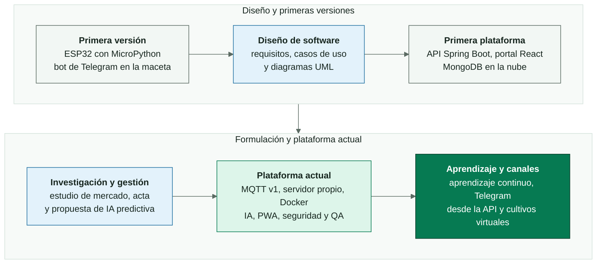
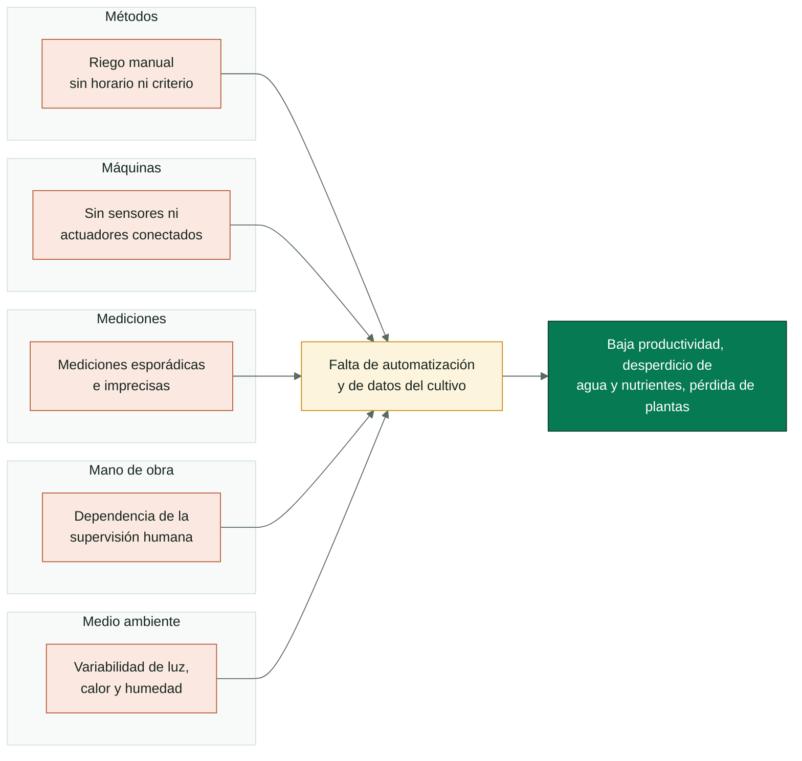
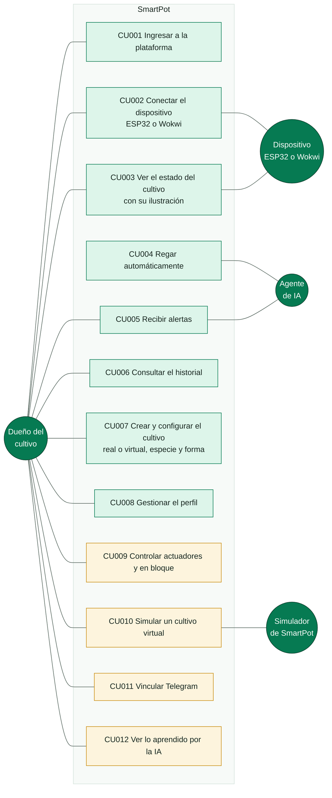
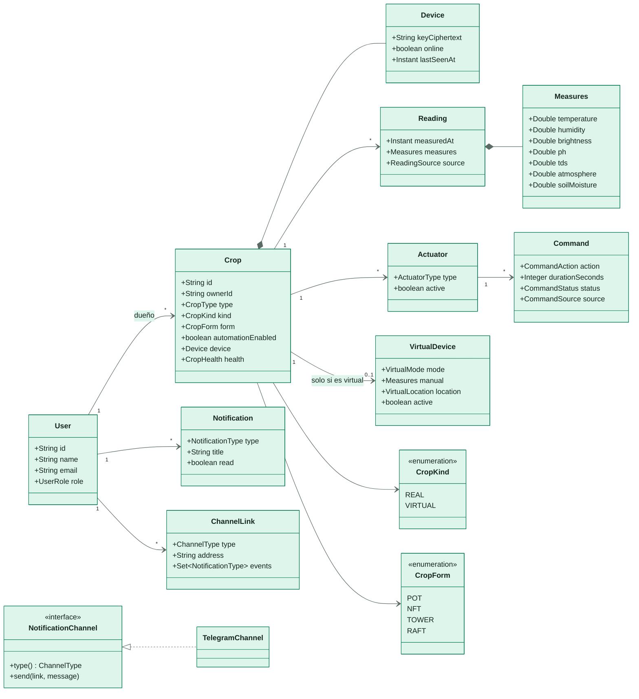
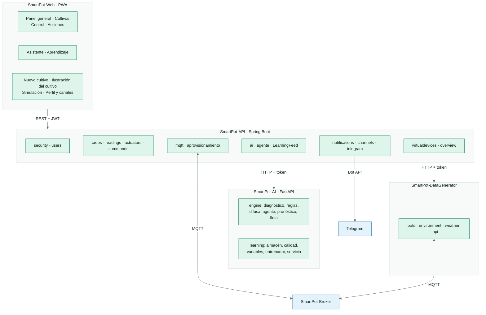
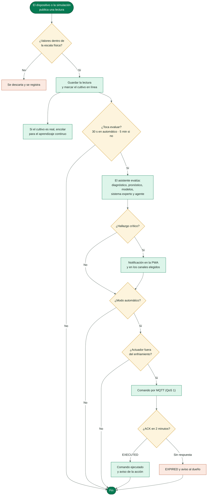
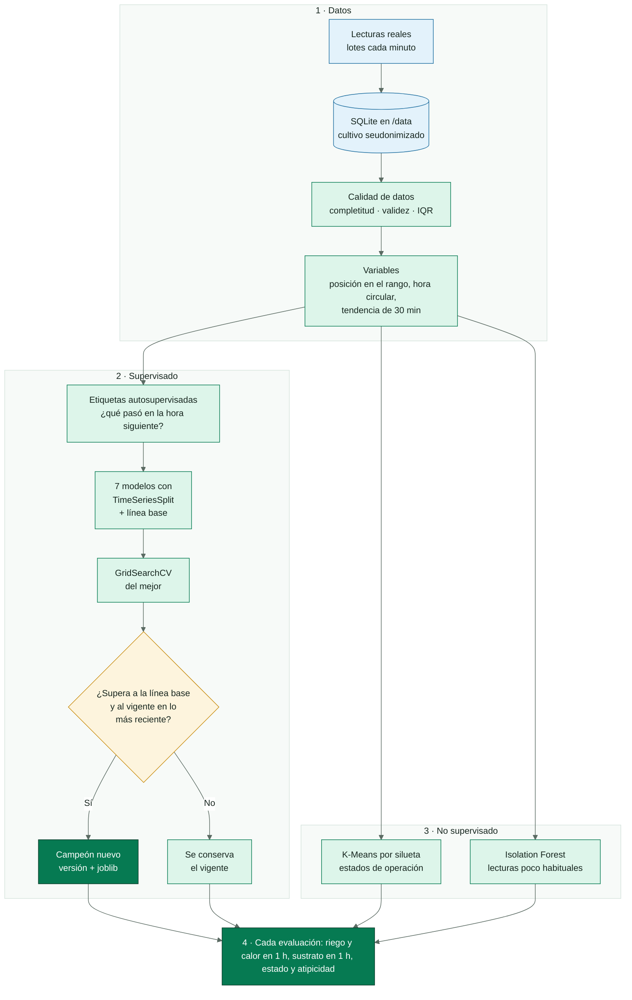
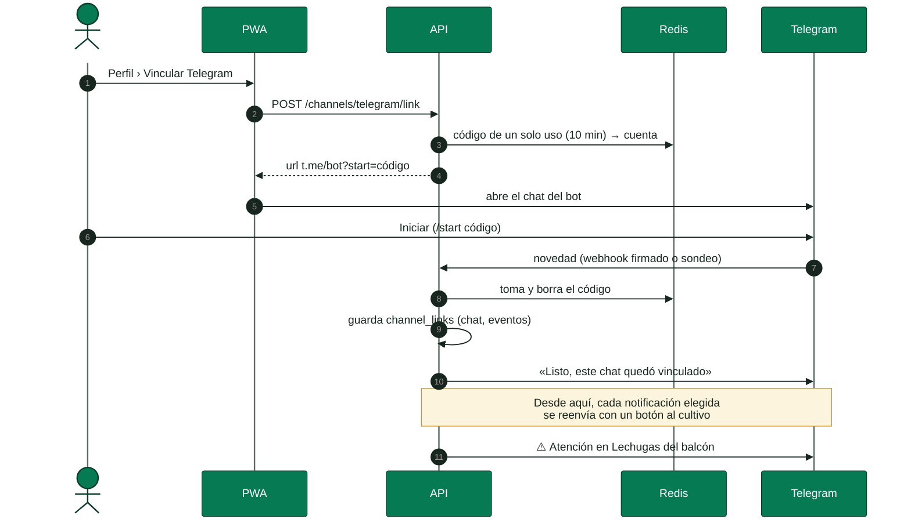
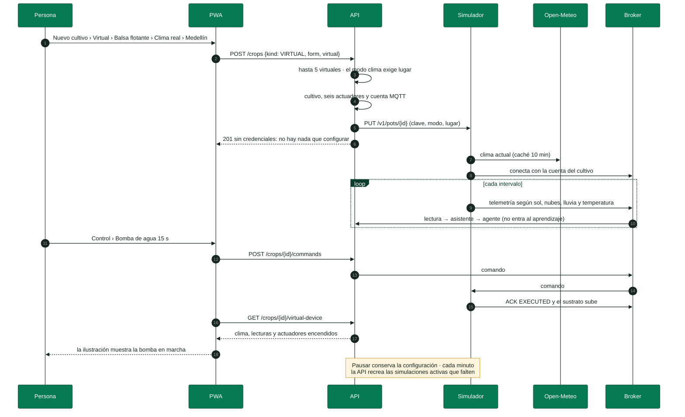

<!-- portada
eyebrow: Recorrido del proyecto
titulo: De la idea a la plataforma
acento: plataforma
subtitulo: Inicio, análisis, diseño, construcción y pruebas de SmartPot
bajada: Cómo nació SmartPot, qué se planeó en la fase de diseño, qué se construyó de verdad, por qué cambió y cómo se comprueba que funciona.
documento: Recorrido del proyecto
version: 1.0 · septiembre 2026
equipo: SmartPotTech
proyecto: smartpot.app
-->

# De la idea a la plataforma

## Ficha del documento

| Campo | Valor |
| --- | --- |
| Proyecto | SmartPot · [smartpot.app](https://smartpot.app) |
| Organización | SmartPotTech |
| Documento | Recorrido del proyecto: inicio, análisis, diseño, construcción y pruebas |
| Versión | 1.0 · septiembre 2026 |
| Fuentes | Documentación de diseño del proyecto (requisitos, casos de uso, diagramas UML, acta de constitución, estudio de mercado, matriz de interesados, propuesta de investigación y plan de trabajo), contrastada con el código de los diez repositorios |
| Documentos hermanos | [Documentación técnica](SmartPot_Technical_Documentation.md): la referencia de la plataforma tal como funciona hoy. [Ciclo de vida del software](SmartPot_Software_Lifecycle.md): la lectura crítica de cada etapa, de la formulación a la mejora continua |
| Cómo leerlo | Cada parte empieza con lo que se planeó y termina con lo que quedó construido. Las tablas de estado dicen, requisito por requisito, qué se cumplió, qué cambió y qué sigue pendiente |

<!-- parte: PARTE I | Inicio -->

## 1. Origen del proyecto

### En palabras simples

SmartPot empezó como una maceta con un ESP32 que mandaba sus lecturas a un bot de Telegram. En la materia de diseño de software el equipo decidió convertirla en un sistema completo: una aplicación propia, una API, una base de datos y automatizaciones. Con los semestres el proyecto sumó un estudio de mercado, una propuesta de investigación con inteligencia artificial y un plan formal de proyecto, y terminó como la plataforma que hoy corre en [smartpot.app](https://smartpot.app).

<!-- diagrama: SmartPot_17_Evolution | titulo=Etapas del proyecto -->

### 1.1 La idea

SmartPot fue la idea elegida entre las propuestas de proyecto de un curso de tecnologías de la información: resolvía un problema real, tenía un alcance controlable en un semestre y permitía aplicar a la vez IoT, bases de datos, backend y frontend. Se planteó como un flujo de datos: capturar las lecturas de los sensores, integrarlas y estandarizarlas, automatizar el riego según lo medido y mostrar el estado del cultivo con gráficos y alertas. El [ciclo de vida del software](SmartPot_Software_Lifecycle.md) analiza esa formulación en detalle.

### 1.2 El problema

La hidroponía necesita un control riguroso y constante del pH, los nutrientes, la temperatura, la luz y la humedad. Hecho a mano es ineficiente, depende de que alguien esté presente y detecta tarde los problemas; las soluciones comerciales son caras y poco flexibles. El diagrama de causa y efecto del proyecto resume el diagnóstico:

<!-- diagrama: SmartPot_09_Cause_Effect | titulo=Causa y efecto del problema -->

### 1.3 Visión y justificación

SmartPot busca ser una solución modular, escalable y de bajo costo para gestionar cultivos hidropónicos, en contextos académicos, domésticos y de pequeña producción. Se alinea con cuatro Objetivos de Desarrollo Sostenible:

| ODS | Aporte |
| --- | --- |
| 2 · Hambre cero | Producir alimentos en poco espacio y con menos recursos, cerca de quien los consume |
| 9 · Industria, innovación e infraestructura | Integrar IoT, datos e inteligencia artificial en la agricultura de precisión |
| 11 · Ciudades y comunidades sostenibles | Agricultura urbana en terrazas, balcones y azoteas |
| 12 · Producción y consumo responsables | Regar y dosificar solo lo necesario |

### 1.4 Objetivos

**Objetivo general.** Automatizar la gestión de cultivos hidropónicos mediante un sistema inteligente que permita el monitoreo en tiempo real y el análisis de datos, aprovechando los recursos de manera eficiente.

| Objetivo específico | Cómo quedó |
| --- | --- |
| Monitorear de forma remota y continua los parámetros del cultivo | Telemetría MQTT cada pocos segundos y PWA instalable |
| Optimizar el uso de agua y nutrientes | Riego automático y preventivo; dosificadores como actuadores; regla de bloqueo de nutrientes |
| Minimizar los errores humanos en la supervisión | Diagnóstico por variable, índice de salud y alertas |
| Reducir el riesgo de pérdida de plantas | Pronóstico de tendencias y acciones antes de que la variable salga de su rango |
| Disminuir la dependencia de la supervisión manual | Agente con modo automático y enfriamiento por actuador |
| Adaptarse a espacios y entornos distintos | Seis especies, cuatro formas (maceta, tubos NFT, torre o balsa), cultivos reales o virtuales y clima real del lugar |
| Comparar estados históricos y recientes | Historial por cultivo, comparación entre cultivos, estados de operación aprendidos |

### 1.5 Formulación: 5W + 2H y modelo de negocio

| Pregunta | Respuesta |
| --- | --- |
| Qué | Un sistema que simula, monitorea y controla las variables críticas de la hidroponía |
| Para quién | Horticultores urbanos, microproductores, instituciones educativas y la comunidad maker |
| Por qué | Mantener el pH y los nutrientes en rango es esencial; la automatización reduce desperdicios |
| Dónde | Espacios urbanos y periurbanos: terrazas, azoteas, invernaderos pequeños y laboratorios |
| Cuándo | Por fases: simulación, API, panel y pruebas |
| Cómo | ESP32 con MicroPython (físico o en Wokwi), backend, aplicación web y base de datos |
| Cuánto | Casi sin costo en la fase académica; bajo en un prototipo físico |

El lienzo del modelo de negocio identificó como propuesta de valor la automatización, el monitoreo en tiempo real, la simulación accesible y la modularidad; como canales, la academia, la web y pilotos educativos.

## 2. Estudio de mercado

| Segmento | Perfil | Demanda estimada inicial |
| --- | --- | --- |
| Horticultores urbanos y domésticos | Espacios reducidos en áreas metropolitanas | 500 a 2000 usuarios |
| Instituciones educativas | Docentes y estudiantes que necesitan plataformas de bajo costo | 50 a 150 instituciones |
| Makers y comunidad IoT | Desarrolladores que buscan proyectos integrales | 200 a 500 usuarios |
| Microproductores agrotecnológicos | Periferias urbanas y ruralidad cercana | 100 a 300 usuarios |

| Oferta existente | Debilidad | Oportunidad para SmartPot |
| --- | --- | --- |
| Sistemas comerciales de hidroponía inteligente | Alto costo y poca flexibilidad | Accesibilidad y adaptabilidad |
| Plataformas IoT genéricas | Requieren conocimiento técnico y no traen el dominio hidropónico | Solución especializada y lista para usar |
| Desarrollos caseros | Sin soporte ni integración | Interfaz amigable y documentación completa |

La estrategia propuesta fue un modelo *freemium* académico en la primera fase y comercial después, con el portal web como canal directo, GitHub como canal de comunidad y las instituciones educativas como multiplicadoras. El estudio concluyó que el mercado existe, que SmartPot ocupa el espacio entre los sistemas caros y los desarrollos caseros complejos, y que los costos de operación del producto mínimo son bajos.

> [!NOTE]
> **Cómo se refleja hoy.** SmartPot es código abierto con licencia MIT, se publica en GitHub con imágenes en GHCR y Docker Hub, tiene una demo de un solo comando para instituciones y makers, y opera en un servidor propio de bajo costo.

## 3. Interesados

| Interesado | Poder | Interés | Manejo | Qué necesitaba |
| --- | --- | --- | --- | --- |
| Institución patrocinadora | Bajo | Alto | Mantener informada | Cumplimiento académico, prototipo y documentación |
| Docente evaluador | Alto | Alto | Administrar de cerca | Entregables del SRS, arquitectura, pruebas y demo |
| Gerente de proyecto | Alto | Alto | Administrar de cerca | Hitos a tiempo y dentro del presupuesto |
| Product Owner | Medio | Alto | Administrar de cerca | Backlog priorizado y requisitos claros |
| Desarrolladores | Bajo | Alto | Mantener informados | Requisitos definidos y un entorno estable |
| Operadores del jardín | Bajo | Alto | Mantener informados | Monitoreo, alertas y una interfaz intuitiva |
| Servicios en la nube | Bajo | Bajo | Monitorear | Consumo eficiente, sin costos extra |
| Comunidad de código abierto | Bajo | Bajo | Monitorear | Repositorio documentado y reutilizable |
| Feria de emprendimiento | Bajo | Medio | Monitorear | Una demo que muestre viabilidad y potencial |

## 4. Acta de constitución

### 4.1 Alcance y entregables

El acta definió un sistema de tres capas (IoT, backend y frontend) desarrollado en dos fases: análisis y diseño, y desarrollo, pruebas e integración.

| Entregable planeado | Estado |
| --- | --- |
| Documento de requisitos (SRS) | Requisitos y casos de uso consolidados en este documento, con su estado actual |
| Diseño del sistema | Diagramas actualizados a la plataforma construida (parte III) |
| Simulación IoT | Firmware MicroPython en Wokwi (un cultivo real) y cultivos virtuales siempre encendidos |
| Backend | API REST con JWT, MQTT, automatización y control de dueño |
| Frontend | PWA con monitoreo, control, panel general, asistente y aprendizaje |
| Informe de pruebas | Parte V y el workflow de QA de la organización |
| Manual de usuario | README de cada repositorio, guía de la demo y ayuda dentro de la PWA |
| Código fuente documentado | Diez repositorios en GitHub con CI, documentación y diagramas |

### 4.2 Hitos

| Hito planeado | Resultado |
| --- | --- |
| Inicio: equipo, repositorios y herramientas | Organización SmartPotTech con un repositorio por componente |
| Definición de requisitos | RF-001 a RF-017 y RNF-001 a RNF-006 |
| Diseño de arquitectura | Arquitectura por componentes, contrato MQTT v1 y API REST |
| Simulación IoT funcional | Firmware en Wokwi publicando por MQTT; simulador para demo y QA |
| Backend core | Lecturas, autenticación JWT y automatización |
| Frontend web | PWA con monitoreo, control y panel |
| Pruebas y QA | Pruebas en cada repositorio y QA de extremo a extremo |
| Entrega final | Plataforma en producción en smartpot.app y documentación |

### 4.3 Riesgos y cómo terminaron

| Riesgo | Valoración | Qué pasó |
| --- | --- | --- |
| Integración entre la simulación y el backend | Alta | Se resolvió con un contrato MQTT v1 explícito, un simulador que lo cumple y una prueba de extremo a extremo que lo recorre en cada cambio |
| Cambios de alcance | Alta | El alcance creció (IA, panel general, cultivos virtuales, Telegram, ilustración de cada cultivo) sin romper lo existente gracias a la separación por componentes |
| Curva de aprendizaje | Moderada | Se documentó cada repositorio y se estandarizaron herramientas (uv, pnpm, Maven Wrapper) |
| Deuda técnica | Moderada | Se hizo una reestructuración completa con pruebas, Dependabot y CI en todos los repositorios |
| Cuotas de servicios gratuitos | Moderada | Se reemplazaron por un servidor propio con Docker, sin depender de capas gratuitas |
| Seguridad y acceso no autorizado a actuadores | Moderada | Se encontraron y corrigieron rutas sin control de dueño; cuenta MQTT por cultivo, cifrado AES-GCM de claves, límite de peticiones y CodeQL |
| Saturación por datos IoT | Moderada | MQTT con QoS, una lectura cada 5 s como máximo por cultivo y Redis para límites y caché |
| Retrasos en la ruta crítica | Alta | El plan se reprogramó con nivelación de recursos (sección 13) |

### 4.4 Presupuesto

El acta asignó 1 000 000 COP: 40 % a infraestructura en la nube, 50 % al tiempo del equipo, 10 % a documentación y presentación, y 0 % a licencias gracias a herramientas abiertas. La plataforma actual mantiene ese espíritu: todo el software es abierto y la operación cabe en un servidor virtual pequeño.

<!-- parte: PARTE II | Análisis -->

## 5. Requisitos funcionales

### En palabras simples

Los requisitos se escribieron antes de programar, cuando SmartPot todavía era una idea. La mayoría se cumplió tal cual; algunos cambiaron porque la construcción encontró una forma mejor, y unos pocos quedan como trabajo futuro. Esta tabla es la matriz de trazabilidad: requisito, estado y dónde vive.

| Requisito | Estado | Cómo quedó construido |
| --- | --- | --- |
| RF-001 Acceder a la plataforma | Cumplido | Registro, ingreso con JWT y recuperación con enlace de 30 minutos (en lugar de enviar credenciales por correo) |
| RF-002 Calibrar sensores | Parcial | La escala de cada sensor se ajusta en el firmware; la PWA administra los actuadores y la clave del dispositivo. La calibración remota queda pendiente |
| RF-003 Visualizar el estado de las plantas | Cumplido | Lecturas frente al rango ideal, índice de salud y panel general de todos los cultivos |
| RF-004 Regar automáticamente | Cumplido | El agente riega con el modo automático; también de forma preventiva por pronóstico y por lo aprendido |
| RF-005 Notificar alertas | Cumplido | Alertas en la PWA y por Telegram, con los tipos que cada persona elige |
| RF-006 Visualizar datos históricos | Cumplido | Historial de 6 h, 24 h o 7 días por variable y exportación CSV |
| RF-007 Registrar datos de sensores | Cumplido | Cada lectura MQTT se guarda en MongoDB durante un año |
| RF-008 Configurar parámetros | Replanteado | Los umbrales vienen de la base de conocimiento de seis especies; umbrales propios por cultivo quedan pendientes |
| RF-009 Automatizar el control de luz | Cumplido | Luz de cultivo cuando falta de día y apagado en el descanso nocturno |
| RF-010 Controlar manualmente | Cumplido | Actuadores por cultivo y órdenes en bloque a varios cultivos |
| RF-011 Visualizar y editar el perfil | Cumplido | Perfil, contraseña, canales de notificación y borrado de la cuenta |
| RF-012 Generar reportes | Parcial | Resumen estadístico, exportación CSV, análisis de todos los cultivos y aprendizaje por especie; los reportes programados quedan pendientes |
| RF-013 Gestión integral de plantas | Cumplido | Crear, editar y eliminar cultivos de seis especies, reales o virtuales, con su forma y sus actuadores |
| RF-014 Gestión de nutrientes | Parcial | Se mide el TDS, existe el dosificador como actuador y la regla de bloqueo de nutrientes; la dosificación física espera hardware |
| RF-015 Conectar con la API | Cumplido | Contrato MQTT v1 para los dispositivos y REST documentado en `/docs` |
| RF-016 Visualizar gráficos históricos | Cumplido | Gráficos con la banda ideal y comparación de una variable entre cultivos |
| RF-017 Determinar el estado general | Cumplido | Índice difuso de 0 a 100 en cinco niveles, más fino que los tres planteados |

## 6. Requisitos no funcionales

| Requisito | Estado | Cómo quedó |
| --- | --- | --- |
| RNF-001 Autenticación en dos pasos | Pendiente | Mitigado con BCrypt de costo 12, límite de peticiones y tokens de recuperación de un solo uso |
| RNF-002 Paleta orientada a la naturaleza | Cumplido | Paleta SmartPot: verdes hoja, azul agua, sol y arcilla, validada para daltonismo en las gráficas |
| RNF-003 Sincronización en tiempo real | Cumplido | El dispositivo publica por MQTT y la API guarda en segundos; la PWA se actualiza cada 10 a 30 s. Un canal en vivo hacia la PWA queda como mejora |
| RNF-004 Soporte para distintos dispositivos | Cumplido | PWA adaptable e instalable en Android, iOS y escritorio |
| RNF-005 Navegación clara | Cumplido | Navegación lateral en escritorio e inferior en el teléfono, textos simples en español |
| RNF-006 Personalización | Pendiente | El tema claro con la paleta de marca es fijo; temas y ajustes de visualización quedan pendientes |

## 7. Casos de uso

Los ocho casos de uso del diseño se mantienen; la construcción sumó cuatro.

<!-- diagrama: SmartPot_10_Use_Cases | titulo=Casos de uso de SmartPot -->

| Caso de uso | Flujo principal hoy | Excepciones cubiertas |
| --- | --- | --- |
| CU001 Ingresar a la plataforma | Correo y contraseña; «Mantener sesión iniciada» | Credenciales inválidas; recuperación por enlace |
| CU002 Conectar el dispositivo (ESP32 o Wokwi) | Crear un cultivo real y seguir la guía: circuito, firmware y `config.py`, o el proyecto de Wokwi | Clave mostrada una sola vez; rotación si se pierde |
| CU003 Ver el estado del cultivo | Panel general, resumen con el rango ideal e ilustración del cultivo sobre todas sus secciones, con su forma, su especie y cada actuador | Sin lecturas: aviso para conectarlo; desconectado: no se ilustra y se explica cómo conectarlo |
| CU004 Regar automáticamente | El agente riega con el modo automático y avisa | Posible falla de sensor: no actúa; enfriamiento por actuador |
| CU005 Recibir alertas | Notificaciones en la PWA y en Telegram | Chat bloqueado: el canal se pausa |
| CU006 Consultar el historial | Historial por variable y exportación CSV | Sin datos en el periodo |
| CU007 Crear y configurar el cultivo | Real o virtual (no cambia después), nombre, especie, forma y modo automático | Validación de campos en español; cambiar el tipo se rechaza |
| CU008 Gestionar el perfil | Datos, contraseña y borrado de la cuenta | Contraseña actual incorrecta |
| CU009 Controlar actuadores y en bloque | Encender o apagar un actuador o la misma orden en varios cultivos | Cultivo sin ese actuador: se informa por cultivo |
| CU010 Simular un cultivo virtual | Crearlo virtual con clima real de un lugar, medidores manuales o día y noche; pausarlo y reanudarlo | Sin ubicación en modo clima; límite de 5 por cuenta; no entrega credenciales |
| CU011 Vincular Telegram | Código de un solo uso desde el perfil y `/start` en el bot | Código vencido o usado |
| CU012 Ver lo aprendido por la IA | Página Aprendizaje y sección del asistente | Especie sin datos suficientes: se explica qué falta |

## 8. Base de conocimiento

La investigación temática de la fase de diseño (qué es un jardín hidropónico, sus partes, el ESP32, Wokwi y las métricas de lechuga y tomate) se convirtió en la base de conocimiento del asistente, ampliada a seis especies y llevada a la escala de los sensores de la maceta.

| Variable | Métrica investigada | Cómo quedó |
| --- | --- | --- |
| pH | 5.5 a 6.5 para lechuga y tomate | Se conserva; fresa, espinaca y pimentón con sus propios rangos |
| Nutrientes | Lechuga 800 a 1700 ppm; tomate con CE de 2.0 a 3.5 mS/cm | Todo en ppm con factor 700 (lechuga 560 a 840, tomate 1400 a 2800) |
| Temperatura del aire | Lechuga 18 a 24 °C; tomate 22 a 28 °C de día | Lechuga 15 a 22 °C y tomate 20 a 28 °C, con tolerancia de 5 °C |
| Humedad relativa | 50 a 70 % y 60 a 70 % | Lechuga 50 a 70 %, tomate 60 a 80 % |
| Luz | Lechuga de 20 000 a 40 000 lux | En la escala relativa del sensor (0 a 2000) y con descanso nocturno de 22:00 a 6:00 |
| Humedad del sustrato | No estaba en la investigación inicial | Se agregó como variable propia, clave para el riego |

<!-- parte: PARTE III | Diseño -->

## 9. Abstracciones del diseño y su implementación

### En palabras simples

El diseño imaginó una maceta que decidía por sí misma: leía sus sensores, evaluaba la salud del cultivo y encendía los actuadores. La construcción movió esa inteligencia a la plataforma: el dispositivo mide, publica y obedece; la API y la IA deciden. Así un dispositivo barato se beneficia de todo lo que la plataforma aprende.

| Abstracción del diseño | Implementación |
| --- | --- |
| `Sensor` con `Brightness`, `Atmosphere`, `PH` y `TDS` | Firmware: `ADCSensor` con `LightSensor`, `PHSensor`, `TDSSensor` y `SoilMoistureSensor`, y `AtmosphereSensor` (DHT22) que entrega temperatura y humedad por separado en lugar de un valor compuesto |
| `Actuador` con `WaterPump` y `UVLight` | Firmware: `Actuator` y `ActuatorBank` con apagado al cumplir la duración. API: `Actuator` con seis tipos (bomba, luz de cultivo, ventilador, humidificador y dosificadores de pH y nutrientes) |
| `LCD Display` | Se conserva en el firmware (`LCDDisplay` 20×4 por I2C) como respaldo local cuando no hay conexión |
| `DeviceController` | Firmware: ciclo principal y `SmartPotClient` (MQTT con TLS). La toma de decisiones pasó al agente de la plataforma |
| `API` con consulta periódica de solicitudes | Tópico `commands` con QoS 1 y confirmación en `commands/ack`; el «identificador de última solicitud» se volvió el id del comando y su máquina de estados |
| `Cultivo.evaluarSalud()` | `Crop` en la API y el asistente de IA: diagnóstico por variable, sistema experto, índice difuso y pronóstico |
| `Usuario` | `User` con rol y datos básicos |
| `Sesión` | JWT sin estado en el servidor; recuperación con `PasswordResetToken` de un solo uso |
| `Notificación` | `Notification` en la PWA y `ChannelLink` para reenviarla a Telegram |
| `Registro Cultivo` e `Historial Cultivo` | `Reading` con `Measures`; el historial son consultas por rango, resúmenes y series agregadas en MongoDB |
| `FabricaCultivos` | Perfiles por especie de la base de conocimiento, compartidos por todos los cultivos de esa especie |

## 10. Diagramas del diseño actualizados

Los diagramas de la fase de diseño describían una aplicación distinta de la construida. Estos son sus equivalentes actuales; la [documentación técnica](SmartPot_Technical_Documentation.md) trae además la arquitectura general, el flujo de una lectura, los estados de un comando, el modelo de datos, el despliegue y las redes.

### 10.1 Clases del dominio

<!-- diagrama: SmartPot_11_Domain_Classes | titulo=Clases del dominio -->

### 10.2 Componentes

<!-- diagrama: SmartPot_12_Components | titulo=Componentes y paquetes | lamina=H -->

El diagrama de paquetes del diseño agrupaba `GestorUsuario`, `GestorCultivo`, `API` y `Jardin`. Hoy cada paquete de la API es un dominio con la misma organización por capas (`controller`, `service`, `repository`, `mapper` y `model`), y el jardín vive en dos repositorios: el firmware y el simulador.

### 10.3 Actividad: control automático

El diagrama de actividades del diseño («Control automático») planteaba leer los sensores, comparar con los límites, generar la alerta y el comando al actuador y guardar su estado. La construcción conserva ese flujo y le agrega la evaluación del asistente, el enfriamiento, la confirmación de la maceta y el aprendizaje.

<!-- diagrama: SmartPot_13_Control_Activity | titulo=Actividad del control automático -->

### 10.4 Actividad y secuencia: datos históricos

El módulo elegido para la primera implementación fue **Datos históricos**. Su diagrama de actividades y su secuencia pedían verificar que la persona tuviera cultivo, que existieran registros, mostrar una tabla y permitir cambiar a gráfica. Hoy: la PWA avisa si no hay cultivos o si aún no hay lecturas, el historial muestra un gráfico por variable con la banda ideal, se elige el periodo (6 h, 24 h o 7 días) y se exporta a CSV. La librería de gráficos pasó de D3.js a Recharts.

### 10.5 Actividad: enviar un comando

El diseño validaba la sesión, verificaba que hubiera cultivo asociado, dejaba el comando en una cola, lo enviaba al broker y esperaba el estado. Se construyó igual: control de dueño, comando `PENDING`, publicación con QoS 1, `SENT`, confirmación `EXECUTED` o `FAILED`, y `EXPIRED` con aviso si la maceta no responde en 2 minutos.

## 11. Patrones de diseño

| Patrón planeado | Dónde quedó |
| --- | --- |
| Abstract Factory para crear sensores | Se simplificó a una jerarquía: `ADCSensor` concentra la lectura y el mapeo de escala; cada sensor solo define su rango. En MicroPython una fábrica añadía memoria sin beneficio |
| Facade (`print_table` y `send_msg`) | `utils.py` sigue ocultando el formato de la consola y `smartpot_client.py` oculta MQTT, los tópicos y las cargas. El envío a Telegram salió de la maceta y ahora vive en la API |
| Flyweight (cultivo compartido y registros) | Los perfiles por especie son el estado compartido; las lecturas son el estado propio de cada cultivo |

La construcción sumó otros patrones:

| Patrón | Uso |
| --- | --- |
| Strategy | `NotificationChannel`: cada canal (hoy Telegram) es una implementación intercambiable |
| Observer | Eventos de Spring: lectura registrada, notificación creada, cultivo eliminado y clave rotada; cada módulo reacciona sin acoplarse |
| Gateway y Null Object | `MqttGateway` con la implementación de Paho y una deshabilitada para pruebas |
| Repository, DTO y Mapper | Persistencia y contratos separados de las entidades en cada dominio |
| Sistema de producción | Reglas del sistema experto con prioridad y encadenamiento hacia adelante |
| Pipeline y campeón y retador | Escalado y modelo en un solo `Pipeline`; un modelo nuevo solo reemplaza al vigente si lo mejora |

## 12. Interfaz

Los prototipos de Figma definieron las pantallas principales y la navegación. La PWA las conserva (ingreso, panel, detalle del cultivo, historial, perfil y alertas) y suma el panel general, el control general, el centro de acciones, la página de aprendizaje y la maceta virtual con su escena del clima. El requisito de una paleta orientada a la naturaleza se cumplió con la paleta SmartPot, que también usan estos documentos.

<!-- parte: PARTE IV | Construcción -->

## 13. Gestión del proyecto

El plan se armó con Scrum en sprints de dos semanas, una estructura de desglose del trabajo de cuatro niveles, estimaciones PERT y un cronograma con ruta crítica.

| Análisis | Resultado |
| --- | --- |
| Ruta crítica | Continua desde el acta de constitución hasta el cierre; los puntos más sensibles fueron la especificación de contratos de la API, el SRS y las pruebas de integración |
| Recursos | Hoja con personas, equipos, plataformas en la nube y herramientas, con códigos para la trazabilidad |
| Nivelación | Se eliminaron las sobreasignaciones del equipo: el cierre pasó al 10 de junio de 2026, con 56 días de duración |
| Lección | Con cuatro personas efectivas, mantener la fecha original exigía cargas diarias imposibles; la reprogramación fue una corrección del plan, no un error |

## 14. Evolución de la arquitectura

| Aspecto | Diseño inicial | Construido | Por qué |
| --- | --- | --- | --- |
| Comunicación del dispositivo | Bot de Telegram en el ESP32; luego consulta periódica de solicitudes por HTTP | MQTT v1 con TLS, QoS 1, ACK, estado retenido y última voluntad | Conexión liviana y bidireccional, y saber si el cultivo está en línea |
| Base de datos | H2 o MySQL con JPA en el acta; esquemas de Mongoose en el modelo | MongoDB 8 con validadores `$jsonSchema` y TTL | Lecturas con variables opcionales y consultas por cultivo y fecha |
| Backend | Spring Boot sobre Java 17 | Spring Boot 4.1 sobre Java 21 con hilos virtuales | Versiones con soporte vigente |
| Frontend | React con Vite | PWA en React 19, TypeScript 6 y Tailwind CSS 4 | Instalable y con un solo código para teléfono y escritorio |
| Infraestructura | Capas gratuitas en la nube | Servidor propio con Docker, Nginx, TLS y despliegue automático desde GHCR | Sin límites de cuota y con control de la seguridad |
| Inteligencia | `evaluarSalud()` con reglas fijas; propuesta de LSTM y regresión | Sistema experto, lógica difusa, modelos base, pronóstico Theil-Sen, análisis de flota y aprendizaje continuo con lecturas reales | Explicable desde el primer día y cada vez más preciso con datos reales; una LSTM necesita meses de datos que aún no existen |
| Notificaciones | Correo y bot en la maceta | PWA y Telegram desde la API, con canales intercambiables | Un solo lugar con los permisos y datos de cada cuenta |
| Simulación | Wokwi | Wokwi a mano (cultivo real) y cultivos virtuales siempre encendidos con clima real | Una demo y un QA que no dependen de una pestaña abierta |
| Seguridad | JWT, AES y límite de peticiones en el acta | Todo lo anterior más control de dueño, cuenta MQTT por cultivo, contenedores endurecidos, CodeQL y SBOM | La revisión encontró rutas sin control de dueño y servicios expuestos |

### 14.1 Organización del código

| Repositorio | Contenido |
| --- | --- |
| `.github` | Entornos Docker (demo, desarrollo y producción), Kubernetes, despliegue central, QA, documentación y perfil |
| SmartPot-API | Java 21 y Spring Boot 4.1 |
| SmartPot-Web | PWA en React |
| SmartPot-AI | FastAPI y scikit-learn |
| SmartPot-DataGenerator | Simulador de los cultivos virtuales y su API de control |
| SmartPot-IoT | Firmware MicroPython para ESP32 y Wokwi |
| SmartPot-Broker, -DB, -Cache, -Mail | Imágenes endurecidas de Mosquitto, MongoDB, Redis y Mailpit |
| SmartPot-Proxy | Archivado: su función la cumple Nginx en el servidor |

Convenciones: código e identificadores en inglés; interfaz, mensajes de la API, registros y documentación en español; Python con uv, web con pnpm y Java con Maven Wrapper; Dependabot, CodeQL y CI en todos los repositorios.

### 14.2 Integración y despliegue continuos

Cada servicio publica su imagen en GHCR (y en Docker Hub como réplica) con SBOM y atestación de procedencia, y pide el despliegue al workflow central, que corre de a uno: si llegan varios pedidos a la vez, solo el más reciente espera. El servidor descarga las imágenes desde GHCR, recrea solo lo que cambió y aplica los esquemas de la base con la migración de SmartPot-DB.

### 14.3 Inteligencia artificial

La propuesta de investigación planteó pasar de un control reactivo a uno predictivo con modelos entrenados con los datos del propio cultivo. La plataforma lo hace por capas: el sistema experto y la lógica difusa explican cada decisión desde la primera lectura; el pronóstico anticipa tendencias; y el aprendizaje continuo entrena, con las lecturas reales, modelos supervisados que anticipan riego y calor, estiman la humedad del sustrato y reconocen los estados típicos de cada especie.

<!-- diagrama: SmartPot_16_Learning | titulo=Aprendizaje continuo -->

### 14.4 Telegram, de la maceta a la plataforma

La primera versión de SmartPot enviaba las lecturas a un bot de Telegram desde el ESP32. El diseño propuso reemplazarlo por software propio, y así se hizo. Telegram vuelve ahora como **canal de notificación** centralizado en la API: la maceta no conoce Telegram, cada persona vincula su chat con un código de un solo uso y elige qué avisos recibir, y la arquitectura de canales permite sumar otros servicios sin tocar el resto.

<!-- diagrama: SmartPot_14_Telegram_Sequence | titulo=Vinculación de Telegram -->

### 14.5 Simulación: Wokwi y cultivos virtuales

Wokwi fue la decisión que permitió enfocarse en el software sin hardware. Sigue siendo la forma de probar el firmware real, a mano y en el navegador. Para una demo y un QA que no dependan de una pestaña abierta, el simulador corre siempre junto a la plataforma: un cultivo virtual sigue medidores manuales, el ciclo del día o el clima real del lugar. La primera versión encendía una «maceta virtual» sobre cualquier cultivo; la revisión separó los dos mundos: el tipo se elige al crear el cultivo y no cambia, Wokwi cuenta como cultivo real, y cada cultivo, real o virtual, se ve en vivo con su forma (maceta, tubos NFT, torre o balsa) y cada actuador.

<!-- diagrama: SmartPot_15_Virtual_Crop_Sequence | titulo=Cultivo virtual con clima real -->

<!-- parte: PARTE V | Pruebas -->

## 15. Estrategia de pruebas

| Nivel | Qué se prueba | Herramientas |
| --- | --- | --- |
| Unidad | Reglas de negocio, cifrado, modelos, física del simulador, formato | JUnit y Mockito, pytest, Vitest |
| Controladores | Cadena de seguridad real, control de dueño, errores en español, webhook firmado | MockMvc con Spring Security |
| Componentes | Pantallas y componentes de la PWA con su accesibilidad | Testing Library |
| Contrato | Tópicos y cargas MQTT, esquemas de la IA y del simulador | pytest y pruebas de la API |
| Imágenes | Autenticación del broker, ACL por cultivo, TLS, validadores de MongoDB, Redis y SMTP | Pruebas de humo en CI |
| Extremo a extremo | La plataforma completa armada con las ocho imágenes | `scripts/e2e.py` sobre la demo |
| Calidad de modelos | Cada modelo aprendido debe superar a una línea base en las lecturas más recientes | Validación cruzada temporal |

## 16. Resultados

| Repositorio | Pruebas |
| --- | --- |
| SmartPot-API | 106 |
| SmartPot-AI | 73 |
| SmartPot-Web | 45 |
| SmartPot-DataGenerator | 23 |
| SmartPot-IoT | 13 |
| SmartPot-Broker | 10 comprobaciones |
| SmartPot-DB, -Cache, -Mail | Pruebas de humo |
| End-to-End | 30 comprobaciones |

El workflow de QA corre en cada cambio de la organización, cada lunes y a mano; compila las ocho imágenes, levanta la demo y recorre el camino completo de una persona nueva.

### 16.1 Aceptación de los casos de uso

| Caso de uso | Cómo se comprueba |
| --- | --- |
| CU001 | E2E: registro, ingreso y rechazo sin sesión |
| CU002 | E2E: cultivo real con credenciales, telemetría con la clave y rechazo de una clave incorrecta; pruebas de la guía de conexión |
| CU003 | E2E: la lectura llega por MQTT y el panel general resume la cuenta; pruebas de la ilustración y de la conexión |
| CU004 | Pruebas del agente y de la API: acciones con modo automático, enfriamiento y falla de sensor |
| CU005 | Pruebas de notificaciones y del reenvío a canales |
| CU006 | E2E: series agregadas; pruebas del historial y la exportación |
| CU007, CU008 | Pruebas de controladores y validaciones; E2E: el tipo no cambia y un cultivo real no se simula |
| CU009 | E2E: comando con ACK, orden en bloque y automatización en bloque |
| CU010 | E2E: cultivo virtual manual creado sin credenciales, con seis actuadores, que publica por MQTT, informa su estado y se pausa |
| CU011 | Pruebas del bot: código de un solo uso, chats privados, estado y escape de HTML |
| CU012 | E2E: la IA recibe lecturas reales; pruebas de la página y de los modelos |

### 16.2 Calidad de los modelos aprendidos

Las pruebas entrenan con dos cultivos simulados durante tres días (2160 lecturas) y exigen que cada modelo supere a su línea base en el 20 % de lecturas más recientes:

| Tarea | Mejor modelo en la validación | Métrica | Modelo | Línea base |
| --- | --- | --- | --- | --- |
| ¿Se secará el sustrato en 1 h? | Regresión logística | F1 macro | 0.89 | 0.46 |
| ¿Habrá calor en 1 h? | Bosque aleatorio | F1 macro | 0.92 | 0.49 |
| Humedad del sustrato en 1 h | Bosque aleatorio | Error medio | 1.2 % | 4.5 % |

> [!IMPORTANT]
> **Datos reales.** Estos números provienen de series simuladas. En producción cada especie entrena con sus propias lecturas y la página Aprendizaje muestra los puntajes reales; mientras no haya casos suficientes, la tarea queda pendiente y lo explica.

## 17. Estado final y trabajo futuro

| Pendiente | Origen |
| --- | --- |
| Autenticación en dos pasos | RNF-001 |
| Temas y ajustes de visualización | RNF-006 |
| Umbrales propios por cultivo y calibración remota de sensores | RF-008, RF-002 |
| Reportes periódicos programados | RF-012 |
| Actualización en vivo hacia la PWA | RNF-003 |
| Más canales (WhatsApp, correo) sobre la misma interfaz | Arquitectura de canales |
| Prototipo físico y validación experimental con un ciclo de cultivo | Propuesta de investigación |
| Redes recurrentes (LSTM) cuando haya meses de datos reales | Propuesta de investigación |
| Medición formal de cobertura y de latencia | Requisitos de aprobación del acta |

## 18. Equipo y créditos

| Persona | Aporte |
| --- | --- |
| Sebastián López Osorno | Gerencia del proyecto, arquitectura y desarrollo de la plataforma |
| Valentina Restrepo Arboleda | Formulación del proyecto y estudio de mercado |
| José Alejandro Calderón Jaramillo | Formulación del proyecto y estudio de mercado |
| Darwin David Castaño Hernández | Propuesta de investigación y casos de uso |
| Andrés David Medina Martínez | Propuesta de investigación y diagrama de paquetes |
| Jaziel García Ramírez | Diagramas de componentes y artefactos |

El proyecto nació y creció en el Politécnico Colombiano Jaime Isaza Cadavid, con el acompañamiento de los docentes de cada curso.
