<!-- portada
eyebrow: Ciclo de vida del software
titulo: SmartPot de punta a punta
acento: punta a punta
subtitulo: Formulación, gestión, análisis, diseño, construcción, pruebas y mejora continua
bajada: Una lectura crítica de cada etapa del proyecto: qué se planeó, qué evidencia dejó, qué no cuadraba y qué se aprendió para el siguiente ciclo.
documento: Ciclo de vida del software
version: 1.0 · septiembre 2026
equipo: SmartPotTech
proyecto: smartpot.app
-->

# SmartPot de punta a punta

## Ficha del documento

| Campo | Valor |
| --- | --- |
| Proyecto | SmartPot · [smartpot.app](https://smartpot.app) |
| Organización | SmartPotTech |
| Documento | Ciclo de vida del software: formulación y evaluación, gestión, análisis, diseño, construcción, pruebas y mejora continua |
| Versión | 1.0 · septiembre 2026 |
| Periodo | Septiembre de 2024 a septiembre de 2026 |
| Fuentes | Formulación del proyecto (idea, problema, árboles, 5 porqués, PESTEL, involucrados, marco lógico), estudio de mercado, acta de constitución, informe de gestión del cronograma y los recursos, informe de tareas críticas, propuesta de investigación, requisitos, casos de uso, diagramas UML del diseño y base de conocimiento; todo contrastado con el historial de los repositorios y la plataforma en producción |
| Documentos hermanos | [Documentación técnica](SmartPot_Technical_Documentation.md): la plataforma tal como funciona hoy. [Recorrido del proyecto](SmartPot_Project_Journey.md): requisito por requisito y diagrama por diagrama, qué se planeó y qué quedó construido |
| Cómo leerlo | Cada parte corresponde a una disciplina del ciclo de vida y tiene tres capas: lo que se hizo, con su diagrama; la **lectura crítica**, con lo que estuvo bien y lo que no cuadraba; y la **evidencia hoy**, con lo que queda en el código, las pruebas o la operación |

## 1. El proyecto en el tiempo

### En palabras simples

SmartPot pasó por todas las etapas de un proyecto de software, aunque no en el orden de un libro. Primero se diseñó y se construyó una primera versión; después se formuló como proyecto (problema, objetivos, mercado y finanzas); luego se planeó con las herramientas de la gerencia de proyectos; y al final la plataforma se reestructuró en ciclos cortos de mejora continua hasta quedar en producción. Este documento recorre esas etapas como disciplinas y, en cada una, separa lo que se dijo de lo que se puede comprobar.

<!-- diagrama: SmartPot_17_Evolution | titulo=Etapas del proyecto -->
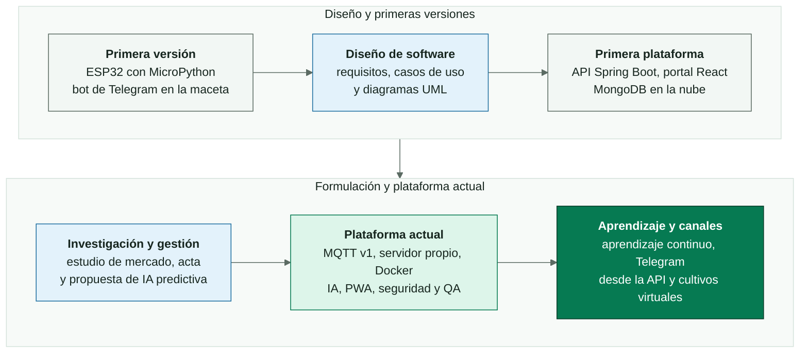
```mermaid
%%{init: {"theme": "base", "fontFamily": "Segoe UI, Arial, sans-serif", "themeVariables": {"fontFamily": "Segoe UI, Arial, sans-serif", "fontSize": "15px", "primaryColor": "#DDF5EA", "primaryTextColor": "#17261F", "primaryBorderColor": "#067A52", "secondaryColor": "#E3F2FB", "secondaryTextColor": "#17261F", "secondaryBorderColor": "#1F6FA0", "tertiaryColor": "#F2F7F4", "tertiaryTextColor": "#17261F", "tertiaryBorderColor": "#D5E3DC", "lineColor": "#5B6B63", "textColor": "#17261F", "mainBkg": "#DDF5EA", "nodeBorder": "#067A52", "clusterBkg": "#F7FAF8", "clusterBorder": "#D5E3DC", "edgeLabelBackground": "#FFFFFF", "actorBkg": "#067A52", "actorBorder": "#0B3D2B", "actorTextColor": "#FFFFFF", "actorLineColor": "#5B6B63", "signalColor": "#17261F", "signalTextColor": "#17261F", "labelBoxBkgColor": "#0B3D2B", "labelBoxBorderColor": "#0B3D2B", "labelTextColor": "#FFFFFF", "loopTextColor": "#0B3D2B", "noteBkgColor": "#FDF4DD", "noteBorderColor": "#C98D12", "noteTextColor": "#17261F", "activationBkgColor": "#DDF5EA", "activationBorderColor": "#067A52", "attributeBackgroundColorOdd": "#FFFFFF", "attributeBackgroundColorEven": "#F2F7F4"}}}%%
flowchart TB
  subgraph antes["Diseño y primeras versiones"]
    direction LR
    f1["<b>Primera versión</b><br/>ESP32 con MicroPython<br/>bot de Telegram en la maceta"] --> f2["<b>Diseño de software</b><br/>requisitos, casos de uso<br/>y diagramas UML"]
    f2 --> f3["<b>Primera plataforma</b><br/>API Spring Boot, portal React<br/>MongoDB en la nube"]
  end
  subgraph despues["Formulación y plataforma actual"]
    direction LR
    f4["<b>Investigación y gestión</b><br/>estudio de mercado, acta<br/>y propuesta de IA predictiva"] --> f5["<b>Plataforma actual</b><br/>MQTT v1, servidor propio, Docker<br/>IA, PWA, seguridad y QA"]
    f5 --> f6["<b>Aprendizaje y canales</b><br/>aprendizaje continuo, Telegram<br/>desde la API y cultivos virtuales"]
  end
  antes --> despues
  classDef past fill:#F2F7F4,stroke:#5B6B63,color:#17261F
  classDef design fill:#E3F2FB,stroke:#1F6FA0,color:#17261F
  classDef now fill:#DDF5EA,stroke:#067A52,color:#17261F
  classDef latest fill:#067A52,stroke:#0B3D2B,color:#FFFFFF
  class f1,f3 past
  class f2,f4 design
  class f5 now
  class f6 latest
```

| Semestre | Disciplinas dominantes | Qué produjo | Commits humanos |
| --- | --- | --- | --- |
| 2024-2 | Análisis y diseño | Primera matriz de requisitos (agosto de 2024), casos de uso, diagramas UML, primera API, primer portal, firmware del ESP32, simulador y primeros análisis de datos | 379 |
| 2025-1 | Construcción | Ajustes y mantenimiento de la primera plataforma | 141 |
| 2025-2 | Formulación y evaluación | Idea, problema, árboles, marco lógico, estudio de mercado (noviembre de 2025) y crecimiento de la PWA | 553 |
| 2026-1 | Gestión de proyectos | Acta de constitución, EDT, cronograma con ruta crítica, recursos y nivelación; propuesta de investigación | 145 |
| 2026-2 | Construcción, pruebas y mejora continua | Reestructuración completa, tres ciclos de mejora y la plataforma en producción | 714 |

Los repositorios suman 2217 commits, de los cuales 1932 son de personas y el resto de bots de automatización, sobre todo actualizaciones de dependencias. La tabla ya deja ver la primera lección del proyecto: los semestres de planeación formal (2026-1) fueron los de menos construcción, y el mayor avance llegó cuando el trabajo se organizó en ciclos cortos con pruebas automáticas.

| Disciplina | Parte | Diagramas |
| --- | --- | --- |
| Formulación y evaluación de proyectos TI | I | Árbol de problemas, causa y efecto, árbol de objetivos, poder e interés, fases de la investigación |
| Gestión de proyectos TI | II | EDT, red de precedencias, ruta crítica, ciclo Scrum, riesgos |
| Análisis | III | Casos de uso |
| Diseño | IV | Contexto, contenedores, componentes, clases, actividad, secuencia, estados, datos, mapa de la PWA, redes |
| Construcción | V | Despliegue, asistente de IA, aprendizaje, Telegram, cultivos reales y virtuales, cultivo en vivo |
| Pruebas | VI | Pirámide de pruebas, workflow de QA |
| Mejora continua | VII | Ciclo PDCA, ciclos de mejora |

<!-- parte: PARTE I | Formulación y evaluación de proyectos TI -->

## 2. Identificación del problema

### 2.1 La idea

SmartPot fue la idea elegida entre las propuestas de proyecto de un curso de tecnologías de la información. Nació de una observación simple: el riego y la nutrición de un cultivo hidropónico dependen de variables que cambian todo el tiempo (pH, sólidos disueltos, luz, temperatura y humedad), y la mayoría de pequeños productores y aficionados las controla a mano. La idea citaba tres datos de la FAO: la agricultura usa cerca del 70 % del agua dulce, el riego tradicional pierde hasta el 40 % por ineficiencia y la hidroponía puede reducir el consumo hasta en un 90 %.

La idea se formuló como un proyecto de datos y no como un aparato:

| Alcance de la idea | Cómo quedó construido |
| --- | --- |
| Captura en tiempo real desde sensores | Telemetría MQTT v1 con credencial por cultivo |
| Integración y estandarización de las mediciones | Contrato JSON único y validadores `$jsonSchema` en MongoDB |
| Automatización del riego según lo sensado | Agente de automatización con modo automático y enfriamiento por actuador |
| Visualizaciones, tabulados y alertas | PWA con panel general, historial, comparador y alertas por Telegram |
| Diccionario de variables y metadatos | Contrato MQTT, esquema de datos y base de conocimiento documentados |
| Documentación reproducible | Tres documentos, diagramas en Mermaid y una demo de un solo comando |

> [!TIP]
> **Lectura crítica.** Plantear SmartPot como un *pipeline* de datos (capturar, limpiar, integrar, decidir, mostrar) fue la mejor decisión de la formulación. Separó el valor del hardware: el dispositivo solo mide y obedece, y todo lo que aprende la plataforma sirve igual para una maceta física, una simulada en Wokwi o una virtual.

### 2.2 Árbol de problemas

El problema central se definió como la **gestión ineficiente de cultivos hidropónicos por falta de control preciso y continuo de sus parámetros**.

<!-- diagrama: SmartPot_18_Problem_Tree | titulo=Árbol de problemas -->
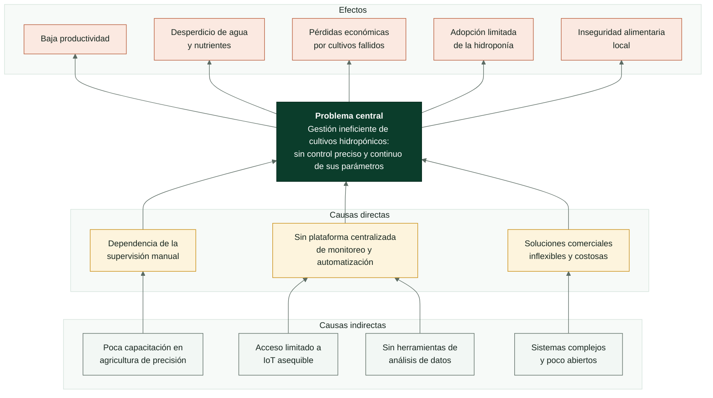
```mermaid
%%{init: {"theme": "base", "fontFamily": "Segoe UI, Arial, sans-serif", "themeVariables": {"fontFamily": "Segoe UI, Arial, sans-serif", "fontSize": "15px", "primaryColor": "#DDF5EA", "primaryTextColor": "#17261F", "primaryBorderColor": "#067A52", "secondaryColor": "#E3F2FB", "secondaryTextColor": "#17261F", "secondaryBorderColor": "#1F6FA0", "tertiaryColor": "#F2F7F4", "tertiaryTextColor": "#17261F", "tertiaryBorderColor": "#D5E3DC", "lineColor": "#5B6B63", "textColor": "#17261F", "mainBkg": "#DDF5EA", "nodeBorder": "#067A52", "clusterBkg": "#F7FAF8", "clusterBorder": "#D5E3DC", "edgeLabelBackground": "#FFFFFF", "actorBkg": "#067A52", "actorBorder": "#0B3D2B", "actorTextColor": "#FFFFFF", "actorLineColor": "#5B6B63", "signalColor": "#17261F", "signalTextColor": "#17261F", "labelBoxBkgColor": "#0B3D2B", "labelBoxBorderColor": "#0B3D2B", "labelTextColor": "#FFFFFF", "loopTextColor": "#0B3D2B", "noteBkgColor": "#FDF4DD", "noteBorderColor": "#C98D12", "noteTextColor": "#17261F", "activationBkgColor": "#DDF5EA", "activationBorderColor": "#067A52", "attributeBackgroundColorOdd": "#FFFFFF", "attributeBackgroundColorEven": "#F2F7F4"}}}%%
flowchart BT
  subgraph efectos["Efectos"]
    e1["Baja productividad"]
    e2["Desperdicio de agua<br/>y nutrientes"]
    e3["Pérdidas económicas<br/>por cultivos fallidos"]
    e4["Adopción limitada<br/>de la hidroponía"]
    e5["Inseguridad alimentaria<br/>local"]
  end
  problema["<b>Problema central</b><br/>Gestión ineficiente de cultivos hidropónicos:<br/>sin control preciso y continuo de sus parámetros"]
  subgraph directas["Causas directas"]
    c1["Dependencia de la<br/>supervisión manual"]
    c2["Sin plataforma centralizada<br/>de monitoreo y automatización"]
    c3["Soluciones comerciales<br/>inflexibles y costosas"]
  end
  subgraph indirectas["Causas indirectas"]
    i1["Poca capacitación en<br/>agricultura de precisión"]
    i2["Acceso limitado a<br/>IoT asequible"]
    i3["Sin herramientas de<br/>análisis de datos"]
    i4["Sistemas complejos<br/>y poco abiertos"]
  end
  problema --> e1 & e2 & e3 & e4 & e5
  c1 & c2 & c3 --> problema
  i1 --> c1
  i2 --> c2
  i3 --> c2
  i4 --> c3
  classDef leaf fill:#DDF5EA,stroke:#067A52,color:#17261F
  classDef water fill:#E3F2FB,stroke:#1F6FA0,color:#17261F
  classDef sun fill:#FDF4DD,stroke:#C98D12,color:#17261F
  classDef clay fill:#FBE9E1,stroke:#B85A38,color:#17261F
  classDef core fill:#067A52,stroke:#0B3D2B,color:#FFFFFF
  classDef deep fill:#0B3D2B,stroke:#06281C,color:#FFFFFF
  classDef muted fill:#F2F7F4,stroke:#5B6B63,color:#17261F
  class e1,e2,e3,e4,e5 clay
  class problema deep
  class c1,c2,c3 sun
  class i1,i2,i3,i4 muted
```

### 2.3 Causa y efecto

El diagrama de Ishikawa ordenó las causas con las categorías clásicas de métodos, máquinas, mediciones, mano de obra y medio ambiente.

<!-- diagrama: SmartPot_09_Cause_Effect | titulo=Causa y efecto del problema -->
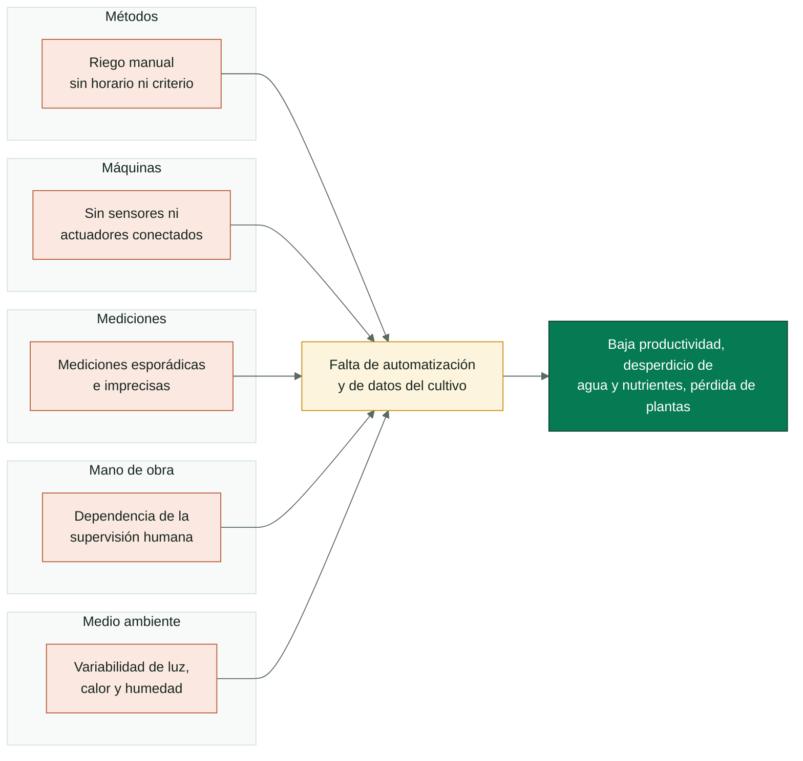
```mermaid
%%{init: {"theme": "base", "fontFamily": "Segoe UI, Arial, sans-serif", "themeVariables": {"fontFamily": "Segoe UI, Arial, sans-serif", "fontSize": "15px", "primaryColor": "#DDF5EA", "primaryTextColor": "#17261F", "primaryBorderColor": "#067A52", "secondaryColor": "#E3F2FB", "secondaryTextColor": "#17261F", "secondaryBorderColor": "#1F6FA0", "tertiaryColor": "#F2F7F4", "tertiaryTextColor": "#17261F", "tertiaryBorderColor": "#D5E3DC", "lineColor": "#5B6B63", "textColor": "#17261F", "mainBkg": "#DDF5EA", "nodeBorder": "#067A52", "clusterBkg": "#F7FAF8", "clusterBorder": "#D5E3DC", "edgeLabelBackground": "#FFFFFF", "actorBkg": "#067A52", "actorBorder": "#0B3D2B", "actorTextColor": "#FFFFFF", "actorLineColor": "#5B6B63", "signalColor": "#17261F", "signalTextColor": "#17261F", "labelBoxBkgColor": "#0B3D2B", "labelBoxBorderColor": "#0B3D2B", "labelTextColor": "#FFFFFF", "loopTextColor": "#0B3D2B", "noteBkgColor": "#FDF4DD", "noteBorderColor": "#C98D12", "noteTextColor": "#17261F", "activationBkgColor": "#DDF5EA", "activationBorderColor": "#067A52", "attributeBackgroundColorOdd": "#FFFFFF", "attributeBackgroundColorEven": "#F2F7F4"}}}%%
flowchart LR
  subgraph metodos["Métodos"]
    m1["Riego manual<br/>sin horario ni criterio"]
  end
  subgraph maquinas["Máquinas"]
    m2["Sin sensores ni<br/>actuadores conectados"]
  end
  subgraph mediciones["Mediciones"]
    m3["Mediciones esporádicas<br/>e imprecisas"]
  end
  subgraph mano["Mano de obra"]
    m4["Dependencia de la<br/>supervisión humana"]
  end
  subgraph ambiente["Medio ambiente"]
    m5["Variabilidad de luz,<br/>calor y humedad"]
  end
  m1 --> raiz["Falta de automatización<br/>y de datos del cultivo"]
  m2 --> raiz
  m3 --> raiz
  m4 --> raiz
  m5 --> raiz
  raiz --> efecto["Baja productividad, desperdicio de<br/>agua y nutrientes, pérdida de plantas"]
  classDef cause fill:#FBE9E1,stroke:#B85A38,color:#17261F
  classDef root fill:#FDF4DD,stroke:#C98D12,color:#17261F
  classDef effect fill:#067A52,stroke:#0B3D2B,color:#FFFFFF
  class m1,m2,m3,m4,m5 cause
  class raiz root
  class efecto effect
```

### 2.4 Los 5 porqués

| Pregunta | Respuesta de la formulación |
| --- | --- |
| ¿Por qué la gestión es ineficiente? | Porque depende de la supervisión manual y hay poco control automatizado |
| ¿Por qué la supervisión manual desperdicia recursos? | Porque una persona no puede seguir todas las variables todo el tiempo |
| ¿Por qué no se automatiza? | Porque las soluciones son costosas, poco accesibles o complejas para pequeños productores |
| ¿Por qué el costo y la rigidez son un obstáculo? | Porque exigen una inversión alta y no se adaptan a cada cultivo |
| ¿Por qué crear SmartPot? | Para ofrecer una herramienta asequible, flexible y educativa que use la simulación para bajar costos |

> [!NOTE]
> **Lectura crítica.** Las tres técnicas llegan a la misma raíz, falta de automatización y de datos del cultivo, y eso da confianza en el diagnóstico. Tienen tres debilidades que conviene corregir en una próxima formulación:
>
> - El quinto porqué no es una causa sino la justificación de la solución; la cadena causal termina en el cuarto.
> - El Ishikawa omite la categoría *materiales* (solución nutritiva, sustrato, calidad del agua), que en hidroponía explica buena parte de las pérdidas.
> - Efectos como la inseguridad alimentaria local son reales pero el proyecto no puede medirlos; en el marco lógico quedan como fin, no como indicador.

## 3. Objetivos y alternativa elegida

### 3.1 Árbol de objetivos

Al invertir el árbol de problemas, cada causa se convierte en un medio. El diagrama agrega, en cursiva, cómo construyó SmartPot cada medio.

<!-- diagrama: SmartPot_19_Objective_Tree | titulo=Árbol de objetivos -->
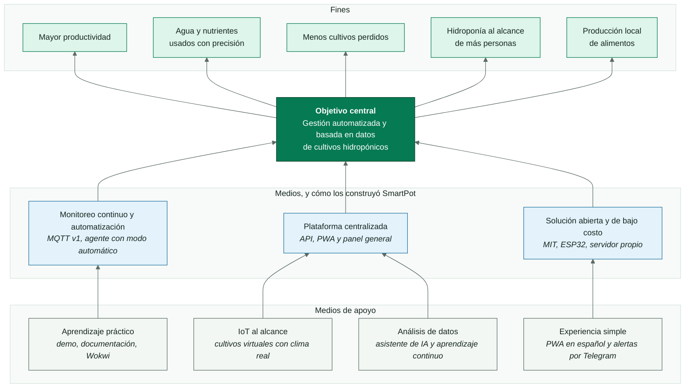
```mermaid
%%{init: {"theme": "base", "fontFamily": "Segoe UI, Arial, sans-serif", "themeVariables": {"fontFamily": "Segoe UI, Arial, sans-serif", "fontSize": "15px", "primaryColor": "#DDF5EA", "primaryTextColor": "#17261F", "primaryBorderColor": "#067A52", "secondaryColor": "#E3F2FB", "secondaryTextColor": "#17261F", "secondaryBorderColor": "#1F6FA0", "tertiaryColor": "#F2F7F4", "tertiaryTextColor": "#17261F", "tertiaryBorderColor": "#D5E3DC", "lineColor": "#5B6B63", "textColor": "#17261F", "mainBkg": "#DDF5EA", "nodeBorder": "#067A52", "clusterBkg": "#F7FAF8", "clusterBorder": "#D5E3DC", "edgeLabelBackground": "#FFFFFF", "actorBkg": "#067A52", "actorBorder": "#0B3D2B", "actorTextColor": "#FFFFFF", "actorLineColor": "#5B6B63", "signalColor": "#17261F", "signalTextColor": "#17261F", "labelBoxBkgColor": "#0B3D2B", "labelBoxBorderColor": "#0B3D2B", "labelTextColor": "#FFFFFF", "loopTextColor": "#0B3D2B", "noteBkgColor": "#FDF4DD", "noteBorderColor": "#C98D12", "noteTextColor": "#17261F", "activationBkgColor": "#DDF5EA", "activationBorderColor": "#067A52", "attributeBackgroundColorOdd": "#FFFFFF", "attributeBackgroundColorEven": "#F2F7F4"}}}%%
flowchart BT
  subgraph fines["Fines"]
    f1["Mayor productividad"]
    f2["Agua y nutrientes<br/>usados con precisión"]
    f3["Menos cultivos perdidos"]
    f4["Hidroponía al alcance<br/>de más personas"]
    f5["Producción local<br/>de alimentos"]
  end
  objetivo["<b>Objetivo central</b><br/>Gestión automatizada y basada en datos<br/>de cultivos hidropónicos"]
  subgraph medios["Medios, y cómo los construyó SmartPot"]
    m1["Monitoreo continuo y automatización<br/><i>MQTT v1, agente con modo automático</i>"]
    m2["Plataforma centralizada<br/><i>API, PWA y panel general</i>"]
    m3["Solución abierta y de bajo costo<br/><i>MIT, ESP32, servidor propio</i>"]
  end
  subgraph apoyos["Medios de apoyo"]
    a1["Aprendizaje práctico<br/><i>demo, documentación, Wokwi</i>"]
    a2["IoT al alcance<br/><i>cultivos virtuales con clima real</i>"]
    a3["Análisis de datos<br/><i>asistente de IA y aprendizaje continuo</i>"]
    a4["Experiencia simple<br/><i>PWA en español y alertas por Telegram</i>"]
  end
  objetivo --> f1 & f2 & f3 & f4 & f5
  m1 & m2 & m3 --> objetivo
  a1 --> m1
  a2 --> m2
  a3 --> m2
  a4 --> m3
  classDef leaf fill:#DDF5EA,stroke:#067A52,color:#17261F
  classDef water fill:#E3F2FB,stroke:#1F6FA0,color:#17261F
  classDef sun fill:#FDF4DD,stroke:#C98D12,color:#17261F
  classDef clay fill:#FBE9E1,stroke:#B85A38,color:#17261F
  classDef core fill:#067A52,stroke:#0B3D2B,color:#FFFFFF
  classDef deep fill:#0B3D2B,stroke:#06281C,color:#FFFFFF
  classDef muted fill:#F2F7F4,stroke:#5B6B63,color:#17261F
  class f1,f2,f3,f4,f5 leaf
  class objetivo core
  class m1,m2,m3 water
  class a1,a2,a3,a4 muted
```

### 3.2 Objetivo SMART

| Criterio | Formulación | Lectura crítica |
| --- | --- | --- |
| Específico | Monitorear y automatizar un jardín hidropónico simulado: humedad, temperatura, luz, pH y nutrientes | Bien acotado; la plataforma lo cumple y agrega humedad del sustrato y atmósfera |
| Medible | Simulación completa en Wokwi, API, interfaz, base de datos, reportes y riego e iluminación automáticos | Mide **productos**, no resultados: no dice cuánta agua se ahorra ni cuánto tiempo pasa el cultivo en rango |
| Alcanzable | Prototipo dentro del curso con un proceso iterativo | Cierto para el software; la parte física quedó fuera por diseño |
| Relevante | Valor académico y social | Se sostiene: código abierto, demo para instituciones y documentación completa |
| Temporal | Análisis y diseño de agosto a septiembre; desarrollo y pruebas de octubre a diciembre | La primera plataforma existía antes de esta formulación y siguió creciendo dos años más; el plazo describía un semestre, no el producto |

### 3.3 Cómo evolucionaron los objetivos

| Documento | Objetivo general | Qué cambió |
| --- | --- | --- |
| Formulación | Automatizar la gestión de cultivos hidropónicos con monitoreo en tiempo real y análisis de datos | Cinco objetivos específicos por etapa: analizar, diseñar, desarrollar, probar y mantener |
| Proyecto integrador | El mismo | Siete objetivos por beneficio: monitoreo remoto, agua y nutrientes, errores humanos, pérdida de plantas, dependencia manual, espacios reducidos e historial |
| Acta de constitución | Sistema completo de monitoreo y automatización para lechuga y tomate | Objetivos por dimensión (alcance, tiempo, costo, calidad y relevancia) con indicadores de éxito |
| Propuesta de investigación | Integrar IoT y modelos de analítica para el control inteligente de la lechuga | Seis objetivos que incluyen hardware físico, parámetros agronómicos y validación experimental |

> [!IMPORTANT]
> **Lectura crítica.** El objetivo general se mantuvo estable durante dos años, lo que muestra una visión clara. Los específicos, en cambio, se reescribieron en cada curso sin trazar cuáles reemplazaban a cuáles. La plataforma cumple los objetivos de software de los cuatro documentos; quedan abiertos los que exigen hardware y un ciclo de cultivo real (sección 9).

## 4. Entorno e involucrados

### 4.1 PESTEL

| Factor | Formulación | Hoy |
| --- | --- | --- |
| Político | Políticas de agricultura urbana y apoyo institucional | Sin cambios: el proyecto sigue dentro del marco académico |
| Económico | Herramientas educativas gratuitas y alojamiento económico | Se reemplazaron las capas gratuitas por un servidor propio pequeño para no depender de cuotas |
| Social | Seguridad alimentaria, aprendizaje práctico y comunidades *maker* | Demo de un solo comando y cultivos virtuales para aprender sin hardware |
| Tecnológico | Wokwi, Spring Boot, React y ESP32 | Se sumaron MQTT con TLS, Docker, FastAPI con scikit-learn y la PWA instalable |
| Ecológico | Eficiencia hídrica y menos pesticidas | Riego preventivo y bloqueo de nutrientes; el ahorro real solo se podrá medir con un prototipo físico |
| Legal | Marco académico y software libre | Licencia MIT, datos personales mínimos, borrado de la cuenta y cultivos seudonimizados para el aprendizaje |

### 4.2 Poder e interés

El análisis identificó actores primarios (docente y equipo de desarrollo), secundarios (institución, coordinación, proveedores de nube, horticultores, microproductores y comunidad *maker*) y terciarios (usuarios potenciales, proveedores alternativos y competencia). La matriz de interesados calificó a nueve de ellos de 1 a 10 en poder e interés.

<!-- diagrama: SmartPot_20_Stakeholder_Map | titulo=Poder e interés de los interesados -->
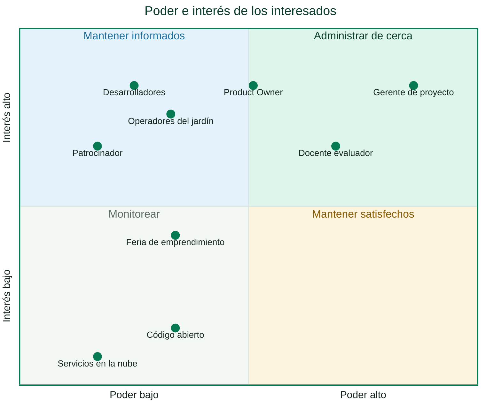
```mermaid
%%{init: {"theme": "base", "fontFamily": "Segoe UI, Arial, sans-serif", "themeVariables": {"fontFamily": "Segoe UI, Arial, sans-serif", "fontSize": "15px", "primaryColor": "#DDF5EA", "primaryTextColor": "#17261F", "primaryBorderColor": "#067A52", "secondaryColor": "#E3F2FB", "secondaryTextColor": "#17261F", "secondaryBorderColor": "#1F6FA0", "tertiaryColor": "#F2F7F4", "tertiaryTextColor": "#17261F", "tertiaryBorderColor": "#D5E3DC", "lineColor": "#5B6B63", "textColor": "#17261F", "mainBkg": "#DDF5EA", "nodeBorder": "#067A52", "clusterBkg": "#F7FAF8", "clusterBorder": "#D5E3DC", "edgeLabelBackground": "#FFFFFF", "actorBkg": "#067A52", "actorBorder": "#0B3D2B", "actorTextColor": "#FFFFFF", "actorLineColor": "#5B6B63", "signalColor": "#17261F", "signalTextColor": "#17261F", "labelBoxBkgColor": "#0B3D2B", "labelBoxBorderColor": "#0B3D2B", "labelTextColor": "#FFFFFF", "loopTextColor": "#0B3D2B", "noteBkgColor": "#FDF4DD", "noteBorderColor": "#C98D12", "noteTextColor": "#17261F", "activationBkgColor": "#DDF5EA", "activationBorderColor": "#067A52", "attributeBackgroundColorOdd": "#FFFFFF", "attributeBackgroundColorEven": "#F2F7F4", "quadrant1Fill": "#DDF5EA", "quadrant2Fill": "#E3F2FB", "quadrant3Fill": "#F2F7F4", "quadrant4Fill": "#FDF4DD", "quadrant1TextFill": "#0B3D2B", "quadrant2TextFill": "#1F6FA0", "quadrant3TextFill": "#5B6B63", "quadrant4TextFill": "#8A5A00", "quadrantPointFill": "#067A52", "quadrantPointTextFill": "#17261F", "quadrantXAxisTextFill": "#17261F", "quadrantYAxisTextFill": "#17261F", "quadrantTitleFill": "#0B3D2B", "quadrantInternalBorderStrokeFill": "#D5E3DC", "quadrantExternalBorderStrokeFill": "#067A52"}, "quadrantChart": {"chartWidth": 760, "chartHeight": 640, "pointLabelFontSize": 14, "quadrantLabelFontSize": 17, "titleFontSize": 20, "pointRadius": 7}}}%%
quadrantChart
  title Poder e interés de los interesados
  x-axis Poder bajo --> Poder alto
  y-axis Interés bajo --> Interés alto
  quadrant-1 Administrar de cerca
  quadrant-2 Mantener informados
  quadrant-3 Monitorear
  quadrant-4 Mantener satisfechos
  Gerente de proyecto: [0.86, 0.84]
  Docente evaluador: [0.69, 0.67]
  Product Owner: [0.51, 0.84]
  Desarrolladores: [0.25, 0.84]
  Operadores del jardín: [0.33, 0.76]
  Patrocinador: [0.17, 0.67]
  Feria de emprendimiento: [0.34, 0.42]
  Código abierto: [0.34, 0.16]
  Servicios en la nube: [0.17, 0.08]
```

| Interesado | Poder | Interés | Impacto (poder × interés) | Manejo según su posición | Manejo en la matriz original |
| --- | --- | --- | --- | --- | --- |
| Gerente de proyecto | 10 | 10 | 100 | Administrar de cerca | Administrar de cerca |
| Docente evaluador | 8 | 8 | 64 | Administrar de cerca | Administrar de cerca |
| Product Owner | 6 | 10 | 60 | Administrar de cerca | Administrar de cerca |
| Desarrolladores | 3 | 10 | 30 | **Mantener informados** | Mantener satisfechos |
| Operadores del jardín | 3 | 9 | 27 | **Mantener informados** | Mantener satisfechos |
| Institución patrocinadora | 2 | 8 | 16 | **Mantener informados** | Mantener satisfechos |
| Feria de emprendimiento | 4 | 5 | 20 | Monitorear (en el límite) | Monitorear |
| Comunidad de código abierto | 4 | 2 | 8 | Monitorear | Monitorear |
| Servicios en la nube | 2 | 1 | 2 | Monitorear | Monitorear |

> [!WARNING]
> **Lectura crítica.** Tres de los nueve interesados tenían un manejo que no correspondía a su posición: con poder bajo e interés alto, la estrategia es *mantener informados*, no *mantener satisfechos*. Además, la columna de conclusiones quedó desplazada una fila y trae frases de otro contexto (ventas, una aplicación móvil, un equipo interno de TI), y la exposición oral ubicó a los proveedores de nube con poder alto mientras la matriz les daba 2. La tabla anterior es la versión corregida y es la que usa el [recorrido del proyecto](SmartPot_Project_Journey.md).

## 5. Marco lógico

| Nivel | Resumen narrativo | Indicador planteado | Evidencia hoy |
| --- | --- | --- | --- |
| Fin | Contribuir a la sostenibilidad y eficiencia de la agricultura urbana mediante la tecnología | Menor consumo de agua; más uso de tecnologías de monitoreo | No medible todavía: requiere un prototipo físico y un ciclo de cultivo comparado |
| Propósito | Optimizar la gestión de cultivos hidropónicos con monitoreo y control automatizados | 95 % de precisión en la gestión de variables; menos tiempo de supervisión manual | El agente actúa solo con el modo automático; «precisión» nunca se definió, así que no hay con qué comparar |
| Resultado 1 | Prototipo completo en simulación | Validación en Wokwi | Cumplido: firmware en Wokwi (cultivo real) y cultivos virtuales que publican por MQTT |
| Resultado 2 | Plataforma web con backend y frontend | API con 80 % de cobertura de pruebas | Plataforma en producción con 260 pruebas; la cobertura no se mide formalmente |
| Resultado 3 | Monitoreo y control en tiempo real | Sistema funcional | Cumplido: telemetría, comandos con confirmación y estado en línea |
| Actividades | Análisis y diseño; desarrollo; pruebas y validación; documentación y cierre | Cronograma y repositorios | Cumplidas en ciclos (parte VII) |

> [!IMPORTANT]
> **Lectura crítica.** El marco lógico tenía la estructura correcta pero indicadores sin línea base, sin meta fechada y, sobre todo, sin supuestos: la columna que dice qué debe ser cierto fuera del proyecto para que funcione. Para el próximo ciclo se propone medir el propósito con un indicador que la plataforma ya puede calcular:
>
> - **Tiempo en rango:** porcentaje de lecturas de cada cultivo dentro del rango ideal de su especie, por semana.
> - **Intervenciones manuales:** comandos enviados por la persona frente a los ejecutados por el agente.
> - **Supuestos explícitos:** el dispositivo tiene conexión estable, los sensores están calibrados y la persona activa el modo automático.

## 6. Estudio de mercado

### 6.1 Demanda y oferta

| Segmento | Demanda inicial estimada |
| --- | --- |
| Horticultores urbanos y domésticos (Medellín, Bogotá, Cali) | 500 a 2000 personas |
| Instituciones educativas y semilleros | 50 a 150 instituciones |
| *Makers* y comunidad IoT | 200 a 500 personas |
| Microproductores agrotecnológicos | 100 a 300 personas |

La oferta se describió como un oligopolio parcial con tres tipos de oferentes: sistemas comerciales de hidroponía inteligente (500 a 5000 USD, robustos pero caros), plataformas IoT genéricas (baratas pero sin el dominio hidropónico) y desarrollos caseros (gratuitos pero sin soporte). SmartPot se ubicó en el espacio vacío entre ellos: accesible, educativo y listo para usar.

### 6.2 Coherencia de las cifras

| Dato | Presentación del estudio | Documento del estudio | Observación |
| --- | --- | --- | --- |
| Plan Profesional | 9 a 12 USD al mes | 20 USD al mes | Dos precios para el mismo plan |
| Plan Empresarial | 50 a 100 USD al mes | 100 USD al mes | Coherente en el tope |
| Costo del MVP | ~20 USD al año | 81 000 a 120 000 COP al año | El mismo documento lista un servidor de 5 a 8 USD al mes, que ya suma 60 a 96 USD al año |
| Crecimiento | 30 % a 40 % anual | De 800–2900 a 2500–5000 personas | Pasar de un rango al otro implica crecer entre 72 % y 212 % |
| Demanda | Consumo nacional aparente | Producción + importaciones − exportaciones | Fórmula de bienes físicos; no se calculó para un servicio digital |
| Aceptación | 75 % a 85 % | Probabilidad «alta» | Sin método ni fuente primaria |
| Valor percibido | — | Ahorro de agua del 90 % | Es un beneficio de la hidroponía, no de SmartPot |

> [!WARNING]
> **Lectura crítica.** El estudio acertó en lo cualitativo: el nicho entre lo caro y lo casero existe, el canal académico es el natural y el costo de operación es bajo. Falló en lo cuantitativo: los rangos de demanda no salen de un cálculo, el precio cambió entre la presentación y el documento, y ninguna cifra tuvo fuente primaria. Su propia recomendación sigue vigente y es la prioridad comercial: **validar la demanda con un piloto académico y métricas de adopción** antes de fijar precios.

### 6.3 Qué quedó del estudio

| Recomendación del estudio | Estado |
| --- | --- |
| Piloto académico con instituciones | Demo de un solo comando en GHCR y Docker Hub, pensada para aulas y semilleros |
| Métricas de adopción | Pendiente: la plataforma no registra analítica de uso; se propone un conteo agregado y anónimo de cuentas y cultivos activos |
| Canal directo, comunidad y academia | Portal en smartpot.app, organización pública en GitHub y documentación en español |
| Modelo *freemium* | No implementado: hoy todo es gratuito y de código abierto |

## 7. Estudio técnico

| Aspecto | Planteado en la formulación y el acta | Resuelto en la plataforma |
| --- | --- | --- |
| Localización | Capas gratuitas en la nube | Un servidor virtual propio con Nginx y TLS; dominios `smartpot.app`, `api`, `mqtt` y `mail` |
| Tamaño | Un MVP para dos especies | Ocho contenedores; seis especies; una lectura cada 5 s como máximo por cultivo; hasta 5 cultivos virtuales por cuenta; cuatro formas de cultivo |
| Proceso | ESP32 que envía datos a la API por HTTP | Telemetría y comandos por MQTT v1 con QoS 1, confirmación y última voluntad |
| Tecnología | Java 17, H2 o MySQL con JPA, React con Vite | Java 21 con Spring Boot 4.1, MongoDB 8, Redis, FastAPI con scikit-learn, React 19 como PWA |
| Seguridad | JWT, AES y límite de peticiones | Lo anterior más control de dueño, cuenta MQTT por cultivo, contenedores endurecidos, CodeQL y SBOM |
| Insumos para el prototipo físico | Cotización de sensores y actuadores | Sensores de pH y TDS de 25 a 40 USD cada uno, ESP32 de 20 a 30 USD y bombas de 15 a 50 USD: del orden de 85 a 160 USD sin la estructura hidráulica |

> [!NOTE]
> **Lectura crítica.** El estudio técnico original era una lista de tecnologías más que un estudio de capacidad. La plataforma respondió las preguntas que faltaban (cuánto aguanta, dónde corre, cómo se asegura) con decisiones medibles: límites por cultivo, validadores de datos, pruebas de humo de cada imagen y un endpoint `/health` por servicio.

## 8. Estudio financiero y evaluación

### 8.1 Presupuestos

| Documento | Monto | Composición |
| --- | --- | --- |
| Acta de constitución | 1 000 000 COP | 40 % infraestructura, 0 % licencias, 50 % tiempo del equipo, 10 % documentación |
| Restricción del mismo acta | 0 a 50 USD | Solo herramientas abiertas y capas gratuitas |
| Propuesta de investigación | 108 606 000 COP | 45 000 000 COP de flujo institucional y 63 606 000 COP de recursos propios; 67,2 millones en equipos |

> [!CAUTION]
> **Lectura crítica.** El acta se contradice: asigna un millón de pesos y a la vez restringe el gasto a 50 USD, unos 200 000 COP. La propuesta de investigación multiplica ese monto por cien y su lista de equipos (cabina para microorganismos, autoclave, incubadora, microscopio) viene de una plantilla de otra disciplina: no corresponde a un sistema hidropónico con ESP32. Un presupuesto de investigación coherente con SmartPot se arma con el prototipo físico (sección 7), el tiempo del equipo y la socialización de resultados.

### 8.2 Modelo de evaluación

El proyecto nunca tuvo un flujo de caja. Este modelo lo construye con los datos del estudio de mercado y supuestos explícitos, para responder la pregunta que el estudio dejó abierta: ¿qué tendría que pasar para que SmartPot se sostenga?

| Supuesto | Valor | Origen |
| --- | --- | --- |
| Horizonte | Año 0 de inversión, año 1 académico y gratuito, años 2 y 3 comerciales | Fases de precios del estudio |
| Inversión | 1 000 000 COP | Acta de constitución |
| Operación del MVP | 120 000 COP al año | Tope del estudio de mercado |
| Operación en escalamiento | 20 USD al mes | Tope del estudio de mercado |
| Tasa de cambio y de descuento | 4000 COP por USD; 12 % anual | Supuestos de este análisis |
| Comisión de pago | 5 % del ingreso | Supuesto de este análisis |
| Costo del equipo | 1 300 000 COP al mes: una persona a medio tiempo desde el año 2 | Rubro de personal de la propuesta de investigación |

| Escenario | Usuarios año 2 | Conversión a pago | Precio | Suscripciones año 2 |
| --- | --- | --- | --- | --- |
| Conservador | 2500 (+30 % al año 3) | 1 % | 9 USD | 25 |
| Base | 3750 (+35 %) | 3 % | 10,5 USD | 112 |
| Optimista | 5000 (+40 %) | 5 % | 12 USD | 250 |

| Escenario | VPN sin costo del equipo | B/C | VPN con una persona a medio tiempo | B/C |
| --- | --- | --- | --- | --- |
| Conservador | 14,9 millones COP | 5,07 | −8,6 millones COP | 0,68 |
| Base | 92,0 millones COP | 12,91 | 68,4 millones COP | 3,19 |
| Optimista | 242,6 millones COP | 16,50 | 219,1 millones COP | 6,59 |

| Precio del plan | Punto de equilibrio sin equipo | Con una persona a medio tiempo |
| --- | --- | --- |
| 9 USD al mes | 2,6 suscripciones | 40,6 suscripciones |
| 10,5 USD al mes | 2,3 suscripciones | 34,8 suscripciones |
| 12 USD al mes | 2,0 suscripciones | 30,5 suscripciones |

> [!IMPORTANT]
> **Lectura crítica.** La TIR no aporta aquí: con una inversión de un millón y flujos de decenas de millones da valores de varios cientos por ciento o no existe. Lo que decide la viabilidad es otra cosa:
>
> - La infraestructura casi no pesa: dos o tres suscripciones la pagan.
> - El tiempo de las personas sí: sostener a alguien a medio tiempo exige entre 31 y 41 suscripciones, y el escenario conservador no lo logra.
> - La variable crítica es la **conversión a pago**, que nadie ha medido. Por eso la prioridad es el piloto con métricas de adopción, no el modelo de precios.
>
> La evaluación social es favorable en cualquier escenario: el software es abierto, la demo no cuesta y el conocimiento queda documentado para otras instituciones.

## 9. Propuesta de investigación

La propuesta formuló SmartPot como investigación aplicada de doce meses: *sistema IoT asistido por IA para la automatización, supervisión remota y análisis predictivo de las condiciones ambientales en cultivos hidropónicos de lechuga*, alineada con los ODS 2, 12 y 13. Su objetivo era pasar de un control reactivo, que actúa cuando la variable ya salió de rango, a uno predictivo.

<!-- diagrama: SmartPot_36_Research_Phases | titulo=Fases de la propuesta de investigación y su estado -->
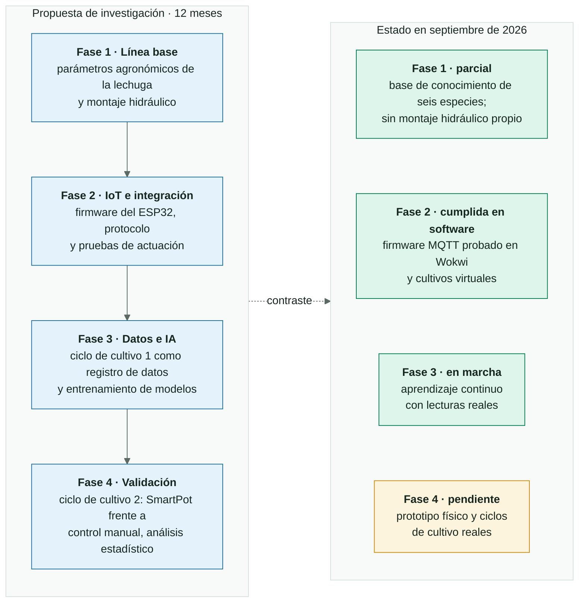
```mermaid
%%{init: {"theme": "base", "fontFamily": "Segoe UI, Arial, sans-serif", "themeVariables": {"fontFamily": "Segoe UI, Arial, sans-serif", "fontSize": "15px", "primaryColor": "#DDF5EA", "primaryTextColor": "#17261F", "primaryBorderColor": "#067A52", "secondaryColor": "#E3F2FB", "secondaryTextColor": "#17261F", "secondaryBorderColor": "#1F6FA0", "tertiaryColor": "#F2F7F4", "tertiaryTextColor": "#17261F", "tertiaryBorderColor": "#D5E3DC", "lineColor": "#5B6B63", "textColor": "#17261F", "mainBkg": "#DDF5EA", "nodeBorder": "#067A52", "clusterBkg": "#F7FAF8", "clusterBorder": "#D5E3DC", "edgeLabelBackground": "#FFFFFF", "actorBkg": "#067A52", "actorBorder": "#0B3D2B", "actorTextColor": "#FFFFFF", "actorLineColor": "#5B6B63", "signalColor": "#17261F", "signalTextColor": "#17261F", "labelBoxBkgColor": "#0B3D2B", "labelBoxBorderColor": "#0B3D2B", "labelTextColor": "#FFFFFF", "loopTextColor": "#0B3D2B", "noteBkgColor": "#FDF4DD", "noteBorderColor": "#C98D12", "noteTextColor": "#17261F", "activationBkgColor": "#DDF5EA", "activationBorderColor": "#067A52", "attributeBackgroundColorOdd": "#FFFFFF", "attributeBackgroundColorEven": "#F2F7F4"}}}%%
flowchart LR
  subgraph propuesta["Propuesta de investigación · 12 meses"]
    direction TB
    f1["<b>Fase 1 · Línea base</b><br/>parámetros agronómicos de la lechuga<br/>y montaje hidráulico"]
    f2["<b>Fase 2 · IoT e integración</b><br/>firmware del ESP32, protocolo<br/>y pruebas de actuación"]
    f3["<b>Fase 3 · Datos e IA</b><br/>ciclo de cultivo 1 como registro de datos<br/>y entrenamiento de modelos"]
    f4["<b>Fase 4 · Validación</b><br/>ciclo de cultivo 2: SmartPot frente a<br/>control manual, análisis estadístico"]
    f1 --> f2 --> f3 --> f4
  end
  subgraph hoy["Estado en septiembre de 2026"]
    direction TB
    h1["<b>Fase 1 · parcial</b><br/>base de conocimiento de seis especies;<br/>sin montaje hidráulico propio"]
    h2["<b>Fase 2 · cumplida en software</b><br/>firmware MQTT probado en Wokwi<br/>y cultivos virtuales"]
    h3["<b>Fase 3 · en marcha</b><br/>aprendizaje continuo<br/>con lecturas reales"]
    h4["<b>Fase 4 · pendiente</b><br/>prototipo físico y ciclos<br/>de cultivo reales"]
    h1 ~~~ h2 ~~~ h3 ~~~ h4
  end
  propuesta -. "contraste" .-> hoy
  classDef leaf fill:#DDF5EA,stroke:#067A52,color:#17261F
  classDef water fill:#E3F2FB,stroke:#1F6FA0,color:#17261F
  classDef sun fill:#FDF4DD,stroke:#C98D12,color:#17261F
  classDef clay fill:#FBE9E1,stroke:#B85A38,color:#17261F
  classDef core fill:#067A52,stroke:#0B3D2B,color:#FFFFFF
  classDef deep fill:#0B3D2B,stroke:#06281C,color:#FFFFFF
  classDef muted fill:#F2F7F4,stroke:#5B6B63,color:#17261F
  class f1,f2,f3,f4 water
  class h1,h2,h3 leaf
  class h4 sun
```

| Elemento | Propuesta | Lectura crítica |
| --- | --- | --- |
| Hipótesis | Implícita: el control asistido por IA mantiene mejor el cultivo que el manual | Conviene escribirla y ligarla a métricas: tiempo en rango, intervenciones, biomasa fresca y litros de agua y solución |
| Modelos | Regresión y redes LSTM | Una LSTM necesita meses de datos etiquetados; la plataforma empezó con técnicas explicables y aprende con lo que llega (sección 28) |
| Datos | Modo *data logger* durante un ciclo de 30 a 45 días | Ya existe: la IA guarda las lecturas reales, seudonimizadas, y reentrena por especie |
| Validación | SmartPot frente a control manual en un segundo ciclo | Pendiente: exige el montaje físico |
| Productos | Artículo y socialización en un evento | Pendiente; esta documentación es la base del artículo |
| Bibliografía | Mínimo 20 referencias | Tiene 10; hay que completarla |

Referencias de la propuesta, útiles para el trabajo futuro:

| Referencia | Aporte |
| --- | --- |
| Kurniasari et al. (2025), *IOP Conf. Series: Earth and Environmental Science* | Hidroponía con ESP32 y monitoreo en tiempo real |
| Kushawaha et al. (2024), *MethodsX* | Sistema hidropónico doméstico, pequeño e inteligente |
| Munaganuri, Yamarthi y Bolem (2025), *PeerJ Computer Science* | LSTM para agricultura inteligente |
| Rajaseger et al. (2023), *Bioinformation* | Tendencias de la hidroponía sostenible |
| Stevens et al. (2024), *PLoS ONE* | Manejo de nutrientes de bajo costo en microescala |
| *The Aquaponic Ecosystem Using IoT and IA Solutions* (2022), *IJWLTT* | IoT e IA en acuaponía |
| Ullah et al. (2019), *Intelligent Control and Automation* | Monitoreo y control hidropónico de bajo costo |
| Lowe, Qin y Mao (2022), *Water* | Aprendizaje automático en tratamiento y monitoreo de agua |
| Pandi et al. (2024), *Earth Science Informatics* | Monitoreo ambiental con IA para hidroponía |
| Mellit et al. (2021), *Energies* | Monitoreo remoto de invernaderos con IoT y redes profundas |

<!-- parte: PARTE II | Gestión de proyectos TI -->

## 10. Acta de constitución: lo que fijó y lo que pasó

| Dimensión | Objetivo e indicador del acta | Resultado |
| --- | --- | --- |
| Alcance | 90 % de las funcionalidades críticas entregadas | 13 de 17 requisitos funcionales cumplidos (76 %), 3 parciales y 1 replanteado; 16 de 17 con avance (94 %) |
| Tiempo | Fase 1 de marzo a abril y fase 2 de abril a julio de 2026, con desviación máxima de una semana | Incumplido: de marzo a junio hubo poca construcción y el grueso llegó en septiembre de 2026 |
| Costo | 0 % de sobrecosto | Cumplido en licencias (todo es abierto); el servidor propio no estaba previsto en el acta |
| Calidad | Cobertura de pruebas de al menos 80 %; menos de 3 defectos críticos al cierre | Sin defectos críticos abiertos al cierre del tercer ciclo; la cobertura no se mide formalmente |
| Relevancia | Prototipo presentado y aprobado | Plataforma en producción, abierta y con demo pública |

| Premisa del acta | Qué pasó |
| --- | --- |
| Equipo de cuatro personas: gerente, dos desarrolladores y un analista | Cerca de tres de cada cuatro commits humanos los hizo una sola persona |
| Capas gratuitas de nube como infraestructura | Se abandonaron por un servidor propio: las cuotas y la seguridad no se podían controlar |
| Hardware físico fuera de alcance | Se respetó; la simulación creció hasta tener cultivos virtuales siempre encendidos |
| Scrum con sprints de dos semanas | La línea base del cronograma usó sprints de tres a cinco días y la construcción se hizo en ciclos (sección 15) |

> [!IMPORTANT]
> **Lectura crítica.** El acta es el documento de gestión más completo del proyecto: objetivos con indicador, riesgos con controles, criterios de aprobación y de cierre, y niveles de autoridad. Su debilidad fue la de muchos proyectos académicos: se escribió para aprobar la planeación y no se volvió a abrir. Dos de sus criterios de cierre se habrían disparado (el alcance creció más del 30 % y el calendario no se cumplió), y ninguno generó una solicitud de cambio.

## 11. Alcance

### 11.1 Estructura de desglose del trabajo

La EDT se construyó en cuatro niveles; este es su primer nivel y los paquetes de trabajo.

<!-- diagrama: SmartPot_21_WBS | titulo=Estructura de desglose del trabajo | lamina=H -->
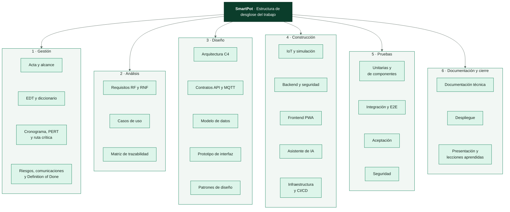
```mermaid
%%{init: {"theme": "base", "fontFamily": "Segoe UI, Arial, sans-serif", "themeVariables": {"fontFamily": "Segoe UI, Arial, sans-serif", "fontSize": "15px", "primaryColor": "#DDF5EA", "primaryTextColor": "#17261F", "primaryBorderColor": "#067A52", "secondaryColor": "#E3F2FB", "secondaryTextColor": "#17261F", "secondaryBorderColor": "#1F6FA0", "tertiaryColor": "#F2F7F4", "tertiaryTextColor": "#17261F", "tertiaryBorderColor": "#D5E3DC", "lineColor": "#5B6B63", "textColor": "#17261F", "mainBkg": "#DDF5EA", "nodeBorder": "#067A52", "clusterBkg": "#F7FAF8", "clusterBorder": "#D5E3DC", "edgeLabelBackground": "#FFFFFF", "actorBkg": "#067A52", "actorBorder": "#0B3D2B", "actorTextColor": "#FFFFFF", "actorLineColor": "#5B6B63", "signalColor": "#17261F", "signalTextColor": "#17261F", "labelBoxBkgColor": "#0B3D2B", "labelBoxBorderColor": "#0B3D2B", "labelTextColor": "#FFFFFF", "loopTextColor": "#0B3D2B", "noteBkgColor": "#FDF4DD", "noteBorderColor": "#C98D12", "noteTextColor": "#17261F", "activationBkgColor": "#DDF5EA", "activationBorderColor": "#067A52", "attributeBackgroundColorOdd": "#FFFFFF", "attributeBackgroundColorEven": "#F2F7F4"}}}%%
flowchart TB
  root["<b>SmartPot</b> · Estructura de desglose del trabajo"]
  subgraph g["1 · Gestión"]
    direction TB
    g1["Acta y alcance"] ~~~ g2["EDT y diccionario"] ~~~ g3["Cronograma, PERT<br/>y ruta crítica"] ~~~ g4["Riesgos, comunicaciones<br/>y Definition of Done"]
  end
  subgraph a["2 · Análisis"]
    direction TB
    a1["Requisitos RF y RNF"] ~~~ a2["Casos de uso"] ~~~ a3["Matriz de trazabilidad"]
  end
  subgraph d["3 · Diseño"]
    direction TB
    d1["Arquitectura C4"] ~~~ d2["Contratos API y MQTT"] ~~~ d3["Modelo de datos"] ~~~ d4["Prototipo de interfaz"] ~~~ d5["Patrones de diseño"]
  end
  subgraph c["4 · Construcción"]
    direction TB
    c1["IoT y simulación"] ~~~ c2["Backend y seguridad"] ~~~ c3["Frontend PWA"] ~~~ c4["Asistente de IA"] ~~~ c5["Infraestructura<br/>y CI/CD"]
  end
  subgraph p["5 · Pruebas"]
    direction TB
    p1["Unitarias y<br/>de componentes"] ~~~ p2["Integración y E2E"] ~~~ p3["Aceptación"] ~~~ p4["Seguridad"]
  end
  subgraph x["6 · Documentación y cierre"]
    direction TB
    x1["Documentación técnica"] ~~~ x2["Despliegue"] ~~~ x3["Presentación y<br/>lecciones aprendidas"]
  end
  root --> g & a & d & c & p & x
  classDef leaf fill:#DDF5EA,stroke:#067A52,color:#17261F
  classDef water fill:#E3F2FB,stroke:#1F6FA0,color:#17261F
  classDef sun fill:#FDF4DD,stroke:#C98D12,color:#17261F
  classDef clay fill:#FBE9E1,stroke:#B85A38,color:#17261F
  classDef core fill:#067A52,stroke:#0B3D2B,color:#FFFFFF
  classDef deep fill:#0B3D2B,stroke:#06281C,color:#FFFFFF
  classDef muted fill:#F2F7F4,stroke:#5B6B63,color:#17261F
  class root deep
  class g1,g2,g3,g4,a1,a2,a3,d1,d2,d3,d4,d5,c1,c2,c3,c4,c5,p1,p2,p3,p4,x1,x2,x3 leaf
  style g fill:#F2F7F4,stroke:#067A52
  style a fill:#F2F7F4,stroke:#067A52
  style d fill:#F2F7F4,stroke:#067A52
  style c fill:#F2F7F4,stroke:#067A52
  style p fill:#F2F7F4,stroke:#067A52
  style x fill:#F2F7F4,stroke:#067A52
```

### 11.2 Priorización y MVP

La matriz de Eisenhower ordenó el trabajo en cuatro grupos y definió el producto mínimo viable.

| Cuadrante | Tareas | Hoy |
| --- | --- | --- |
| Hacer | Arquitectura React, Spring Boot y base de datos; simulación básica en Wokwi; primer endpoint que recibe datos | Cumplido y superado |
| Planificar | Backend completo, frontend, control automático y pruebas de integración | Cumplido |
| Delegar | Investigación de mercado, documentación de usuario y diseño visual avanzado | Hechos por el equipo; el diseño visual se resolvió con la paleta SmartPot validada |
| Eliminar | Aplicación móvil, asistentes de voz y cultivos exóticos | La PWA instalable cubre el móvil; la voz sigue fuera; hay seis especies comunes |

| Función del MVP | Estado |
| --- | --- |
| Monitoreo en tiempo real de pH, temperatura y conductividad | Cumplido con siete variables |
| Comunicación completa: ESP32, backend, base de datos y frontend | Cumplido con MQTT v1 |
| Control manual de actuadores desde la web | Cumplido, también en bloque |

> [!TIP]
> **Lectura crítica.** Eliminar la aplicación móvil fue una buena decisión que la PWA volvió innecesaria de revisar: una sola base de código se instala en el teléfono y en el escritorio. El MVP estaba bien definido, con tres funciones verificables; es el artefacto de la formulación que mejor resistió el paso del tiempo.

## 12. Cronograma

### 12.1 Red de precedencias

La tabla de precedencias de la formulación codificó las actividades por fase (AN análisis, DI diseño, DE desarrollo, PR pruebas) con su duración y responsable.

<!-- diagrama: SmartPot_22_Precedence_Network | titulo=Red de precedencias de la formulación | lamina=H -->

```mermaid
%%{init: {"theme": "base", "fontFamily": "Segoe UI, Arial, sans-serif", "themeVariables": {"fontFamily": "Segoe UI, Arial, sans-serif", "fontSize": "15px", "primaryColor": "#DDF5EA", "primaryTextColor": "#17261F", "primaryBorderColor": "#067A52", "secondaryColor": "#E3F2FB", "secondaryTextColor": "#17261F", "secondaryBorderColor": "#1F6FA0", "tertiaryColor": "#F2F7F4", "tertiaryTextColor": "#17261F", "tertiaryBorderColor": "#D5E3DC", "lineColor": "#5B6B63", "textColor": "#17261F", "mainBkg": "#DDF5EA", "nodeBorder": "#067A52", "clusterBkg": "#F7FAF8", "clusterBorder": "#D5E3DC", "edgeLabelBackground": "#FFFFFF", "actorBkg": "#067A52", "actorBorder": "#0B3D2B", "actorTextColor": "#FFFFFF", "actorLineColor": "#5B6B63", "signalColor": "#17261F", "signalTextColor": "#17261F", "labelBoxBkgColor": "#0B3D2B", "labelBoxBorderColor": "#0B3D2B", "labelTextColor": "#FFFFFF", "loopTextColor": "#0B3D2B", "noteBkgColor": "#FDF4DD", "noteBorderColor": "#C98D12", "noteTextColor": "#17261F", "activationBkgColor": "#DDF5EA", "activationBorderColor": "#067A52", "attributeBackgroundColorOdd": "#FFFFFF", "attributeBackgroundColorEven": "#F2F7F4"}}}%%
flowchart LR
  an1["AN-01<br/>Investigación y requisitos<br/><b>2 semanas</b>"] --> an2["AN-02<br/>Alcance y MVP<br/><i>jefe de proyecto</i>"]
  an2 --> di1["DI-01<br/>Arquitectura de software"]
  an2 --> di4["DI-04<br/>Wireframes de la interfaz"]
  di1 --> di2["DI-02<br/>Base de datos"]
  di1 --> di3["DI-03<br/>API REST"]
  di1 --> de1["DE-01<br/>Entornos de desarrollo"]
  de1 --> de2["DE-02<br/>Simulación en Wokwi<br/><b>3 semanas</b>"]
  di2 --> de3["DE-03<br/>Backend<br/><b>4 semanas</b>"]
  di3 --> de3
  de3 --> de4["DE-04<br/>Frontend<br/><b>4 semanas</b>"]
  di4 --> de4
  de2 --> pr1["PR-01<br/>Pruebas de integración"]
  de4 --> pr1
  pr1 --> pr2["PR-02<br/>Pruebas de usabilidad"]
  classDef leaf fill:#DDF5EA,stroke:#067A52,color:#17261F
  classDef water fill:#E3F2FB,stroke:#1F6FA0,color:#17261F
  classDef sun fill:#FDF4DD,stroke:#C98D12,color:#17261F
  classDef clay fill:#FBE9E1,stroke:#B85A38,color:#17261F
  classDef core fill:#067A52,stroke:#0B3D2B,color:#FFFFFF
  classDef deep fill:#0B3D2B,stroke:#06281C,color:#FFFFFF
  classDef muted fill:#F2F7F4,stroke:#5B6B63,color:#17261F
  class an1,an2 water
  class di1,di2,di3,di4 leaf
  class de1,de2,de3,de4 core
  class pr1,pr2 sun
```

> [!NOTE]
> **Lectura crítica.** La red hace depender el frontend (DE-04) de un backend terminado (DE-03), lo que alarga la ruta crítica en cuatro semanas. El acta proponía lo contrario en su plan de riesgos: documentar los contratos de la API desde el inicio y usar *mocks* para desacoplar capas. Con los contratos primero, backend y frontend pueden avanzar en paralelo; así se trabajó después con OpenAPI en `/docs` y el contrato MQTT v1.

### 12.2 Ruta crítica

En la gestión del proyecto el cronograma se llevó a MS Project con estimaciones PERT, una EDT de cuatro niveles y el método de la ruta crítica. El informe de tareas críticas lista 57 actividades sin holgura, desde la redacción del acta hasta el archivo del repositorio.

<!-- diagrama: SmartPot_23_Critical_Path_Gantt | titulo=Ruta crítica de la línea base | lamina=H -->
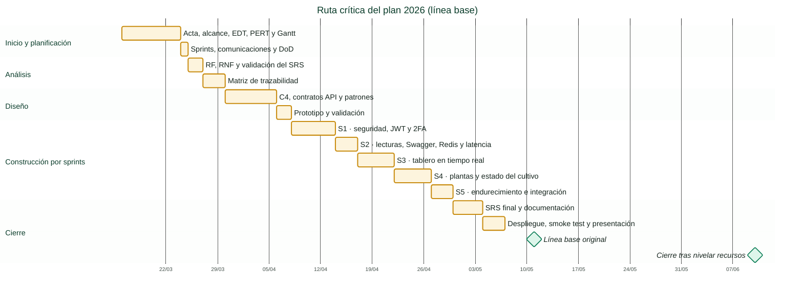
```mermaid
%%{init: {"theme": "base", "fontFamily": "Segoe UI, Arial, sans-serif", "themeVariables": {"fontFamily": "Segoe UI, Arial, sans-serif", "fontSize": "15px", "primaryColor": "#DDF5EA", "primaryTextColor": "#17261F", "primaryBorderColor": "#067A52", "secondaryColor": "#E3F2FB", "secondaryTextColor": "#17261F", "secondaryBorderColor": "#1F6FA0", "tertiaryColor": "#F2F7F4", "tertiaryTextColor": "#17261F", "tertiaryBorderColor": "#D5E3DC", "lineColor": "#5B6B63", "textColor": "#17261F", "mainBkg": "#DDF5EA", "nodeBorder": "#067A52", "clusterBkg": "#F7FAF8", "clusterBorder": "#D5E3DC", "edgeLabelBackground": "#FFFFFF", "actorBkg": "#067A52", "actorBorder": "#0B3D2B", "actorTextColor": "#FFFFFF", "actorLineColor": "#5B6B63", "signalColor": "#17261F", "signalTextColor": "#17261F", "labelBoxBkgColor": "#0B3D2B", "labelBoxBorderColor": "#0B3D2B", "labelTextColor": "#FFFFFF", "loopTextColor": "#0B3D2B", "noteBkgColor": "#FDF4DD", "noteBorderColor": "#C98D12", "noteTextColor": "#17261F", "activationBkgColor": "#DDF5EA", "activationBorderColor": "#067A52", "attributeBackgroundColorOdd": "#FFFFFF", "attributeBackgroundColorEven": "#F2F7F4", "taskBkgColor": "#DDF5EA", "taskBorderColor": "#067A52", "taskTextColor": "#17261F", "taskTextDarkColor": "#17261F", "taskTextLightColor": "#17261F", "taskTextOutsideColor": "#17261F", "activeTaskBkgColor": "#E3F2FB", "activeTaskBorderColor": "#1F6FA0", "critBkgColor": "#FDF4DD", "critBorderColor": "#C98D12", "doneTaskBkgColor": "#F2F7F4", "doneTaskBorderColor": "#5B6B63", "sectionBkgColor": "#F2F7F4", "altSectionBkgColor": "#FFFFFF", "sectionBkgColor2": "#EEFAF4", "gridColor": "#D5E3DC", "todayLineColor": "#D64545", "titleColor": "#0B3D2B"}, "gantt": {"barHeight": 26, "fontSize": 14, "sectionFontSize": 14, "leftPadding": 230, "useWidth": 1500}}}%%
gantt
  title Ruta crítica del plan 2026 (línea base)
  dateFormat YYYY-MM-DD
  axisFormat %d/%m
  section Inicio y planificación
  Acta, alcance, EDT, PERT y Gantt :crit, p1, 2026-03-16, 2026-03-24
  Sprints, comunicaciones y DoD :crit, p2, 2026-03-24, 2026-03-25
  section Análisis
  RF, RNF y validación del SRS :crit, a1, 2026-03-25, 2026-03-27
  Matriz de trazabilidad :crit, a2, 2026-03-27, 2026-03-30
  section Diseño
  C4, contratos API y patrones :crit, d1, 2026-03-30, 2026-04-06
  Prototipo y validación :crit, d2, 2026-04-06, 2026-04-08
  section Construcción por sprints
  S1 · seguridad, JWT y 2FA :crit, s1, 2026-04-08, 2026-04-14
  S2 · lecturas, Swagger, Redis y latencia :crit, s2, 2026-04-14, 2026-04-17
  S3 · tablero en tiempo real :crit, s3, 2026-04-17, 2026-04-22
  S4 · plantas y estado del cultivo :crit, s4, 2026-04-22, 2026-04-27
  S5 · endurecimiento e integración :crit, s5, 2026-04-27, 2026-04-30
  section Cierre
  SRS final y documentación :crit, c1, 2026-04-30, 2026-05-04
  Despliegue, smoke test y presentación :crit, c2, 2026-05-04, 2026-05-07
  Línea base original :milestone, m1, 2026-05-11, 0d
  Cierre tras nivelar recursos :milestone, m2, 2026-06-10, 0d
```

| Versión del plan | Fin del proyecto | Observación |
| --- | --- | --- |
| Formulación | Diciembre (un semestre) | Cuatro fases mensuales |
| Hitos del acta | 24 de julio de 2026 | Ocho hitos entre el 16 de marzo y el 24 de julio |
| Línea base en MS Project | 11 de mayo de 2026 | Tareas de uno a dos días y sprints de tres a cinco días |
| Plan nivelado | 10 de junio de 2026 | 56,06 días de duración tras eliminar sobreasignaciones |

> [!WARNING]
> **Lectura crítica.** El mismo alcance tuvo tres fechas de fin distintas. La línea base comprimió el plan del acta: terminaba dos meses y medio antes del último hito, con sprints de menos de una semana aunque el acta fijaba dos, y con actividades como «implementar la autenticación en dos pasos» en un día. Además, el informe de tareas críticas muestra todas las actividades al 0 % y en estado «retrasada»: el avance nunca se registró, así que el cronograma no podía avisar de ningún desvío. La lección práctica fue reemplazar el porcentaje declarado por evidencia automática: pruebas y QA en verde por cambio, y despliegues trazables.

## 13. Recursos, asignación y nivelación

| Tipo | Recursos | Criterio de costo |
| --- | --- | --- |
| Personas (4) | Gerente de proyecto, desarrollador *full stack* 1, desarrollador *full stack* 2, analista y *tester* | Tasa estándar por hora |
| Equipos (4) | Un computador por persona | Costo cero: equipos propios |
| Plataformas (3) | IoT y simulación; backend y base de datos; frontend y despliegue web | Costo total; solo backend y base de datos con 20 USD de contingencia |
| Herramientas (2) | Repositorio e integración continua; desarrollo y pruebas | Costo cero: gratuitas |

| Tipo de actividad | Recurso base | Recursos adicionales |
| --- | --- | --- |
| Gestión, alcance, riesgos, comunicaciones y cierre | Gerente con su equipo | Repositorio o herramientas solo si la tarea las usa |
| Requisitos, trazabilidad, validación y pruebas | Analista con su equipo | Herramientas de pruebas y plataformas involucradas |
| Diseño técnico, backend, seguridad y API | Desarrollador 1 | Backend y base de datos, simulación, repositorio |
| Frontend, tablero e interfaz | Desarrollador 2 | Frontend y despliegue web |
| Simulación IoT e integración con el ESP32 virtual | Desarrollador 1 | Simulación y backend |

La nivelación fue manual: se movieron horas entre días cercanos hasta que ninguna persona superara 8 horas por jornada, sin sumar recursos que el equipo no tenía. El cierre pasó al 10 de junio de 2026.

| Trabajo del informe | Proceso del PMBOK (6.ª edición) |
| --- | --- |
| Ruta crítica | 6.5 Desarrollar el cronograma |
| Hoja de recursos | 9.3 Adquirir los recursos (el informe lo rotuló 9.2) |
| Asignación a actividades | 9.2 Estimar los recursos de las actividades |
| Eliminación de sobreasignaciones | 9.6 Controlar los recursos, 6.6 Controlar el cronograma y 4.6 Control integrado de cambios |

> [!TIP]
> **Lectura crítica.** El informe de gestión es el mejor razonado de los documentos: explica qué se hizo, cómo y por qué, y acepta que alargar el plazo era más honesto que sostener cargas imposibles. Queda una deuda: el presupuesto del acta dedica la mitad al tiempo del equipo, pero el informe no reporta la línea base de costo que resultó de las tarifas. Cerrar ese círculo permite comparar el costo planeado con el valor ganado.

## 14. Riesgos

<!-- diagrama: SmartPot_25_Risk_Outcomes | titulo=Riesgos del acta y su desenlace -->
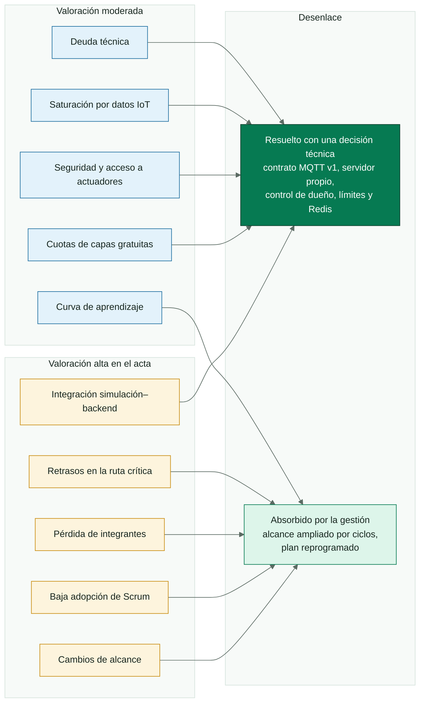
```mermaid
%%{init: {"theme": "base", "fontFamily": "Segoe UI, Arial, sans-serif", "themeVariables": {"fontFamily": "Segoe UI, Arial, sans-serif", "fontSize": "15px", "primaryColor": "#DDF5EA", "primaryTextColor": "#17261F", "primaryBorderColor": "#067A52", "secondaryColor": "#E3F2FB", "secondaryTextColor": "#17261F", "secondaryBorderColor": "#1F6FA0", "tertiaryColor": "#F2F7F4", "tertiaryTextColor": "#17261F", "tertiaryBorderColor": "#D5E3DC", "lineColor": "#5B6B63", "textColor": "#17261F", "mainBkg": "#DDF5EA", "nodeBorder": "#067A52", "clusterBkg": "#F7FAF8", "clusterBorder": "#D5E3DC", "edgeLabelBackground": "#FFFFFF", "actorBkg": "#067A52", "actorBorder": "#0B3D2B", "actorTextColor": "#FFFFFF", "actorLineColor": "#5B6B63", "signalColor": "#17261F", "signalTextColor": "#17261F", "labelBoxBkgColor": "#0B3D2B", "labelBoxBorderColor": "#0B3D2B", "labelTextColor": "#FFFFFF", "loopTextColor": "#0B3D2B", "noteBkgColor": "#FDF4DD", "noteBorderColor": "#C98D12", "noteTextColor": "#17261F", "activationBkgColor": "#DDF5EA", "activationBorderColor": "#067A52", "attributeBackgroundColorOdd": "#FFFFFF", "attributeBackgroundColorEven": "#F2F7F4"}}}%%
flowchart LR
  subgraph altos["Valoración alta en el acta"]
    r1["Integración simulación–backend"]
    r2["Cambios de alcance"]
    r3["Baja adopción de Scrum"]
    r4["Pérdida de integrantes"]
    r5["Retrasos en la ruta crítica"]
  end
  subgraph moderados["Valoración moderada"]
    r6["Curva de aprendizaje"]
    r7["Deuda técnica"]
    r8["Cuotas de capas gratuitas"]
    r9["Seguridad y acceso a actuadores"]
    r10["Saturación por datos IoT"]
  end
  subgraph desenlace["Desenlace"]
    ok["Resuelto con una decisión técnica<br/>contrato MQTT v1, servidor propio,<br/>control de dueño, límites y Redis"]
    parcial["Absorbido por la gestión<br/>alcance ampliado por ciclos,<br/>plan reprogramado"]
  end
  r1 & r8 & r9 & r10 & r7 --> ok
  r2 & r3 & r4 & r5 & r6 --> parcial
  classDef leaf fill:#DDF5EA,stroke:#067A52,color:#17261F
  classDef water fill:#E3F2FB,stroke:#1F6FA0,color:#17261F
  classDef sun fill:#FDF4DD,stroke:#C98D12,color:#17261F
  classDef clay fill:#FBE9E1,stroke:#B85A38,color:#17261F
  classDef core fill:#067A52,stroke:#0B3D2B,color:#FFFFFF
  classDef deep fill:#0B3D2B,stroke:#06281C,color:#FFFFFF
  classDef muted fill:#F2F7F4,stroke:#5B6B63,color:#17261F
  class r1,r2,r3,r4,r5 sun
  class r6,r7,r8,r9,r10 water
  class ok core
  class parcial leaf
```

El desenlace de cada riesgo del acta está en el [recorrido del proyecto](SmartPot_Project_Journey.md). Aquí interesa lo que el registro **no** vio:

| Riesgo no identificado | Cómo apareció | Respuesta |
| --- | --- | --- |
| Configuración que rompe producción | Tras cambiar el prefijo a `/api/v1`, las rutas públicas quedaron con el prefijo viejo y todo respondía 401 | Pruebas de controladores con la cadena de seguridad real y un E2E que se registra e ingresa en cada cambio |
| Servicios expuestos | Base de datos, caché, correo y API publicados en todas las interfaces | Redes internas de Docker, UFW cerrado y solo Nginx expuesto |
| Acceso a cultivos ajenos | Rutas sin control de dueño | Control de dueño en cada servicio y pruebas que lo verifican |
| Dependencia de una persona | Tres de cada cuatro commits humanos de una sola persona | Documentación completa, demo reproducible y convenciones iguales en todos los repositorios |
| Datos personales en documentos | Documentos de trabajo con datos de identificación | La documentación publicada no los incluye |

> [!NOTE]
> **Lectura crítica.** El registro de riesgos miraba al equipo y al calendario; los riesgos que de verdad se materializaron fueron de configuración y seguridad. Un registro vivo, revisado al final de cada ciclo, los habría anticipado.

## 15. Metodología, comunicaciones y control de cambios

El acta adoptó Scrum con sprints de dos semanas, backlog priorizado por el Product Owner, demos ante el docente y retrospectivas.

<!-- diagrama: SmartPot_24_Scrum_Cycle | titulo=Ciclo Scrum planeado -->
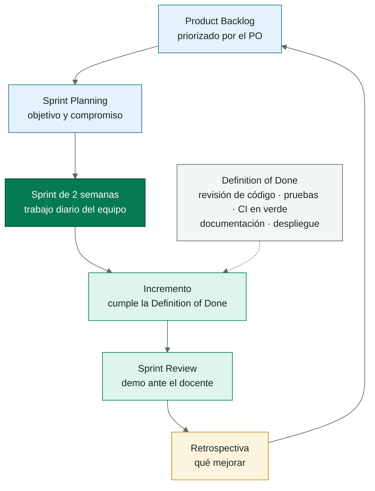
```mermaid
%%{init: {"theme": "base", "fontFamily": "Segoe UI, Arial, sans-serif", "themeVariables": {"fontFamily": "Segoe UI, Arial, sans-serif", "fontSize": "15px", "primaryColor": "#DDF5EA", "primaryTextColor": "#17261F", "primaryBorderColor": "#067A52", "secondaryColor": "#E3F2FB", "secondaryTextColor": "#17261F", "secondaryBorderColor": "#1F6FA0", "tertiaryColor": "#F2F7F4", "tertiaryTextColor": "#17261F", "tertiaryBorderColor": "#D5E3DC", "lineColor": "#5B6B63", "textColor": "#17261F", "mainBkg": "#DDF5EA", "nodeBorder": "#067A52", "clusterBkg": "#F7FAF8", "clusterBorder": "#D5E3DC", "edgeLabelBackground": "#FFFFFF", "actorBkg": "#067A52", "actorBorder": "#0B3D2B", "actorTextColor": "#FFFFFF", "actorLineColor": "#5B6B63", "signalColor": "#17261F", "signalTextColor": "#17261F", "labelBoxBkgColor": "#0B3D2B", "labelBoxBorderColor": "#0B3D2B", "labelTextColor": "#FFFFFF", "loopTextColor": "#0B3D2B", "noteBkgColor": "#FDF4DD", "noteBorderColor": "#C98D12", "noteTextColor": "#17261F", "activationBkgColor": "#DDF5EA", "activationBorderColor": "#067A52", "attributeBackgroundColorOdd": "#FFFFFF", "attributeBackgroundColorEven": "#F2F7F4"}}}%%
flowchart TB
  backlog["Product Backlog<br/>priorizado por el PO"] --> planning["Sprint Planning<br/>objetivo y compromiso"]
  planning --> sprint["Sprint de 2 semanas<br/>trabajo diario del equipo"]
  sprint --> incremento["Incremento<br/>cumple la Definition of Done"]
  incremento --> review["Sprint Review<br/>demo ante el docente"]
  review --> retro["Retrospectiva<br/>qué mejorar"]
  retro --> backlog
  dod["Definition of Done<br/>revisión de código · pruebas · CI en verde<br/>documentación · despliegue"] -.-> incremento
  classDef leaf fill:#DDF5EA,stroke:#067A52,color:#17261F
  classDef water fill:#E3F2FB,stroke:#1F6FA0,color:#17261F
  classDef sun fill:#FDF4DD,stroke:#C98D12,color:#17261F
  classDef clay fill:#FBE9E1,stroke:#B85A38,color:#17261F
  classDef core fill:#067A52,stroke:#0B3D2B,color:#FFFFFF
  classDef deep fill:#0B3D2B,stroke:#06281C,color:#FFFFFF
  classDef muted fill:#F2F7F4,stroke:#5B6B63,color:#17261F
  class backlog,planning water
  class sprint core
  class incremento,review leaf
  class retro sun
  class dod muted
```

| Práctica | Planeada | Cómo se trabajó |
| --- | --- | --- |
| Iteración | Cinco sprints de dos semanas | Ciclos de mejora con diagnóstico, backlog y criterios de aceptación (parte VII) |
| Definition of Done | Revisión de código, cobertura mínima y demo | Código con sus pruebas, CI del repositorio en verde, QA de extremo a extremo en verde, documentación al día y despliegue desde GHCR con `/health` en UP |
| Comunicaciones | Canales, frecuencia y demos | Commits pequeños en inglés con un solo propósito, READMEs por repositorio y estos documentos |
| Control de cambios | Proceso formal y backlog congelado por sprint | Cada ciclo abre un alcance nuevo; el contrato MQTT versionado (`v1`) protege a los dispositivos de los cambios |
| Métricas | Velocidad y *burndown* | Pruebas, estado del QA y despliegues por ciclo (sección 38) |

> [!IMPORTANT]
> **Lectura crítica.** Scrum se planeó completo pero no se ejecutó como tal: con una persona haciendo la mayor parte del trabajo, las ceremonias pierden sentido. Lo que sí funcionó fue su esencia: iteraciones cortas, un incremento desplegable al final de cada una y una definición de terminado automatizada. Para un equipo pequeño, un tablero Kanban con límites de trabajo en curso y la misma definición de terminado es más honesto que un Scrum nominal.

<!-- parte: PARTE III | Análisis -->

## 16. De la necesidad al requisito

Los requisitos tuvieron tres versiones:

| Versión | Fecha | Contenido |
| --- | --- | --- |
| Matriz de requisitos | Agosto de 2024 | Requisitos no funcionales RNF001 a RNF007 en versión 0.1, todos «sin empezar»; el contrato de la API era el RNF007 |
| Acta de constitución | Marzo de 2026 | RF-001 a RF-017 y RNF-001 a RNF-006; el contrato de la API pasó a ser el RF-015 |
| Plataforma | Septiembre de 2026 | 13 requisitos funcionales cumplidos, 3 parciales y 1 replanteado; 4 no funcionales cumplidos y 2 pendientes |

El estado de cada requisito está en el [recorrido del proyecto](SmartPot_Project_Journey.md). Esta sección revisa su **calidad** con las características de un buen requisito (necesario, sin ambigüedad, verificable y completo).

| Requisito | Problema | Reescritura verificable |
| --- | --- | --- |
| RF-002 Calibrar sensores | La descripción quedó cortada a mitad de frase | El sistema permite ajustar la escala de cada sensor de un cultivo y registra quién la cambió |
| RF-009, RF-012, RF-013 y RF-014 | Usan «podrá» o «permitirá» junto a otros con «debe»: no queda claro si son obligatorios | Todos con «debe» y una prioridad MoSCoW explícita |
| RF-014 Gestión de nutrientes | «De manera efectiva» no se puede probar | El sistema bloquea la dosificación de nutrientes cuando el TDS supera el máximo de la especie |
| RF-017 Estado general | Tres niveles fijos | Índice de 0 a 100 con cinco niveles y el aporte de cada variable (implementado así) |
| RNF-001 Doble verificación | Se justificaba con ISO/IEC 25000, que es un marco de calidad y no exige 2FA | La cuenta admite un segundo factor por aplicación de autenticación; motivo: la característica de seguridad de ISO/IEC 25010 |
| RNF-002 Paleta | «Un diseño llamativo que garantice la permanencia» no se puede verificar | Los textos cumplen contraste WCAG AA y las series de las gráficas son distinguibles con daltonismo (lo segundo ya se valida) |
| RNF-003 Tiempo real | En la matriz de 2024 hablaba de «canciones guardadas»: un error de copia de otro proyecto | La PWA muestra una lectura nueva en menos de 30 s desde que el dispositivo la publica |
| RNF-005 Navegación clara | «Entendible para todas las edades» no es medible | Toda función principal está a dos toques o menos desde el panel |

> [!WARNING]
> **Lectura crítica.** Faltaron requisitos no funcionales que la plataforma tuvo que resolver igual: disponibilidad, rendimiento (la latencia de 500 ms solo aparecía en los criterios de aprobación), privacidad y retención de datos, observabilidad y mantenibilidad. Hoy existen como decisiones de construcción (retención de un año, límites de peticiones, `/health` por servicio, CI en todos los repositorios) y conviene elevarlos a requisitos para poder probarlos.

## 17. Casos de uso

<!-- diagrama: SmartPot_10_Use_Cases | titulo=Casos de uso de SmartPot -->
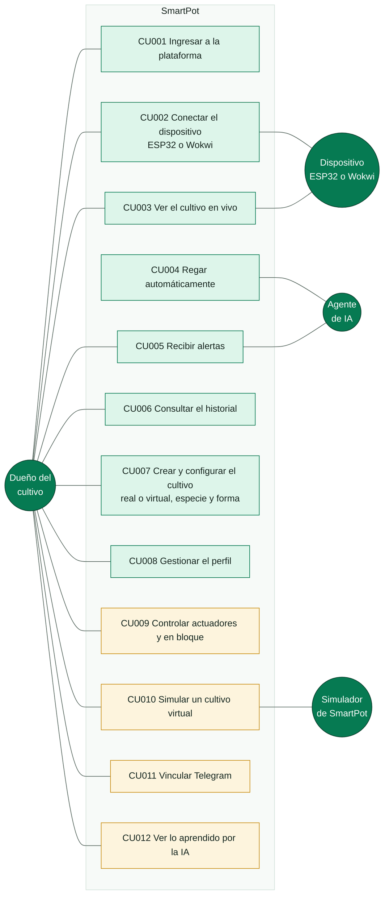
```mermaid
%%{init: {"theme": "base", "fontFamily": "Segoe UI, Arial, sans-serif", "themeVariables": {"fontFamily": "Segoe UI, Arial, sans-serif", "fontSize": "15px", "primaryColor": "#DDF5EA", "primaryTextColor": "#17261F", "primaryBorderColor": "#067A52", "secondaryColor": "#E3F2FB", "secondaryTextColor": "#17261F", "secondaryBorderColor": "#1F6FA0", "tertiaryColor": "#F2F7F4", "tertiaryTextColor": "#17261F", "tertiaryBorderColor": "#D5E3DC", "lineColor": "#5B6B63", "textColor": "#17261F", "mainBkg": "#DDF5EA", "nodeBorder": "#067A52", "clusterBkg": "#F7FAF8", "clusterBorder": "#D5E3DC", "edgeLabelBackground": "#FFFFFF", "actorBkg": "#067A52", "actorBorder": "#0B3D2B", "actorTextColor": "#FFFFFF", "actorLineColor": "#5B6B63", "signalColor": "#17261F", "signalTextColor": "#17261F", "labelBoxBkgColor": "#0B3D2B", "labelBoxBorderColor": "#0B3D2B", "labelTextColor": "#FFFFFF", "loopTextColor": "#0B3D2B", "noteBkgColor": "#FDF4DD", "noteBorderColor": "#C98D12", "noteTextColor": "#17261F", "activationBkgColor": "#DDF5EA", "activationBorderColor": "#067A52", "attributeBackgroundColorOdd": "#FFFFFF", "attributeBackgroundColorEven": "#F2F7F4"}}}%%
flowchart LR
  persona(("Dueño del<br/>cultivo"))
  subgraph sistema["SmartPot"]
    direction TB
    cu1["CU001 Ingresar a la plataforma"]
    cu2["CU002 Conectar el dispositivo<br/>ESP32 o Wokwi"]
    cu3["CU003 Ver el cultivo en vivo"]
    cu4["CU004 Regar automáticamente"]
    cu5["CU005 Recibir alertas"]
    cu6["CU006 Consultar el historial"]
    cu7["CU007 Crear y configurar el cultivo<br/>real o virtual, especie y forma"]
    cu8["CU008 Gestionar el perfil"]
    cu9["CU009 Controlar actuadores y en bloque"]
    cu10["CU010 Simular un cultivo virtual"]
    cu11["CU011 Vincular Telegram"]
    cu12["CU012 Ver lo aprendido por la IA"]
  end
  maceta(("Dispositivo<br/>ESP32 o Wokwi"))
  simulador(("Simulador<br/>de SmartPot"))
  agente(("Agente<br/>de IA"))
  persona --- cu1
  persona --- cu2
  persona --- cu3
  persona --- cu5
  persona --- cu6
  persona --- cu7
  persona --- cu8
  persona --- cu9
  persona --- cu10
  persona --- cu11
  persona --- cu12
  cu2 --- maceta
  cu3 --- maceta
  cu10 --- simulador
  cu4 --- agente
  cu5 --- agente
  classDef actor fill:#067A52,stroke:#0B3D2B,color:#FFFFFF
  classDef base fill:#DDF5EA,stroke:#067A52,color:#17261F
  classDef nuevo fill:#FDF4DD,stroke:#C98D12,color:#17261F
  class persona,maceta,simulador,agente actor
  class cu1,cu2,cu3,cu4,cu5,cu6,cu7,cu8 base
  class cu9,cu10,cu11,cu12 nuevo
```

Los ocho casos de uso del diseño se conservan y la construcción sumó cuatro: controlar en bloque, simular un cultivo virtual, vincular Telegram y ver lo aprendido por la IA. El cambio de fondo es un actor nuevo: el **agente de IA** aparece como actor secundario de «regar automáticamente» y «recibir alertas». En el diseño la maceta decidía; en la plataforma decide un agente que la persona activa y puede auditar.

## 18. Trazabilidad

El acta pedía una matriz de trazabilidad de requisito a módulo y a caso de prueba. Esta es la matriz con la plataforma actual:

| Requisito | Caso de uso | Dónde vive | Cómo se prueba |
| --- | --- | --- | --- |
| RF-001 Acceder | CU001 | API `security` y `users`; PWA de ingreso | E2E: registro, ingreso y rechazo sin sesión |
| RF-002 Calibrar sensores | CU002 | Firmware `ADCSensor`; PWA del dispositivo | Pruebas del firmware |
| RF-003 Estado de las plantas | CU003 | API `overview` y `crops`; IA de salud | E2E: panel general |
| RF-004 Riego automático | CU004 | API `ai` (agente de automatización); IA del agente | Pruebas del agente y de sus reglas |
| RF-005 Alertas | CU005 | API `notifications` y `channels` | Pruebas de notificaciones y del reenvío a Telegram |
| RF-006 Historial | CU006 | API `readings`; PWA de historial y CSV | E2E: series agregadas |
| RF-007 Registrar lecturas | CU003 | API `mqtt` y `readings`, con retención de un año | E2E: lectura publicada por MQTT |
| RF-008 Configurar parámetros | CU007 | Base de conocimiento de la IA | Pruebas de los perfiles por especie |
| RF-009 Control de luz | CU004 | Reglas del agente con descanso nocturno | Pruebas de reglas |
| RF-010 Control manual | CU009 | API `commands` y `actuators` | E2E: comando con ACK y orden en bloque |
| RF-011 Perfil | CU008 | API `users` y `channels` | Pruebas de controladores |
| RF-012 Reportes | CU006, CU012 | Resumen, CSV, análisis de flota y aprendizaje | Pruebas de la IA; E2E de aprendizaje |
| RF-013 Gestión de plantas | CU007 | API `crops` y `actuators` | Pruebas de controladores |
| RF-014 Nutrientes | CU009 | Dosificadores y regla de bloqueo de nutrientes | Pruebas de reglas |
| RF-015 Conectar con la API | CU002 | Contrato MQTT v1 y OpenAPI en `/docs` | Pruebas de contrato y E2E |
| RF-016 Gráficos históricos | CU006 | PWA: gráfico con banda ideal y comparador | Pruebas de componentes |
| RF-017 Estado general | CU003 | IA: índice difuso de salud | Pruebas de la IA |

## 19. Reglas de negocio y base de conocimiento

| Regla | Valor | Por qué |
| --- | --- | --- |
| Frecuencia máxima de lecturas | Una cada 5 s por cultivo | Proteger la base de datos y la API de un dispositivo mal configurado |
| Retención de lecturas | Un año | Historial útil sin crecimiento indefinido |
| Evaluación del agente | Cada 5 minutos, con las últimas 48 lecturas | Suficiente para ver tendencias sin saturar la IA |
| Enfriamiento por actuador | 10 minutos | Evitar que el agente encienda y apague en ciclo |
| Vencimiento de un comando | 2 minutos sin confirmación | Avisar a la persona si el dispositivo no responde |
| Sensor sospechoso | El agente no actúa | Ante un valor imposible es más seguro no regar |
| Límite de peticiones | 300 por minuto; 10 por minuto en autenticación | Frenar abuso y fuerza bruta |
| Recuperación de contraseña | Enlace de un solo uso que vence en 30 minutos | No enviar credenciales por correo |
| Cultivos virtuales | Hasta 5 por cuenta; real o virtual no cambia tras crearlo | Mantener acotado el simulador compartido |
| Descanso nocturno de la luz | De 22:00 a 6:00, hora de Colombia | Respetar el fotoperiodo |

La base de conocimiento nació de la investigación temática del diseño (lechuga y tomate) y hoy cubre seis especies: lechuga, tomate, fresa, albahaca, espinaca y pimentón. El detalle de sus rangos está en el [recorrido del proyecto](SmartPot_Project_Journey.md) y en la [documentación técnica](SmartPot_Technical_Documentation.md).

<!-- parte: PARTE IV | Diseño -->

## 20. Arquitectura

### 20.1 Contexto

<!-- diagrama: SmartPot_26_C4_Context | titulo=Contexto del sistema -->
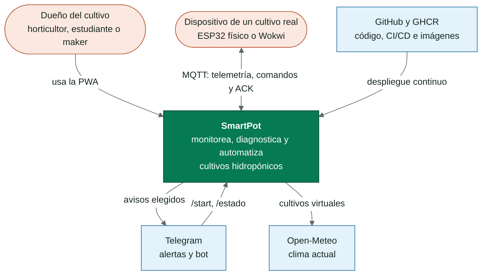
```mermaid
%%{init: {"theme": "base", "fontFamily": "Segoe UI, Arial, sans-serif", "themeVariables": {"fontFamily": "Segoe UI, Arial, sans-serif", "fontSize": "15px", "primaryColor": "#DDF5EA", "primaryTextColor": "#17261F", "primaryBorderColor": "#067A52", "secondaryColor": "#E3F2FB", "secondaryTextColor": "#17261F", "secondaryBorderColor": "#1F6FA0", "tertiaryColor": "#F2F7F4", "tertiaryTextColor": "#17261F", "tertiaryBorderColor": "#D5E3DC", "lineColor": "#5B6B63", "textColor": "#17261F", "mainBkg": "#DDF5EA", "nodeBorder": "#067A52", "clusterBkg": "#F7FAF8", "clusterBorder": "#D5E3DC", "edgeLabelBackground": "#FFFFFF", "actorBkg": "#067A52", "actorBorder": "#0B3D2B", "actorTextColor": "#FFFFFF", "actorLineColor": "#5B6B63", "signalColor": "#17261F", "signalTextColor": "#17261F", "labelBoxBkgColor": "#0B3D2B", "labelBoxBorderColor": "#0B3D2B", "labelTextColor": "#FFFFFF", "loopTextColor": "#0B3D2B", "noteBkgColor": "#FDF4DD", "noteBorderColor": "#C98D12", "noteTextColor": "#17261F", "activationBkgColor": "#DDF5EA", "activationBorderColor": "#067A52", "attributeBackgroundColorOdd": "#FFFFFF", "attributeBackgroundColorEven": "#F2F7F4"}}}%%
flowchart TB
  persona(["Dueño del cultivo<br/>horticultor, estudiante o maker"])
  smartpot["<b>SmartPot</b><br/>monitorea, diagnostica y automatiza<br/>cultivos hidropónicos"]
  maceta(["Dispositivo de un cultivo real<br/>ESP32 físico o Wokwi"])
  telegram["Telegram<br/>alertas y bot"]
  clima["Open-Meteo<br/>clima actual"]
  github["GitHub y GHCR<br/>código, CI/CD e imágenes"]
  persona -->|"usa la PWA"| smartpot
  maceta <-->|"MQTT: telemetría, comandos y ACK"| smartpot
  smartpot -->|"avisos elegidos"| telegram
  telegram -->|"/start, /estado"| smartpot
  smartpot -->|"cultivos virtuales"| clima
  github -->|"despliegue continuo"| smartpot
  classDef leaf fill:#DDF5EA,stroke:#067A52,color:#17261F
  classDef water fill:#E3F2FB,stroke:#1F6FA0,color:#17261F
  classDef sun fill:#FDF4DD,stroke:#C98D12,color:#17261F
  classDef clay fill:#FBE9E1,stroke:#B85A38,color:#17261F
  classDef core fill:#067A52,stroke:#0B3D2B,color:#FFFFFF
  classDef deep fill:#0B3D2B,stroke:#06281C,color:#FFFFFF
  classDef muted fill:#F2F7F4,stroke:#5B6B63,color:#17261F
  class persona,maceta clay
  class smartpot core
  class telegram,clima,github water
```

### 20.2 Contenedores

<!-- diagrama: SmartPot_01_Architecture | titulo=Arquitectura general de SmartPot -->
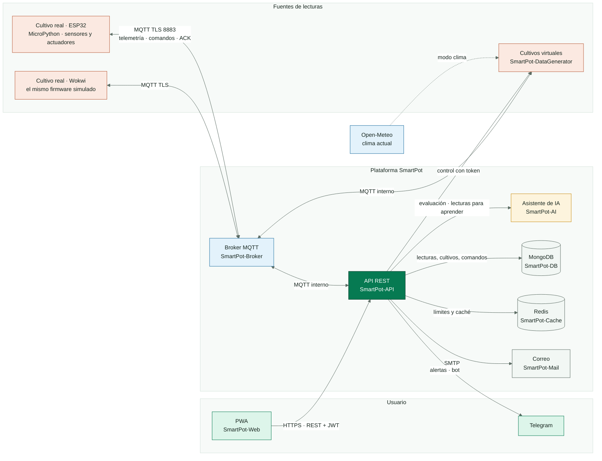
```mermaid
%%{init: {"theme": "base", "fontFamily": "Segoe UI, Arial, sans-serif", "themeVariables": {"fontFamily": "Segoe UI, Arial, sans-serif", "fontSize": "15px", "primaryColor": "#DDF5EA", "primaryTextColor": "#17261F", "primaryBorderColor": "#067A52", "secondaryColor": "#E3F2FB", "secondaryTextColor": "#17261F", "secondaryBorderColor": "#1F6FA0", "tertiaryColor": "#F2F7F4", "tertiaryTextColor": "#17261F", "tertiaryBorderColor": "#D5E3DC", "lineColor": "#5B6B63", "textColor": "#17261F", "mainBkg": "#DDF5EA", "nodeBorder": "#067A52", "clusterBkg": "#F7FAF8", "clusterBorder": "#D5E3DC", "edgeLabelBackground": "#FFFFFF", "actorBkg": "#067A52", "actorBorder": "#0B3D2B", "actorTextColor": "#FFFFFF", "actorLineColor": "#5B6B63", "signalColor": "#17261F", "signalTextColor": "#17261F", "labelBoxBkgColor": "#0B3D2B", "labelBoxBorderColor": "#0B3D2B", "labelTextColor": "#FFFFFF", "loopTextColor": "#0B3D2B", "noteBkgColor": "#FDF4DD", "noteBorderColor": "#C98D12", "noteTextColor": "#17261F", "activationBkgColor": "#DDF5EA", "activationBorderColor": "#067A52", "attributeBackgroundColorOdd": "#FFFFFF", "attributeBackgroundColorEven": "#F2F7F4"}}}%%
flowchart LR
  subgraph campo["Fuentes de lecturas"]
    maceta["Cultivo real · ESP32<br/>MicroPython · sensores y actuadores"]
    wokwi["Cultivo real · Wokwi<br/>el mismo firmware simulado"]
    sim["Cultivos virtuales<br/>SmartPot-DataGenerator"]
  end
  subgraph usuario["Usuario"]
    pwa["PWA<br/>SmartPot-Web"]
    tg["Telegram"]
  end
  subgraph plataforma["Plataforma SmartPot"]
    broker["Broker MQTT<br/>SmartPot-Broker"]
    api["API REST<br/>SmartPot-API"]
    ai["Asistente de IA<br/>SmartPot-AI"]
    db[("MongoDB<br/>SmartPot-DB")]
    cache[("Redis<br/>SmartPot-Cache")]
    mail["Correo<br/>SmartPot-Mail"]
  end
  clima["Open-Meteo<br/>clima actual"]
  maceta <-->|"MQTT TLS 8883<br/>telemetría · comandos · ACK"| broker
  wokwi <-->|"MQTT TLS"| broker
  sim <-->|"MQTT interno"| broker
  clima -.->|"modo clima"| sim
  broker <-->|"MQTT interno"| api
  pwa -->|"HTTPS · REST + JWT"| api
  api -->|"control con token"| sim
  api -->|"evaluación · lecturas para aprender"| ai
  api -->|"lecturas, cultivos, comandos"| db
  api -->|"límites y caché"| cache
  api -->|"SMTP"| mail
  api -->|"alertas · bot"| tg
  classDef device fill:#FBE9E1,stroke:#B85A38,color:#17261F
  classDef edge fill:#E3F2FB,stroke:#1F6FA0,color:#17261F
  classDef core fill:#067A52,stroke:#0B3D2B,color:#FFFFFF
  classDef data fill:#F2F7F4,stroke:#5B6B63,color:#17261F
  classDef brain fill:#FDF4DD,stroke:#C98D12,color:#17261F
  classDef app fill:#DDF5EA,stroke:#067A52,color:#17261F
  class maceta,wokwi,sim device
  class broker,clima edge
  class api core
  class db,cache,mail data
  class ai brain
  class pwa,tg app
```

### 20.3 Decisiones de arquitectura

| Decisión | Alternativa descartada | Por qué | Consecuencia |
| --- | --- | --- | --- |
| MQTT v1 entre dispositivo y plataforma | Consulta periódica por HTTP | Conexión liviana, bidireccional y con estado en línea (última voluntad) | Un broker más que operar y asegurar |
| MongoDB con validadores | H2 o MySQL con JPA | Lecturas con variables opcionales y consultas por cultivo y fecha | La integridad se protege con `$jsonSchema` e índices |
| IA como servicio aparte en Python | Reglas dentro de la API en Java | El ecosistema de ciencia de datos está en Python | Contrato HTTP interno con token entre API e IA |
| El agente decide en la plataforma | El dispositivo decide solo | Un dispositivo barato se beneficia de todo lo aprendido | Sin conexión, el dispositivo solo mide y muestra en su pantalla |
| Simulador como servicio | Solo Wokwi | Demo y QA que no dependen de una pestaña abierta | Un contenedor más, interno y con token |
| Servidor propio con Docker | Capas gratuitas en la nube | Sin cuotas y con control total de la seguridad | La operación queda en manos del equipo |
| PWA | Aplicación móvil nativa | Un solo código para teléfono y escritorio | Sin acceso a funciones nativas avanzadas, que no se necesitan |
| Telegram en la API | Bot dentro del ESP32 | Permisos y datos de cada cuenta en un solo lugar | El dispositivo no conoce ningún canal |
| Despliegue central | Cada repositorio despliega | Un solo lugar con acceso al servidor | Los servicios piden el despliegue y el central lo encola |

## 21. Del diseño original al actual

Los diagramas de la fase de diseño describían otra aplicación. Ponerlos lado a lado muestra qué ideas sobrevivieron y cuáles se movieron de lugar.

### 21.1 Clases

<!-- diagrama: SmartPot_27_Original_Classes | titulo=Clases del diseño original -->
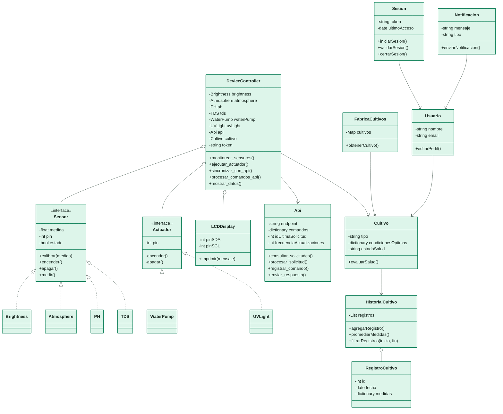
```mermaid
%%{init: {"theme": "base", "fontFamily": "Segoe UI, Arial, sans-serif", "themeVariables": {"fontFamily": "Segoe UI, Arial, sans-serif", "fontSize": "15px", "primaryColor": "#DDF5EA", "primaryTextColor": "#17261F", "primaryBorderColor": "#067A52", "secondaryColor": "#E3F2FB", "secondaryTextColor": "#17261F", "secondaryBorderColor": "#1F6FA0", "tertiaryColor": "#F2F7F4", "tertiaryTextColor": "#17261F", "tertiaryBorderColor": "#D5E3DC", "lineColor": "#5B6B63", "textColor": "#17261F", "mainBkg": "#DDF5EA", "nodeBorder": "#067A52", "clusterBkg": "#F7FAF8", "clusterBorder": "#D5E3DC", "edgeLabelBackground": "#FFFFFF", "actorBkg": "#067A52", "actorBorder": "#0B3D2B", "actorTextColor": "#FFFFFF", "actorLineColor": "#5B6B63", "signalColor": "#17261F", "signalTextColor": "#17261F", "labelBoxBkgColor": "#0B3D2B", "labelBoxBorderColor": "#0B3D2B", "labelTextColor": "#FFFFFF", "loopTextColor": "#0B3D2B", "noteBkgColor": "#FDF4DD", "noteBorderColor": "#C98D12", "noteTextColor": "#17261F", "activationBkgColor": "#DDF5EA", "activationBorderColor": "#067A52", "attributeBackgroundColorOdd": "#FFFFFF", "attributeBackgroundColorEven": "#F2F7F4"}}}%%
classDiagram
  direction TB
  class Sensor {
    <<interface>>
    -float medida
    -int pin
    -bool estado
    +calibrar(medida)
    +encender()
    +apagar()
    +medir()
  }
  class Actuador {
    <<interface>>
    -int pin
    -encender()
    -apagar()
  }
  class DeviceController {
    -Brightness brightness
    -Atmosphere atmosphere
    -PH ph
    -TDS tds
    -WaterPump waterPump
    -UVLight uvLight
    -Api api
    -Cultivo cultivo
    -string token
    +monitorear_sensores()
    +ejecutar_actuador()
    +sincronizar_con_api()
    +procesar_comandos_api()
    +mostrar_datos()
  }
  class Api {
    -string endpoint
    -dictionary comandos
    -int idUltimaSolicitud
    -int frecuenciaActualizaciones
    +consultar_solicitudes()
    +procesar_solicitud()
    +registrar_comando()
    +enviar_respuesta()
  }
  class Cultivo {
    -string tipo
    -dictionary condicionesOptimas
    -string estadoSalud
    +evaluarSalud()
  }
  class HistorialCultivo {
    -List registros
    +agregarRegistro()
    +promediarMedidas()
    +filtrarRegistros(inicio, fin)
  }
  class RegistroCultivo {
    -int id
    -date fecha
    -dictionary medidas
  }
  class FabricaCultivos {
    -Map cultivos
    +obtenerCultivo()
  }
  class Usuario {
    -string nombre
    -string email
    +editarPerfil()
  }
  class Sesion {
    -string token
    -date ultimoAcceso
    +iniciarSesion()
    +validarSesion()
    +cerrarSesion()
  }
  class Notificacion {
    -string mensaje
    -string tipo
    +enviarNotificacion()
  }
  class LCDDisplay {
    -int pinSDA
    -int pinSCL
    +imprimir(mensaje)
  }
  Sensor <|.. Brightness
  Sensor <|.. Atmosphere
  Sensor <|.. PH
  Sensor <|.. TDS
  Actuador <|.. WaterPump
  Actuador <|.. UVLight
  DeviceController o-- Sensor
  DeviceController o-- Actuador
  DeviceController o-- LCDDisplay
  DeviceController --> Api
  DeviceController --> Cultivo
  Cultivo --> HistorialCultivo
  HistorialCultivo o-- RegistroCultivo
  FabricaCultivos --> Cultivo
  Usuario --> Cultivo
  Sesion --> Usuario
  Notificacion --> Usuario
```

<!-- diagrama: SmartPot_11_Domain_Classes | titulo=Clases del dominio actual -->
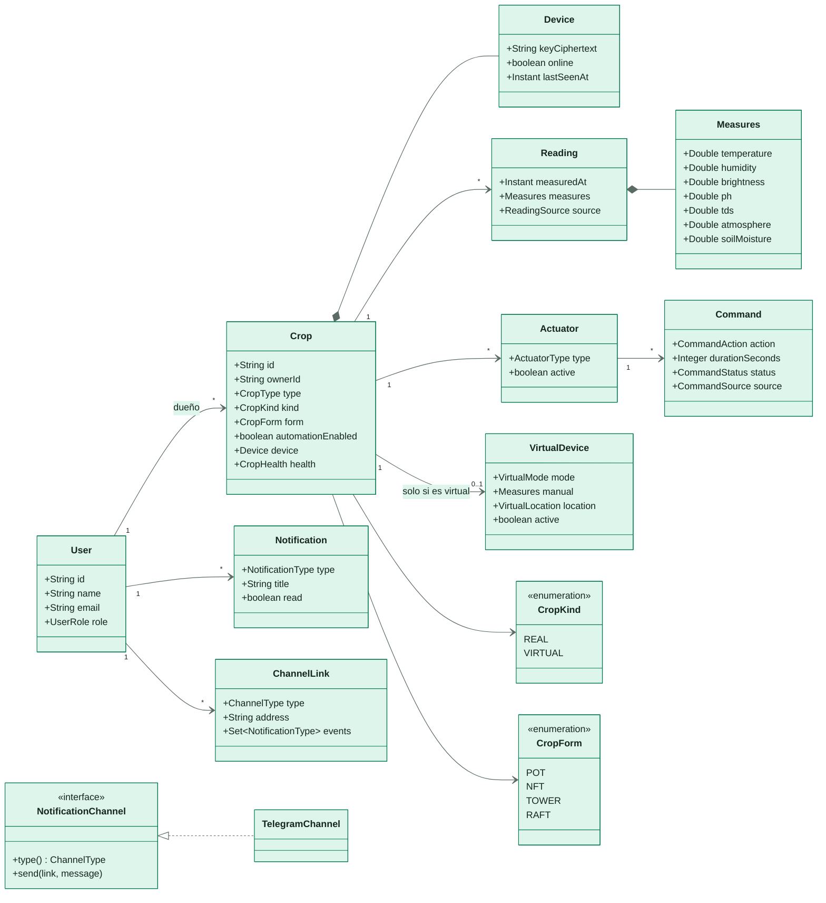
```mermaid
%%{init: {"theme": "base", "fontFamily": "Segoe UI, Arial, sans-serif", "themeVariables": {"fontFamily": "Segoe UI, Arial, sans-serif", "fontSize": "15px", "primaryColor": "#DDF5EA", "primaryTextColor": "#17261F", "primaryBorderColor": "#067A52", "secondaryColor": "#E3F2FB", "secondaryTextColor": "#17261F", "secondaryBorderColor": "#1F6FA0", "tertiaryColor": "#F2F7F4", "tertiaryTextColor": "#17261F", "tertiaryBorderColor": "#D5E3DC", "lineColor": "#5B6B63", "textColor": "#17261F", "mainBkg": "#DDF5EA", "nodeBorder": "#067A52", "clusterBkg": "#F7FAF8", "clusterBorder": "#D5E3DC", "edgeLabelBackground": "#FFFFFF", "actorBkg": "#067A52", "actorBorder": "#0B3D2B", "actorTextColor": "#FFFFFF", "actorLineColor": "#5B6B63", "signalColor": "#17261F", "signalTextColor": "#17261F", "labelBoxBkgColor": "#0B3D2B", "labelBoxBorderColor": "#0B3D2B", "labelTextColor": "#FFFFFF", "loopTextColor": "#0B3D2B", "noteBkgColor": "#FDF4DD", "noteBorderColor": "#C98D12", "noteTextColor": "#17261F", "activationBkgColor": "#DDF5EA", "activationBorderColor": "#067A52", "attributeBackgroundColorOdd": "#FFFFFF", "attributeBackgroundColorEven": "#F2F7F4"}}}%%
classDiagram
  direction LR
  class User {
    +String id
    +String name
    +String email
    +UserRole role
  }
  class Crop {
    +String id
    +String ownerId
    +CropType type
    +CropKind kind
    +CropForm form
    +boolean automationEnabled
    +Device device
    +CropHealth health
  }
  class Device {
    +String keyCiphertext
    +boolean online
    +Instant lastSeenAt
  }
  class Reading {
    +Instant measuredAt
    +Measures measures
    +ReadingSource source
  }
  class Measures {
    +Double temperature
    +Double humidity
    +Double brightness
    +Double ph
    +Double tds
    +Double atmosphere
    +Double soilMoisture
  }
  class Actuator {
    +ActuatorType type
    +boolean active
  }
  class Command {
    +CommandAction action
    +Integer durationSeconds
    +CommandStatus status
    +CommandSource source
  }
  class Notification {
    +NotificationType type
    +String title
    +boolean read
  }
  class ChannelLink {
    +ChannelType type
    +String address
    +Set~NotificationType~ events
  }
  class VirtualDevice {
    +VirtualMode mode
    +Measures manual
    +VirtualLocation location
    +boolean active
  }
  class CropKind {
    <<enumeration>>
    REAL
    VIRTUAL
  }
  class CropForm {
    <<enumeration>>
    POT
    NFT
    TOWER
    RAFT
  }
  class NotificationChannel {
    <<interface>>
    +type() ChannelType
    +send(link, message)
  }
  class TelegramChannel
  User "1" --> "*" Crop : dueño
  Crop *-- Device
  Crop "1" --> "*" Reading
  Reading *-- Measures
  Crop "1" --> "*" Actuator
  Actuator "1" --> "*" Command
  User "1" --> "*" Notification
  User "1" --> "*" ChannelLink
  Crop "1" --> "0..1" VirtualDevice : solo si es virtual
  Crop --> CropKind
  Crop --> CropForm
  NotificationChannel <|.. TelegramChannel
```

| Diseño original | Actual | Lectura |
| --- | --- | --- |
| `DeviceController` con sensores, actuadores, API y cultivo | El dispositivo solo mide y obedece; el dominio vive en la API | La inteligencia se movió a la plataforma |
| `Cultivo.evaluarSalud()` | Índice de salud, diagnóstico y pronóstico en la IA | Un método se volvió un servicio |
| `FabricaCultivos` con un mapa de cultivos | Perfiles por especie compartidos | La fábrica era, en realidad, datos |
| `Sesion` con token y último acceso | JWT sin estado | No hace falta guardar sesiones |
| `Api` con consulta de solicitudes | Comandos con id, estados y confirmación | El «identificador de la última solicitud» se volvió una máquina de estados |

### 21.2 Componentes

<!-- diagrama: SmartPot_28_Original_Components | titulo=Componentes del diseño original | lamina=H -->
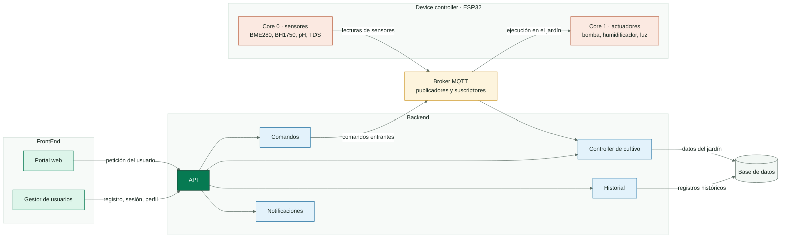
```mermaid
%%{init: {"theme": "base", "fontFamily": "Segoe UI, Arial, sans-serif", "themeVariables": {"fontFamily": "Segoe UI, Arial, sans-serif", "fontSize": "15px", "primaryColor": "#DDF5EA", "primaryTextColor": "#17261F", "primaryBorderColor": "#067A52", "secondaryColor": "#E3F2FB", "secondaryTextColor": "#17261F", "secondaryBorderColor": "#1F6FA0", "tertiaryColor": "#F2F7F4", "tertiaryTextColor": "#17261F", "tertiaryBorderColor": "#D5E3DC", "lineColor": "#5B6B63", "textColor": "#17261F", "mainBkg": "#DDF5EA", "nodeBorder": "#067A52", "clusterBkg": "#F7FAF8", "clusterBorder": "#D5E3DC", "edgeLabelBackground": "#FFFFFF", "actorBkg": "#067A52", "actorBorder": "#0B3D2B", "actorTextColor": "#FFFFFF", "actorLineColor": "#5B6B63", "signalColor": "#17261F", "signalTextColor": "#17261F", "labelBoxBkgColor": "#0B3D2B", "labelBoxBorderColor": "#0B3D2B", "labelTextColor": "#FFFFFF", "loopTextColor": "#0B3D2B", "noteBkgColor": "#FDF4DD", "noteBorderColor": "#C98D12", "noteTextColor": "#17261F", "activationBkgColor": "#DDF5EA", "activationBorderColor": "#067A52", "attributeBackgroundColorOdd": "#FFFFFF", "attributeBackgroundColorEven": "#F2F7F4"}}}%%
flowchart LR
  subgraph front["FrontEnd"]
    portal["Portal web"]
    gestor["Gestor de usuarios"]
  end
  subgraph back["Backend"]
    api["API"]
    comandos["Comandos"]
    controller["Controller de cultivo"]
    historial["Historial"]
    notificaciones["Notificaciones"]
  end
  db[("Base de datos")]
  broker["Broker MQTT<br/>publicadores y suscriptores"]
  subgraph esp["Device controller · ESP32"]
    core0["Core 0 · sensores<br/>BME280, BH1750, pH, TDS"]
    core1["Core 1 · actuadores<br/>bomba, humidificador, luz"]
  end
  portal -->|"petición del usuario"| api
  gestor -->|"registro, sesión, perfil"| api
  api --> comandos & controller & historial & notificaciones
  historial -->|"registros históricos"| db
  controller -->|"datos del jardín"| db
  comandos -->|"comandos entrantes"| broker
  broker -->|"ejecución en el jardín"| core1
  core0 -->|"lecturas de sensores"| broker
  broker --> controller
  classDef leaf fill:#DDF5EA,stroke:#067A52,color:#17261F
  classDef water fill:#E3F2FB,stroke:#1F6FA0,color:#17261F
  classDef sun fill:#FDF4DD,stroke:#C98D12,color:#17261F
  classDef clay fill:#FBE9E1,stroke:#B85A38,color:#17261F
  classDef core fill:#067A52,stroke:#0B3D2B,color:#FFFFFF
  classDef deep fill:#0B3D2B,stroke:#06281C,color:#FFFFFF
  classDef muted fill:#F2F7F4,stroke:#5B6B63,color:#17261F
  class portal,gestor leaf
  class api core
  class comandos,controller,historial,notificaciones water
  class db muted
  class broker sun
  class core0,core1 clay
```

<!-- diagrama: SmartPot_12_Components | titulo=Componentes y paquetes actuales | lamina=H -->
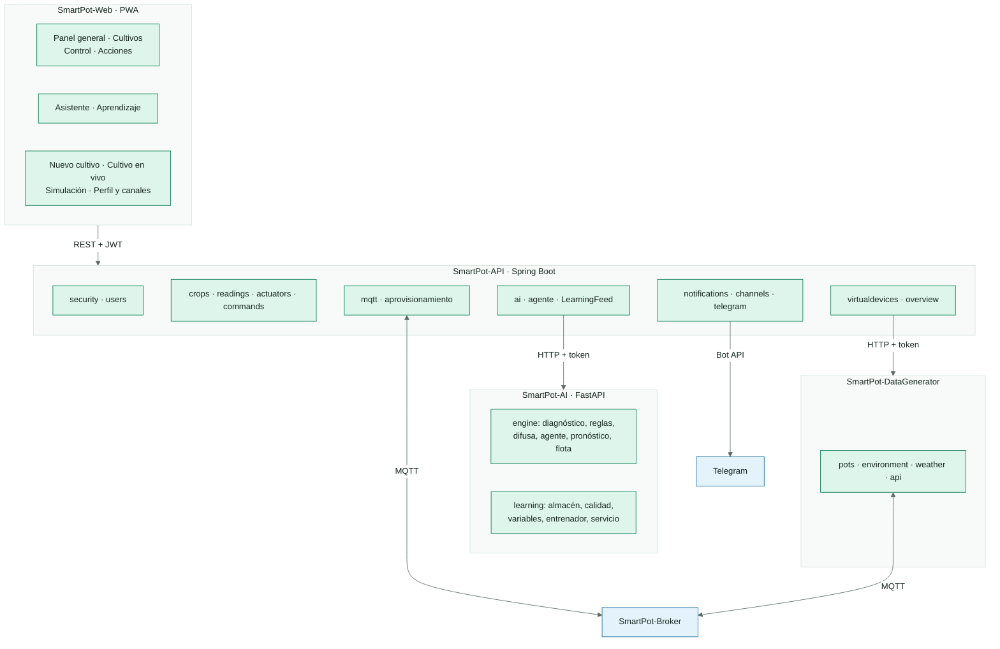
```mermaid
%%{init: {"theme": "base", "fontFamily": "Segoe UI, Arial, sans-serif", "themeVariables": {"fontFamily": "Segoe UI, Arial, sans-serif", "fontSize": "15px", "primaryColor": "#DDF5EA", "primaryTextColor": "#17261F", "primaryBorderColor": "#067A52", "secondaryColor": "#E3F2FB", "secondaryTextColor": "#17261F", "secondaryBorderColor": "#1F6FA0", "tertiaryColor": "#F2F7F4", "tertiaryTextColor": "#17261F", "tertiaryBorderColor": "#D5E3DC", "lineColor": "#5B6B63", "textColor": "#17261F", "mainBkg": "#DDF5EA", "nodeBorder": "#067A52", "clusterBkg": "#F7FAF8", "clusterBorder": "#D5E3DC", "edgeLabelBackground": "#FFFFFF", "actorBkg": "#067A52", "actorBorder": "#0B3D2B", "actorTextColor": "#FFFFFF", "actorLineColor": "#5B6B63", "signalColor": "#17261F", "signalTextColor": "#17261F", "labelBoxBkgColor": "#0B3D2B", "labelBoxBorderColor": "#0B3D2B", "labelTextColor": "#FFFFFF", "loopTextColor": "#0B3D2B", "noteBkgColor": "#FDF4DD", "noteBorderColor": "#C98D12", "noteTextColor": "#17261F", "activationBkgColor": "#DDF5EA", "activationBorderColor": "#067A52", "attributeBackgroundColorOdd": "#FFFFFF", "attributeBackgroundColorEven": "#F2F7F4"}}}%%
flowchart TB
  subgraph web["SmartPot-Web · PWA"]
    w1["Panel general · Cultivos<br/>Control · Acciones"]
    w2["Asistente · Aprendizaje"]
    w3["Nuevo cultivo · Cultivo en vivo<br/>Simulación · Perfil y canales"]
  end
  subgraph api["SmartPot-API · Spring Boot"]
    a1["security · users"]
    a2["crops · readings · actuators · commands"]
    a3["mqtt · aprovisionamiento"]
    a4["ai · agente · LearningFeed"]
    a5["notifications · channels · telegram"]
    a6["virtualdevices · overview"]
  end
  subgraph ai["SmartPot-AI · FastAPI"]
    i1["engine: diagnóstico, reglas,<br/>difusa, agente, pronóstico, flota"]
    i2["learning: almacén, calidad,<br/>variables, entrenador, servicio"]
  end
  subgraph sim["SmartPot-DataGenerator"]
    s1["pots · environment · weather · api"]
  end
  web -->|"REST + JWT"| api
  a3 <-->|"MQTT"| broker["SmartPot-Broker"]
  s1 <-->|"MQTT"| broker
  a4 -->|"HTTP + token"| ai
  a6 -->|"HTTP + token"| sim
  a5 -->|"Bot API"| tg["Telegram"]
  classDef box fill:#DDF5EA,stroke:#067A52,color:#17261F
  classDef ext fill:#E3F2FB,stroke:#1F6FA0,color:#17261F
  class w1,w2,w3,a1,a2,a3,a4,a5,a6,i1,i2,s1 box
  class broker,tg ext
```

El diseño original ya tenía un broker MQTT y dividía el ESP32 en dos núcleos (sensores y actuadores). Se conservó la idea del broker y se simplificó el firmware a un ciclo principal; lo que cambió fue el backend, que pasó de cuatro componentes genéricos a dominios con la misma organización por capas.

### 21.3 Comportamiento: enviar un comando

<!-- diagrama: SmartPot_29_Original_Command_Activity | titulo=Actividad del diseño original: enviar un comando -->
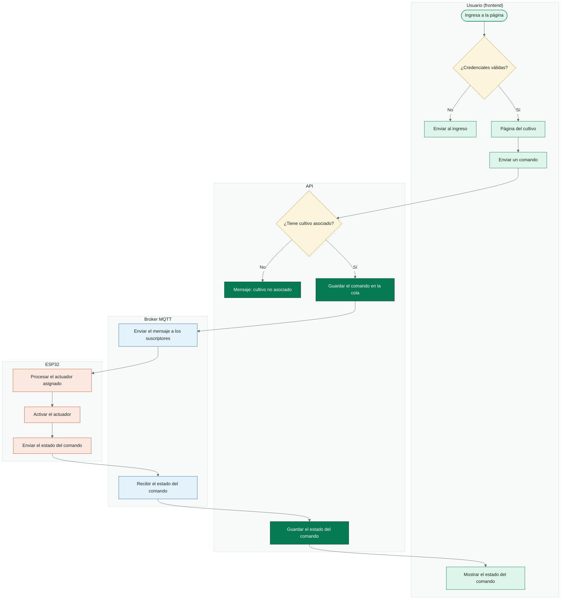
```mermaid
%%{init: {"theme": "base", "fontFamily": "Segoe UI, Arial, sans-serif", "themeVariables": {"fontFamily": "Segoe UI, Arial, sans-serif", "fontSize": "15px", "primaryColor": "#DDF5EA", "primaryTextColor": "#17261F", "primaryBorderColor": "#067A52", "secondaryColor": "#E3F2FB", "secondaryTextColor": "#17261F", "secondaryBorderColor": "#1F6FA0", "tertiaryColor": "#F2F7F4", "tertiaryTextColor": "#17261F", "tertiaryBorderColor": "#D5E3DC", "lineColor": "#5B6B63", "textColor": "#17261F", "mainBkg": "#DDF5EA", "nodeBorder": "#067A52", "clusterBkg": "#F7FAF8", "clusterBorder": "#D5E3DC", "edgeLabelBackground": "#FFFFFF", "actorBkg": "#067A52", "actorBorder": "#0B3D2B", "actorTextColor": "#FFFFFF", "actorLineColor": "#5B6B63", "signalColor": "#17261F", "signalTextColor": "#17261F", "labelBoxBkgColor": "#0B3D2B", "labelBoxBorderColor": "#0B3D2B", "labelTextColor": "#FFFFFF", "loopTextColor": "#0B3D2B", "noteBkgColor": "#FDF4DD", "noteBorderColor": "#C98D12", "noteTextColor": "#17261F", "activationBkgColor": "#DDF5EA", "activationBorderColor": "#067A52", "attributeBackgroundColorOdd": "#FFFFFF", "attributeBackgroundColorEven": "#F2F7F4"}}}%%
flowchart TB
  subgraph u["Usuario (frontend)"]
    u1(["Ingresa a la página"]) --> u2{"¿Credenciales válidas?"}
    u2 -->|"No"| u3["Enviar al ingreso"]
    u2 -->|"Sí"| u4["Página del cultivo"]
    u4 --> u5["Enviar un comando"]
    u9["Mostrar el estado del comando"]
  end
  subgraph a["API"]
    a1{"¿Tiene cultivo asociado?"}
    a1 -->|"No"| a2["Mensaje: cultivo no asociado"]
    a1 -->|"Sí"| a3["Guardar el comando en la cola"]
    a4["Guardar el estado del comando"]
  end
  subgraph b["Broker MQTT"]
    b1["Enviar el mensaje a los suscriptores"]
    b2["Recibir el estado del comando"]
  end
  subgraph e["ESP32"]
    e1["Procesar el actuador asignado"] --> e2["Activar el actuador"]
    e2 --> e3["Enviar el estado del comando"]
  end
  u5 --> a1
  a3 --> b1
  b1 --> e1
  e3 --> b2
  b2 --> a4
  a4 --> u9
  classDef leaf fill:#DDF5EA,stroke:#067A52,color:#17261F
  classDef water fill:#E3F2FB,stroke:#1F6FA0,color:#17261F
  classDef sun fill:#FDF4DD,stroke:#C98D12,color:#17261F
  classDef clay fill:#FBE9E1,stroke:#B85A38,color:#17261F
  classDef core fill:#067A52,stroke:#0B3D2B,color:#FFFFFF
  classDef deep fill:#0B3D2B,stroke:#06281C,color:#FFFFFF
  classDef muted fill:#F2F7F4,stroke:#5B6B63,color:#17261F
  class u1,u3,u4,u5,u9 leaf
  class a1,u2 sun
  class a2,a3,a4 core
  class b1,b2 water
  class e1,e2,e3 clay
```

<!-- diagrama: SmartPot_05_Command_States | titulo=Estados de un comando hoy -->
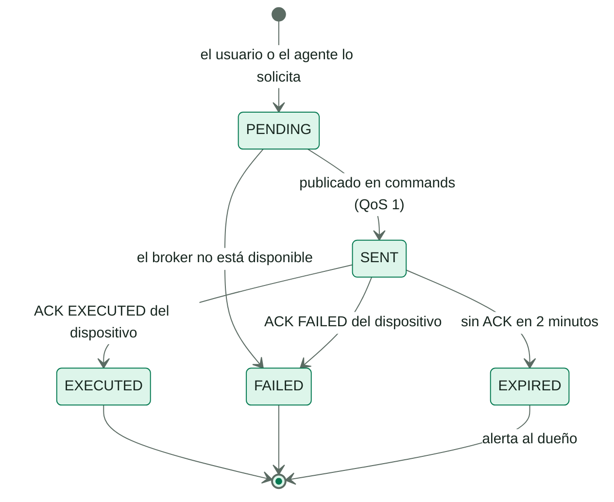
```mermaid
%%{init: {"theme": "base", "fontFamily": "Segoe UI, Arial, sans-serif", "themeVariables": {"fontFamily": "Segoe UI, Arial, sans-serif", "fontSize": "15px", "primaryColor": "#DDF5EA", "primaryTextColor": "#17261F", "primaryBorderColor": "#067A52", "secondaryColor": "#E3F2FB", "secondaryTextColor": "#17261F", "secondaryBorderColor": "#1F6FA0", "tertiaryColor": "#F2F7F4", "tertiaryTextColor": "#17261F", "tertiaryBorderColor": "#D5E3DC", "lineColor": "#5B6B63", "textColor": "#17261F", "mainBkg": "#DDF5EA", "nodeBorder": "#067A52", "clusterBkg": "#F7FAF8", "clusterBorder": "#D5E3DC", "edgeLabelBackground": "#FFFFFF", "actorBkg": "#067A52", "actorBorder": "#0B3D2B", "actorTextColor": "#FFFFFF", "actorLineColor": "#5B6B63", "signalColor": "#17261F", "signalTextColor": "#17261F", "labelBoxBkgColor": "#0B3D2B", "labelBoxBorderColor": "#0B3D2B", "labelTextColor": "#FFFFFF", "loopTextColor": "#0B3D2B", "noteBkgColor": "#FDF4DD", "noteBorderColor": "#C98D12", "noteTextColor": "#17261F", "activationBkgColor": "#DDF5EA", "activationBorderColor": "#067A52", "attributeBackgroundColorOdd": "#FFFFFF", "attributeBackgroundColorEven": "#F2F7F4"}}}%%
stateDiagram-v2
  [*] --> PENDING: el usuario o el agente lo solicita
  PENDING --> SENT: publicado en commands (QoS 1)
  PENDING --> FAILED: el broker no está disponible
  SENT --> EXECUTED: ACK EXECUTED del dispositivo
  SENT --> FAILED: ACK FAILED del dispositivo
  SENT --> EXPIRED: sin ACK en 2 minutos
  EXECUTED --> [*]
  FAILED --> [*]
  EXPIRED --> [*]: alerta al dueño
```

El flujo del diseño se mantuvo casi igual: validar sesión, verificar el cultivo, encolar, publicar y esperar el estado. Lo nuevo es que el estado es explícito (`PENDING`, `SENT`, `EXECUTED`, `FAILED`, `EXPIRED`) y que un comando sin respuesta vence en dos minutos y avisa.

### 21.4 Comportamiento: datos históricos y una lectura

La secuencia original se centraba en consultar el historial; la actual muestra el camino completo de una lectura, desde el dispositivo hasta la acción automática, porque ese es hoy el flujo crítico del sistema.

<!-- diagrama: SmartPot_30_Original_History_Sequence | titulo=Secuencia del diseño original: datos históricos -->
```mermaid
%%{init: {"theme": "base", "fontFamily": "Segoe UI, Arial, sans-serif", "themeVariables": {"fontFamily": "Segoe UI, Arial, sans-serif", "fontSize": "15px", "primaryColor": "#DDF5EA", "primaryTextColor": "#17261F", "primaryBorderColor": "#067A52", "secondaryColor": "#E3F2FB", "secondaryTextColor": "#17261F", "secondaryBorderColor": "#1F6FA0", "tertiaryColor": "#F2F7F4", "tertiaryTextColor": "#17261F", "tertiaryBorderColor": "#D5E3DC", "lineColor": "#5B6B63", "textColor": "#17261F", "mainBkg": "#DDF5EA", "nodeBorder": "#067A52", "clusterBkg": "#F7FAF8", "clusterBorder": "#D5E3DC", "edgeLabelBackground": "#FFFFFF", "actorBkg": "#067A52", "actorBorder": "#0B3D2B", "actorTextColor": "#FFFFFF", "actorLineColor": "#5B6B63", "signalColor": "#17261F", "signalTextColor": "#17261F", "labelBoxBkgColor": "#0B3D2B", "labelBoxBorderColor": "#0B3D2B", "labelTextColor": "#FFFFFF", "loopTextColor": "#0B3D2B", "noteBkgColor": "#FDF4DD", "noteBorderColor": "#C98D12", "noteTextColor": "#17261F", "activationBkgColor": "#DDF5EA", "activationBorderColor": "#067A52", "attributeBackgroundColorOdd": "#FFFFFF", "attributeBackgroundColorEven": "#F2F7F4"}}}%%
sequenceDiagram
  autonumber
  actor U as Usuario
  participant I as Interfaz de datos históricos
  participant A as API
  participant C as Cultivo
  participant R as Registro
  U->>I: Ingresa a la página de datos históricos
  I->>A: Solicita los datos históricos del cultivo
  A->>C: Verifica que el cultivo exista
  alt Existe el cultivo con registros
    C->>R: Verifica los registros históricos
    alt Hay registros
      R-->>A: Registros
      A-->>I: Datos históricos
      I-->>U: Tabla por defecto, con opción de gráfica
    else Sin registros
      A-->>I: «No se han tomado lecturas»
    end
  else No tiene cultivo
    A-->>I: «No cuenta con cultivo»
  end
```

<!-- diagrama: SmartPot_02_Reading_Sequence | titulo=Secuencia de una lectura con automatización | lamina=H -->
```mermaid
%%{init: {"theme": "base", "fontFamily": "Segoe UI, Arial, sans-serif", "themeVariables": {"fontFamily": "Segoe UI, Arial, sans-serif", "fontSize": "15px", "primaryColor": "#DDF5EA", "primaryTextColor": "#17261F", "primaryBorderColor": "#067A52", "secondaryColor": "#E3F2FB", "secondaryTextColor": "#17261F", "secondaryBorderColor": "#1F6FA0", "tertiaryColor": "#F2F7F4", "tertiaryTextColor": "#17261F", "tertiaryBorderColor": "#D5E3DC", "lineColor": "#5B6B63", "textColor": "#17261F", "mainBkg": "#DDF5EA", "nodeBorder": "#067A52", "clusterBkg": "#F7FAF8", "clusterBorder": "#D5E3DC", "edgeLabelBackground": "#FFFFFF", "actorBkg": "#067A52", "actorBorder": "#0B3D2B", "actorTextColor": "#FFFFFF", "actorLineColor": "#5B6B63", "signalColor": "#17261F", "signalTextColor": "#17261F", "labelBoxBkgColor": "#0B3D2B", "labelBoxBorderColor": "#0B3D2B", "labelTextColor": "#FFFFFF", "loopTextColor": "#0B3D2B", "noteBkgColor": "#FDF4DD", "noteBorderColor": "#C98D12", "noteTextColor": "#17261F", "activationBkgColor": "#DDF5EA", "activationBorderColor": "#067A52", "attributeBackgroundColorOdd": "#FFFFFF", "attributeBackgroundColorEven": "#F2F7F4"}}}%%
sequenceDiagram
  autonumber
  participant M as Dispositivo
  participant B as Broker MQTT
  participant A as API
  participant D as MongoDB
  participant I as Asistente de IA
  participant U as PWA
  M->>B: telemetry {temperature, humidity, ph, …}
  B->>A: entrega la lectura (cuenta del cultivo)
  A->>A: valida rangos físicos y limita a 1 lectura cada 5 s
  A->>D: guarda la lectura
  A-)I: evalúa lectura + historial + actuadores + hora local
  I-->>A: salud, diagnóstico, conclusiones, predicciones y acciones
  A->>D: actualiza el índice de salud del cultivo
  alt Modo automático y actuador sin enfriamiento
    A->>D: crea el comando (PENDING)
    A->>B: commands {id, actuator, action, durationSeconds}
    B->>M: comando QoS 1
    M->>B: commands/ack {id, status: EXECUTED}
    B->>A: confirma
    A->>D: comando EXECUTED y estado del actuador
  else Solo recomendación
    A->>D: alerta para el dueño si hay hallazgos críticos
  end
  U->>A: GET /api/v1/crops/{id}/insights
  A-->>U: diagnóstico en español
```

### 21.5 Actividad: control automático

<!-- diagrama: SmartPot_13_Control_Activity | titulo=Actividad del control automático -->
```mermaid
%%{init: {"theme": "base", "fontFamily": "Segoe UI, Arial, sans-serif", "themeVariables": {"fontFamily": "Segoe UI, Arial, sans-serif", "fontSize": "15px", "primaryColor": "#DDF5EA", "primaryTextColor": "#17261F", "primaryBorderColor": "#067A52", "secondaryColor": "#E3F2FB", "secondaryTextColor": "#17261F", "secondaryBorderColor": "#1F6FA0", "tertiaryColor": "#F2F7F4", "tertiaryTextColor": "#17261F", "tertiaryBorderColor": "#D5E3DC", "lineColor": "#5B6B63", "textColor": "#17261F", "mainBkg": "#DDF5EA", "nodeBorder": "#067A52", "clusterBkg": "#F7FAF8", "clusterBorder": "#D5E3DC", "edgeLabelBackground": "#FFFFFF", "actorBkg": "#067A52", "actorBorder": "#0B3D2B", "actorTextColor": "#FFFFFF", "actorLineColor": "#5B6B63", "signalColor": "#17261F", "signalTextColor": "#17261F", "labelBoxBkgColor": "#0B3D2B", "labelBoxBorderColor": "#0B3D2B", "labelTextColor": "#FFFFFF", "loopTextColor": "#0B3D2B", "noteBkgColor": "#FDF4DD", "noteBorderColor": "#C98D12", "noteTextColor": "#17261F", "activationBkgColor": "#DDF5EA", "activationBorderColor": "#067A52", "attributeBackgroundColorOdd": "#FFFFFF", "attributeBackgroundColorEven": "#F2F7F4"}}}%%
flowchart TB
  inicio(["El dispositivo o la simulación<br/>publica una lectura"]) --> valida{"¿Valores dentro de<br/>la escala física?"}
  valida -->|"No"| descarta["Se descarta y se registra"]
  valida -->|"Sí"| guarda["Guardar la lectura<br/>y marcar el cultivo en línea"]
  guarda --> aprende["Si el cultivo es real, encolar<br/>para el aprendizaje continuo"]
  guarda --> evalua{"¿Toca evaluar?<br/>30 s en automático · 5 min si no"}
  evalua -->|"No"| fin(["Fin"])
  evalua -->|"Sí"| ia["El asistente evalúa:<br/>diagnóstico, pronóstico, modelos,<br/>sistema experto y agente"]
  ia --> critico{"¿Hallazgo crítico?"}
  critico -->|"Sí"| alerta["Notificación en la PWA<br/>y en los canales elegidos"]
  critico -->|"No"| auto
  alerta --> auto{"¿Modo automático?"}
  auto -->|"No"| fin
  auto -->|"Sí"| enfria{"¿Actuador fuera<br/>del enfriamiento?"}
  enfria -->|"No"| fin
  enfria -->|"Sí"| comando["Comando por MQTT (QoS 1)"]
  comando --> ack{"¿ACK en 2 minutos?"}
  ack -->|"EXECUTED"| ok["Comando ejecutado<br/>y aviso de la acción"]
  ack -->|"Sin respuesta"| vence["EXPIRED y aviso al dueño"]
  ok --> fin
  vence --> fin
  classDef start fill:#067A52,stroke:#0B3D2B,color:#FFFFFF
  classDef step fill:#DDF5EA,stroke:#067A52,color:#17261F
  classDef ask fill:#FDF4DD,stroke:#C98D12,color:#17261F
  classDef bad fill:#FBE9E1,stroke:#B85A38,color:#17261F
  class inicio,fin start
  class guarda,aprende,ia,alerta,comando,ok step
  class valida,evalua,critico,auto,enfria,ack ask
  class descarta,vence bad
```

### 21.6 Datos

<!-- diagrama: SmartPot_31_Original_Data_Model | titulo=Modelo de datos del diseño original -->
```mermaid
%%{init: {"theme": "base", "fontFamily": "Segoe UI, Arial, sans-serif", "themeVariables": {"fontFamily": "Segoe UI, Arial, sans-serif", "fontSize": "15px", "primaryColor": "#DDF5EA", "primaryTextColor": "#17261F", "primaryBorderColor": "#067A52", "secondaryColor": "#E3F2FB", "secondaryTextColor": "#17261F", "secondaryBorderColor": "#1F6FA0", "tertiaryColor": "#F2F7F4", "tertiaryTextColor": "#17261F", "tertiaryBorderColor": "#D5E3DC", "lineColor": "#5B6B63", "textColor": "#17261F", "mainBkg": "#DDF5EA", "nodeBorder": "#067A52", "clusterBkg": "#F7FAF8", "clusterBorder": "#D5E3DC", "edgeLabelBackground": "#FFFFFF", "actorBkg": "#067A52", "actorBorder": "#0B3D2B", "actorTextColor": "#FFFFFF", "actorLineColor": "#5B6B63", "signalColor": "#17261F", "signalTextColor": "#17261F", "labelBoxBkgColor": "#0B3D2B", "labelBoxBorderColor": "#0B3D2B", "labelTextColor": "#FFFFFF", "loopTextColor": "#0B3D2B", "noteBkgColor": "#FDF4DD", "noteBorderColor": "#C98D12", "noteTextColor": "#17261F", "activationBkgColor": "#DDF5EA", "activationBorderColor": "#067A52", "attributeBackgroundColorOdd": "#FFFFFF", "attributeBackgroundColorEven": "#F2F7F4"}}}%%
erDiagram
  USUARIO ||--o{ SESSION : "inicia"
  USUARIO ||--o{ CULTIVO : "tiene"
  CULTIVO ||--o{ HISTORIAL : "registra"
  USUARIO {
    ObjectId Id
    String Name
    String Email
  }
  SESSION {
    ObjectId Id
    Date Registration
    ObjectId User
  }
  CULTIVO {
    ObjectId Id
    String Status
    String Type
    ObjectId User
  }
  HISTORIAL {
    ObjectId Id
    String Date
    Object Measures "atmósfera, luz, temperatura, pH, TDS, humedad"
    ObjectId Cultivation
  }
```

<!-- diagrama: SmartPot_04_Data_Model | titulo=Colecciones de MongoDB hoy | lamina=H -->
```mermaid
%%{init: {"theme": "base", "fontFamily": "Segoe UI, Arial, sans-serif", "themeVariables": {"fontFamily": "Segoe UI, Arial, sans-serif", "fontSize": "15px", "primaryColor": "#DDF5EA", "primaryTextColor": "#17261F", "primaryBorderColor": "#067A52", "secondaryColor": "#E3F2FB", "secondaryTextColor": "#17261F", "secondaryBorderColor": "#1F6FA0", "tertiaryColor": "#F2F7F4", "tertiaryTextColor": "#17261F", "tertiaryBorderColor": "#D5E3DC", "lineColor": "#5B6B63", "textColor": "#17261F", "mainBkg": "#DDF5EA", "nodeBorder": "#067A52", "clusterBkg": "#F7FAF8", "clusterBorder": "#D5E3DC", "edgeLabelBackground": "#FFFFFF", "actorBkg": "#067A52", "actorBorder": "#0B3D2B", "actorTextColor": "#FFFFFF", "actorLineColor": "#5B6B63", "signalColor": "#17261F", "signalTextColor": "#17261F", "labelBoxBkgColor": "#0B3D2B", "labelBoxBorderColor": "#0B3D2B", "labelTextColor": "#FFFFFF", "loopTextColor": "#0B3D2B", "noteBkgColor": "#FDF4DD", "noteBorderColor": "#C98D12", "noteTextColor": "#17261F", "activationBkgColor": "#DDF5EA", "activationBorderColor": "#067A52", "attributeBackgroundColorOdd": "#FFFFFF", "attributeBackgroundColorEven": "#F2F7F4"}}}%%
erDiagram
  USERS ||--o{ CROPS : "es dueño de"
  USERS ||--o{ NOTIFICATIONS : "recibe"
  USERS ||--o{ PASSWORD_RESET_TOKENS : "solicita"
  USERS ||--o{ CHANNEL_LINKS : "vincula"
  CROPS ||--o{ READINGS : "registra"
  CROPS ||--o{ ACTUATORS : "tiene"
  CROPS ||--o{ COMMANDS : "recibe"
  CROPS ||--o{ NOTIFICATIONS : "genera"
  CROPS ||--o| VIRTUAL_DEVICES : "simula"
  ACTUATORS ||--o{ COMMANDS : "ejecuta"
  USERS {
    ObjectId _id
    string name
    string lastName
    string email "único"
    string passwordHash "BCrypt 12"
    string role "USER o ADMIN"
  }
  CROPS {
    ObjectId _id
    ObjectId ownerId
    string name
    string type "LETTUCE, TOMATO, …"
    string kind "REAL o VIRTUAL, fijo"
    string form "POT, NFT, TOWER, RAFT"
    bool automationEnabled
    object device "keyCiphertext AES-GCM, online, lastSeenAt"
    object health "index, level, label, evaluatedAt"
  }
  READINGS {
    ObjectId _id
    ObjectId cropId
    date measuredAt "TTL 365 días"
    object measures "7 variables"
    string source "MQTT o HTTP"
  }
  ACTUATORS {
    ObjectId _id
    ObjectId cropId
    string type "WATER_PUMP, UV_LIGHT, FAN, …"
    bool active
  }
  COMMANDS {
    ObjectId _id
    ObjectId cropId
    ObjectId actuatorId
    string action "ACTIVATE o DEACTIVATE"
    string status "PENDING … EXPIRED"
    string source "USER o AGENT"
  }
  NOTIFICATIONS {
    ObjectId _id
    ObjectId userId
    ObjectId cropId
    string type "INFO, ALERT, COMMAND, DEVICE, AI"
    bool read
  }
  CHANNEL_LINKS {
    ObjectId _id
    ObjectId userId
    string type "TELEGRAM"
    string address "id del chat"
    bool enabled
    array events "tipos elegidos"
  }
  VIRTUAL_DEVICES {
    ObjectId _id
    ObjectId cropId "único"
    ObjectId ownerId
    string mode "AUTO, MANUAL, WEATHER"
    object manual "medidores"
    object location "nombre, latitud, longitud"
    bool active "false en pausa"
  }
  PASSWORD_RESET_TOKENS {
    ObjectId _id
    ObjectId userId
    string tokenHash "SHA-256"
    date expiresAt "TTL"
  }
```

| Diseño original | Actual | Lectura |
| --- | --- | --- |
| `Session` guardada en la base | Sin colección de sesiones | JWT sin estado |
| `Historial` con `Measures` y referencia al cultivo | `readings` con índice por cultivo y fecha, y TTL de un año | La idea se conservó; se agregaron índices y retención |
| Cuatro entidades | Colecciones de usuarios, cultivos, lecturas, comandos, notificaciones, vínculos de canales y más | El modelo creció con el dominio, no por anticipado |

### 21.7 Objetos y artefactos

El diseño incluía otros dos diagramas que no tienen un equivalente uno a uno:

| Diagrama original | Qué mostraba | Hoy |
| --- | --- | --- |
| Objetos | Instancias de `DeviceController`, `Cultivo`, `Session`, `Notificacion` y sensores con valores de ejemplo | Las pruebas de la API y de la IA construyen esos mismos objetos con datos válidos en cada ejecución |
| Artefactos | Navegador, servidor de aplicación, servidor de API, servidor de base de datos con MongoDB y el ESP32, unidos por HTTP | El despliegue continuo y las redes de producción (figuras de despliegue y redes) |

El diagrama de objetos quedó a medio terminar: conserva los compartimentos de ejemplo de la herramienta y fechas imposibles como «34/34/2324». El de artefactos, en cambio, ya elegía MongoDB, aunque el acta posterior pedía H2 o MySQL con JPA: la decisión de datos se tomó en el diseño y el acta no la recogió.

> [!TIP]
> **Lectura crítica.** El diseño original acertó en lo que depende del problema (sensores, actuadores, cultivo, historial y un broker) y falló en lo que depende de la tecnología (dónde se decide, cómo se guarda una sesión, cómo se confirma un comando). Es la señal de un buen análisis del dominio con poca experiencia en sistemas distribuidos, y justifica haber rediseñado desde el contrato MQTT hacia afuera.

## 22. Interfaz

<!-- diagrama: SmartPot_32_PWA_Sitemap | titulo=Mapa de la PWA -->
```mermaid
%%{init: {"theme": "base", "fontFamily": "Segoe UI, Arial, sans-serif", "themeVariables": {"fontFamily": "Segoe UI, Arial, sans-serif", "fontSize": "15px", "primaryColor": "#DDF5EA", "primaryTextColor": "#17261F", "primaryBorderColor": "#067A52", "secondaryColor": "#E3F2FB", "secondaryTextColor": "#17261F", "secondaryBorderColor": "#1F6FA0", "tertiaryColor": "#F2F7F4", "tertiaryTextColor": "#17261F", "tertiaryBorderColor": "#D5E3DC", "lineColor": "#5B6B63", "textColor": "#17261F", "mainBkg": "#DDF5EA", "nodeBorder": "#067A52", "clusterBkg": "#F7FAF8", "clusterBorder": "#D5E3DC", "edgeLabelBackground": "#FFFFFF", "actorBkg": "#067A52", "actorBorder": "#0B3D2B", "actorTextColor": "#FFFFFF", "actorLineColor": "#5B6B63", "signalColor": "#17261F", "signalTextColor": "#17261F", "labelBoxBkgColor": "#0B3D2B", "labelBoxBorderColor": "#0B3D2B", "labelTextColor": "#FFFFFF", "loopTextColor": "#0B3D2B", "noteBkgColor": "#FDF4DD", "noteBorderColor": "#C98D12", "noteTextColor": "#17261F", "activationBkgColor": "#DDF5EA", "activationBorderColor": "#067A52", "attributeBackgroundColorOdd": "#FFFFFF", "attributeBackgroundColorEven": "#F2F7F4"}}}%%
flowchart LR
  inicio["/ · inicio público<br/>indexable"] --> ingreso["/login · /register<br/>/forgot-password"]
  ingreso --> panel["/app · Panel general"]
  panel --> cultivos["/app/crops · Mis cultivos"]
  cultivos --> nuevo["Nuevo cultivo<br/>real o virtual · especie · forma"]
  cultivos --> detalle["/app/crops/:id"]
  detalle --> t1["Resumen"] & t6["Cultivo en vivo<br/>+ simulación si es virtual"] & t2["Asistente IA"] & t3["Control"] & t4["Historial"] & t5["Dispositivo<br/>solo reales"] & t7["Ajustes"]
  panel --> control["/app/control · Control general"]
  panel --> acciones["/app/actions · Acciones"]
  panel --> aprendizaje["/app/learning · Aprendizaje"]
  panel --> alertas["/app/notifications · Alertas"]
  panel --> perfil["/app/profile · Perfil y Telegram"]
  classDef leaf fill:#DDF5EA,stroke:#067A52,color:#17261F
  classDef water fill:#E3F2FB,stroke:#1F6FA0,color:#17261F
  classDef sun fill:#FDF4DD,stroke:#C98D12,color:#17261F
  classDef clay fill:#FBE9E1,stroke:#B85A38,color:#17261F
  classDef core fill:#067A52,stroke:#0B3D2B,color:#FFFFFF
  classDef deep fill:#0B3D2B,stroke:#06281C,color:#FFFFFF
  classDef muted fill:#F2F7F4,stroke:#5B6B63,color:#17261F
  class inicio,ingreso water
  class panel core
  class cultivos,control,acciones,aprendizaje,alertas,perfil leaf
  class detalle,nuevo sun
  class t1,t2,t3,t4,t5,t6,t7 muted
```

| Principio | Cómo se aplica |
| --- | --- |
| Primero el teléfono | Navegación inferior en el teléfono y lateral en el escritorio; la página de aprendizaje solo en escritorio |
| Lenguaje simple | Textos en español, sin jerga, con explicaciones en cada tarjeta |
| Accesibilidad | Colores de texto de alto contraste, tablas con encabezados y títulos accesibles, y movimiento reducido respetado en la escena del clima |
| Identidad | Paleta SmartPot (verdes hoja, azul agua, sol y arcilla) validada para daltonismo en las gráficas |
| Descubrimiento | Página de inicio indexable con metadatos para buscadores y redes |

## 23. Seguridad por diseño

<!-- diagrama: SmartPot_07_Networks | titulo=Redes y puertos en producción -->
```mermaid
%%{init: {"theme": "base", "fontFamily": "Segoe UI, Arial, sans-serif", "themeVariables": {"fontFamily": "Segoe UI, Arial, sans-serif", "fontSize": "15px", "primaryColor": "#DDF5EA", "primaryTextColor": "#17261F", "primaryBorderColor": "#067A52", "secondaryColor": "#E3F2FB", "secondaryTextColor": "#17261F", "secondaryBorderColor": "#1F6FA0", "tertiaryColor": "#F2F7F4", "tertiaryTextColor": "#17261F", "tertiaryBorderColor": "#D5E3DC", "lineColor": "#5B6B63", "textColor": "#17261F", "mainBkg": "#DDF5EA", "nodeBorder": "#067A52", "clusterBkg": "#F7FAF8", "clusterBorder": "#D5E3DC", "edgeLabelBackground": "#FFFFFF", "actorBkg": "#067A52", "actorBorder": "#0B3D2B", "actorTextColor": "#FFFFFF", "actorLineColor": "#5B6B63", "signalColor": "#17261F", "signalTextColor": "#17261F", "labelBoxBkgColor": "#0B3D2B", "labelBoxBorderColor": "#0B3D2B", "labelTextColor": "#FFFFFF", "loopTextColor": "#0B3D2B", "noteBkgColor": "#FDF4DD", "noteBorderColor": "#C98D12", "noteTextColor": "#17261F", "activationBkgColor": "#DDF5EA", "activationBorderColor": "#067A52", "attributeBackgroundColorOdd": "#FFFFFF", "attributeBackgroundColorEven": "#F2F7F4"}}}%%
flowchart LR
  internet(("Internet"))
  subgraph host["Servidor"]
    nginx["Nginx :443"]
    subgraph public["Red public"]
      web["web-smartpot<br/>127.0.0.1:5173"]
      api["api-smartpot<br/>127.0.0.1:8091"]
      broker["broker-smartpot<br/>0.0.0.0:8883 TLS · 127.0.0.1:9001 WS"]
      mail["mail-smartpot<br/>127.0.0.1:8025"]
      sim["simulator-smartpot<br/>sin puertos · solo salida"]
    end
    subgraph internal["Red internal · sin salida a internet"]
      db[("db-smartpot :27017")]
      cache[("cache-smartpot :6379")]
      ai["ai-smartpot :8000<br/>volumen ai_data"]
    end
  end
  internet -->|"HTTPS"| nginx
  internet -->|"MQTT TLS 8883"| broker
  nginx --> web
  nginx --> api
  nginx -->|"wss /mqtt"| broker
  nginx --> mail
  api --> db
  api --> cache
  api --> ai
  api -->|"8081 con token"| sim
  sim -->|"1883"| broker
  sim -.->|"clima"| internet
  api -.->|"Telegram Bot API"| internet
  api -->|"1883"| broker
  api -->|"SMTP 1025"| mail
  classDef pub fill:#DDF5EA,stroke:#067A52,color:#17261F
  classDef priv fill:#F2F7F4,stroke:#5B6B63,color:#17261F
  classDef gate fill:#067A52,stroke:#0B3D2B,color:#FFFFFF
  classDef world fill:#E3F2FB,stroke:#1F6FA0,color:#17261F
  class web,api,broker,mail,sim pub
  class db,cache,ai priv
  class nginx gate
  class internet world
```

| Amenaza | Control |
| --- | --- |
| Suplantación de un dispositivo | Usuario MQTT por cultivo con clave generada por la API, cifrada con AES-GCM y ACL por tópico |
| Acceso a cultivos ajenos | Control de dueño en cada servicio, probado con la cadena de seguridad real |
| Fuerza bruta | BCrypt de costo 12 y límite de peticiones por IP |
| Escucha en la red | TLS en la web y en la API; MQTT en el puerto 8883 con una autoridad certificadora propia |
| Exposición de servicios internos | Redes internas de Docker y solo Nginx publicado |
| Webhook falsificado | Secreto en la cabecera de Telegram |
| Dependencias vulnerables | Dependabot, CodeQL y SBOM en cada imagen |

<!-- parte: PARTE V | Construcción -->

## 24. Organización del trabajo

| Práctica | Detalle |
| --- | --- |
| Repositorios | Uno por componente, más `.github` para entornos, despliegue, QA y documentación |
| Idiomas | Código en inglés; interfaz, mensajes, registros y documentación en español |
| Herramientas | Python con uv, web con pnpm, Java con Maven Wrapper |
| Commits | En inglés, en imperativo, con un solo propósito y uno o dos archivos |
| Calidad continua | CI en cada repositorio, CodeQL, Dependabot y QA central |
| Entornos | Demo de un solo comando, desarrollo y producción con el mismo `compose` base |

## 25. Infraestructura y despliegue

<!-- diagrama: SmartPot_06_Deployment | titulo=Despliegue continuo -->
```mermaid
%%{init: {"theme": "base", "fontFamily": "Segoe UI, Arial, sans-serif", "themeVariables": {"fontFamily": "Segoe UI, Arial, sans-serif", "fontSize": "15px", "primaryColor": "#DDF5EA", "primaryTextColor": "#17261F", "primaryBorderColor": "#067A52", "secondaryColor": "#E3F2FB", "secondaryTextColor": "#17261F", "secondaryBorderColor": "#1F6FA0", "tertiaryColor": "#F2F7F4", "tertiaryTextColor": "#17261F", "tertiaryBorderColor": "#D5E3DC", "lineColor": "#5B6B63", "textColor": "#17261F", "mainBkg": "#DDF5EA", "nodeBorder": "#067A52", "clusterBkg": "#F7FAF8", "clusterBorder": "#D5E3DC", "edgeLabelBackground": "#FFFFFF", "actorBkg": "#067A52", "actorBorder": "#0B3D2B", "actorTextColor": "#FFFFFF", "actorLineColor": "#5B6B63", "signalColor": "#17261F", "signalTextColor": "#17261F", "labelBoxBkgColor": "#0B3D2B", "labelBoxBorderColor": "#0B3D2B", "labelTextColor": "#FFFFFF", "loopTextColor": "#0B3D2B", "noteBkgColor": "#FDF4DD", "noteBorderColor": "#C98D12", "noteTextColor": "#17261F", "activationBkgColor": "#DDF5EA", "activationBorderColor": "#067A52", "attributeBackgroundColorOdd": "#FFFFFF", "attributeBackgroundColorEven": "#F2F7F4"}}}%%
flowchart TB
  subgraph github["GitHub · SmartPotTech"]
    repo["Push a main<br/>en un servicio"] --> ci["CI del repo<br/>pruebas · CodeQL"]
    repo --> pkg["packaging.yml<br/>imagen + SBOM + procedencia"]
    pkg --> ghcr[("GHCR<br/>registro de despliegue")]
    pkg --> hub[("Docker Hub<br/>réplica de distribución")]
    pkg --> dep["deploy.yml del repo<br/>request-deploy.yml"]
    dep -->|"workflow_dispatch<br/>DEPLOY_DISPATCH_TOKEN"| queue["Cola smartpot-production<br/>uno en curso · el último en espera"]
    queue --> central["deploy.yml central<br/>(.github)"]
    central -.->|"resultado"| dep
    secrets["Secrets solo en .github<br/>ENV_FILE · SERVER_KEY · MQTT_*"] -.-> central
  end
  subgraph servidor["Servidor"]
    stage[".deploy-{id}<br/>compose.yaml · .env · certificados"]
    certs["/etc/mosquitto/certs<br/>usuario 1883"]
    compose["docker compose -p smartpot<br/>pull + up --wait<br/>migración de la base"]
    nginx["Nginx + Let's Encrypt"]
  end
  central -->|"SSH + flock"| stage
  stage --> certs
  stage --> compose
  ghcr -->|"pull"| compose
  hub -.->|"demo a elección"| demo["Demo local<br/>compose.dockerhub.yaml"]
  central -->|"GET /health"| nginx
  classDef gh fill:#DDF5EA,stroke:#067A52,color:#17261F
  classDef key fill:#FDF4DD,stroke:#C98D12,color:#17261F
  classDef srv fill:#E3F2FB,stroke:#1F6FA0,color:#17261F
  classDef core fill:#067A52,stroke:#0B3D2B,color:#FFFFFF
  class repo,ci,pkg,dep,demo gh
  class central core
  class secrets,certs,queue key
  class stage,compose,nginx srv
```

Cada servicio publica su imagen en GHCR (y en Docker Hub como réplica) y pide el despliegue al workflow central, que corre de a uno: si llegan varios pedidos a la vez, solo el más reciente espera. El servidor descarga las imágenes, recrea solo lo que cambió y aplica los esquemas de la base con la migración de SmartPot-DB, idempotente, que evita depender de los scripts de inicio de MongoDB.

## 26. Asistente de IA

<!-- diagrama: SmartPot_03_AI_Assistant | titulo=Técnicas del asistente de IA -->
```mermaid
%%{init: {"theme": "base", "fontFamily": "Segoe UI, Arial, sans-serif", "themeVariables": {"fontFamily": "Segoe UI, Arial, sans-serif", "fontSize": "15px", "primaryColor": "#DDF5EA", "primaryTextColor": "#17261F", "primaryBorderColor": "#067A52", "secondaryColor": "#E3F2FB", "secondaryTextColor": "#17261F", "secondaryBorderColor": "#1F6FA0", "tertiaryColor": "#F2F7F4", "tertiaryTextColor": "#17261F", "tertiaryBorderColor": "#D5E3DC", "lineColor": "#5B6B63", "textColor": "#17261F", "mainBkg": "#DDF5EA", "nodeBorder": "#067A52", "clusterBkg": "#F7FAF8", "clusterBorder": "#D5E3DC", "edgeLabelBackground": "#FFFFFF", "actorBkg": "#067A52", "actorBorder": "#0B3D2B", "actorTextColor": "#FFFFFF", "actorLineColor": "#5B6B63", "signalColor": "#17261F", "signalTextColor": "#17261F", "labelBoxBkgColor": "#0B3D2B", "labelBoxBorderColor": "#0B3D2B", "labelTextColor": "#FFFFFF", "loopTextColor": "#0B3D2B", "noteBkgColor": "#FDF4DD", "noteBorderColor": "#C98D12", "noteTextColor": "#17261F", "activationBkgColor": "#DDF5EA", "activationBorderColor": "#067A52", "attributeBackgroundColorOdd": "#FFFFFF", "attributeBackgroundColorEven": "#F2F7F4"}}}%%
flowchart TB
  req["Lectura actual<br/>+ historial (48)<br/>+ actuadores<br/>+ hora local"] --> diag["Diagnóstico por variable<br/>LOW · OPTIMAL · HIGH · REST"]
  req --> fc["Pronóstico Theil-Sen<br/>tendencia y horas al límite"]
  req --> lr["Aprendizaje continuo<br/>modelos entrenados con lecturas reales"]
  diag --> norm["Normalización<br/>respecto al perfil"]
  norm --> ml["Modelos base<br/>regresión logística · MLP · Isolation Forest"]
  diag --> mem["Memoria de trabajo<br/>hechos status y severity"]
  ml --> mem
  fc --> mem
  lr --> mem
  fc --> ag
  lr --> ag
  mem --> es["Sistema experto<br/>encadenamiento hacia adelante"]
  diag --> fz["Lógica difusa Sugeno<br/>índice de salud 0–100"]
  es --> ag["Agente reactivo<br/>acciones por actuador"]
  diag --> ag
  ml --> ag
  fz --> out["Respuesta<br/>health · diagnosis · conclusions · predictions<br/>forecasts · learning · actions"]
  es --> out
  ag --> out
  lr --> out
  classDef input fill:#E3F2FB,stroke:#1F6FA0,color:#17261F
  classDef step fill:#DDF5EA,stroke:#067A52,color:#17261F
  classDef brain fill:#FDF4DD,stroke:#C98D12,color:#17261F
  classDef result fill:#067A52,stroke:#0B3D2B,color:#FFFFFF
  class req input
  class diag,norm,mem step
  class ml,es,fz,ag,fc,lr brain
  class out result
```

La IA se construyó por capas, de lo explicable a lo aprendido: sistema experto con reglas encadenadas, lógica difusa para el índice de salud, pronóstico Theil-Sen de horas hasta el límite, análisis de flota con K-Means y, encima, modelos entrenados con las lecturas reales.

## 27. Integraciones

### 27.1 Telegram

<!-- diagrama: SmartPot_14_Telegram_Sequence | titulo=Vinculación de Telegram -->
```mermaid
%%{init: {"theme": "base", "fontFamily": "Segoe UI, Arial, sans-serif", "themeVariables": {"fontFamily": "Segoe UI, Arial, sans-serif", "fontSize": "15px", "primaryColor": "#DDF5EA", "primaryTextColor": "#17261F", "primaryBorderColor": "#067A52", "secondaryColor": "#E3F2FB", "secondaryTextColor": "#17261F", "secondaryBorderColor": "#1F6FA0", "tertiaryColor": "#F2F7F4", "tertiaryTextColor": "#17261F", "tertiaryBorderColor": "#D5E3DC", "lineColor": "#5B6B63", "textColor": "#17261F", "mainBkg": "#DDF5EA", "nodeBorder": "#067A52", "clusterBkg": "#F7FAF8", "clusterBorder": "#D5E3DC", "edgeLabelBackground": "#FFFFFF", "actorBkg": "#067A52", "actorBorder": "#0B3D2B", "actorTextColor": "#FFFFFF", "actorLineColor": "#5B6B63", "signalColor": "#17261F", "signalTextColor": "#17261F", "labelBoxBkgColor": "#0B3D2B", "labelBoxBorderColor": "#0B3D2B", "labelTextColor": "#FFFFFF", "loopTextColor": "#0B3D2B", "noteBkgColor": "#FDF4DD", "noteBorderColor": "#C98D12", "noteTextColor": "#17261F", "activationBkgColor": "#DDF5EA", "activationBorderColor": "#067A52", "attributeBackgroundColorOdd": "#FFFFFF", "attributeBackgroundColorEven": "#F2F7F4"}}}%%
sequenceDiagram
  autonumber
  actor P as Persona
  participant W as PWA
  participant A as API
  participant C as Redis
  participant T as Telegram
  P->>W: Perfil › Vincular Telegram
  W->>A: POST /channels/telegram/link
  A->>C: código de un solo uso (10 min) → cuenta
  A-->>W: url t.me/bot?start=código
  W->>T: abre el chat del bot
  P->>T: Iniciar (/start código)
  T->>A: novedad (webhook firmado o sondeo)
  A->>C: toma y borra el código
  A->>A: guarda channel_links (chat, eventos)
  A->>T: «Listo, este chat quedó vinculado»
  Note over A,T: Desde aquí, cada notificación elegida<br/>se reenvía con un botón al cultivo
  A->>T: ⚠️ Atención en Lechugas del balcón
```

### 27.2 Cultivos reales y virtuales

La primera versión encendía una «maceta virtual» sobre cualquier cultivo, incluso uno con hardware, y dibujaba siempre una maceta. La revisión separó los dos mundos y los hizo fieles: el tipo se elige al crear el cultivo y no cambia (el API rechaza el cambio); un cultivo virtual no entrega credenciales, nace con los seis actuadores, se pausa sin perder su configuración y no alimenta el aprendizaje; Wokwi, al ejecutar el firmware real, cuenta como cultivo real. Cada cultivo tiene además su forma (maceta, tubos NFT, torre vertical o balsa flotante) y se ve en vivo con cada actuador encendido o apagado; si no está conectado, no se ilustra.

<!-- diagrama: SmartPot_15_Virtual_Crop_Sequence | titulo=Cultivo virtual con clima real -->
```mermaid
%%{init: {"theme": "base", "fontFamily": "Segoe UI, Arial, sans-serif", "themeVariables": {"fontFamily": "Segoe UI, Arial, sans-serif", "fontSize": "15px", "primaryColor": "#DDF5EA", "primaryTextColor": "#17261F", "primaryBorderColor": "#067A52", "secondaryColor": "#E3F2FB", "secondaryTextColor": "#17261F", "secondaryBorderColor": "#1F6FA0", "tertiaryColor": "#F2F7F4", "tertiaryTextColor": "#17261F", "tertiaryBorderColor": "#D5E3DC", "lineColor": "#5B6B63", "textColor": "#17261F", "mainBkg": "#DDF5EA", "nodeBorder": "#067A52", "clusterBkg": "#F7FAF8", "clusterBorder": "#D5E3DC", "edgeLabelBackground": "#FFFFFF", "actorBkg": "#067A52", "actorBorder": "#0B3D2B", "actorTextColor": "#FFFFFF", "actorLineColor": "#5B6B63", "signalColor": "#17261F", "signalTextColor": "#17261F", "labelBoxBkgColor": "#0B3D2B", "labelBoxBorderColor": "#0B3D2B", "labelTextColor": "#FFFFFF", "loopTextColor": "#0B3D2B", "noteBkgColor": "#FDF4DD", "noteBorderColor": "#C98D12", "noteTextColor": "#17261F", "activationBkgColor": "#DDF5EA", "activationBorderColor": "#067A52", "attributeBackgroundColorOdd": "#FFFFFF", "attributeBackgroundColorEven": "#F2F7F4"}}}%%
sequenceDiagram
  autonumber
  participant P as Persona
  participant W as PWA
  participant A as API
  participant S as Simulador
  participant O as Open-Meteo
  participant B as Broker
  P->>W: Nuevo cultivo › Virtual › Balsa flotante › Clima real › Medellín
  W->>A: POST /crops {kind: VIRTUAL, form, virtual}
  A->>A: hasta 5 virtuales · el modo clima exige lugar
  A->>A: cultivo, seis actuadores y cuenta MQTT
  A->>S: PUT /v1/pots/{id} (clave, modo, lugar)
  A-->>W: 201 sin credenciales: no hay nada que configurar
  S->>O: clima actual (caché 10 min)
  S->>B: conecta con la cuenta del cultivo
  loop cada intervalo
    S->>B: telemetría según sol, nubes, lluvia y temperatura
    B->>A: lectura → asistente → agente (no entra al aprendizaje)
  end
  P->>W: Cultivo en vivo › Bomba de agua 15 s
  W->>A: POST /crops/{id}/commands
  A->>B: comando
  B->>S: comando
  S->>B: ACK EXECUTED y el sustrato sube
  W->>A: GET /crops/{id}/virtual-device
  A-->>W: clima, lecturas y actuadores encendidos
  W-->>P: la balsa con la bomba en marcha
  Note over A,S: Pausar conserva la configuración · cada minuto<br/>la API recrea las simulaciones activas que falten
```

## 28. Aprendizaje continuo

<!-- diagrama: SmartPot_16_Learning | titulo=Aprendizaje continuo con lecturas reales -->
```mermaid
%%{init: {"theme": "base", "fontFamily": "Segoe UI, Arial, sans-serif", "themeVariables": {"fontFamily": "Segoe UI, Arial, sans-serif", "fontSize": "15px", "primaryColor": "#DDF5EA", "primaryTextColor": "#17261F", "primaryBorderColor": "#067A52", "secondaryColor": "#E3F2FB", "secondaryTextColor": "#17261F", "secondaryBorderColor": "#1F6FA0", "tertiaryColor": "#F2F7F4", "tertiaryTextColor": "#17261F", "tertiaryBorderColor": "#D5E3DC", "lineColor": "#5B6B63", "textColor": "#17261F", "mainBkg": "#DDF5EA", "nodeBorder": "#067A52", "clusterBkg": "#F7FAF8", "clusterBorder": "#D5E3DC", "edgeLabelBackground": "#FFFFFF", "actorBkg": "#067A52", "actorBorder": "#0B3D2B", "actorTextColor": "#FFFFFF", "actorLineColor": "#5B6B63", "signalColor": "#17261F", "signalTextColor": "#17261F", "labelBoxBkgColor": "#0B3D2B", "labelBoxBorderColor": "#0B3D2B", "labelTextColor": "#FFFFFF", "loopTextColor": "#0B3D2B", "noteBkgColor": "#FDF4DD", "noteBorderColor": "#C98D12", "noteTextColor": "#17261F", "activationBkgColor": "#DDF5EA", "activationBorderColor": "#067A52", "attributeBackgroundColorOdd": "#FFFFFF", "attributeBackgroundColorEven": "#F2F7F4"}}}%%
flowchart TB
  subgraph prep["1 · Datos"]
    direction LR
    lect["Lecturas reales<br/>lotes cada minuto"] --> alm[("SQLite en /data<br/>cultivo seudonimizado")]
    alm --> cal["Calidad de datos<br/>completitud · validez · IQR"]
    cal --> var["Variables<br/>posición en el rango, hora circular,<br/>tendencia de 30 min"]
  end
  subgraph sup["2 · Supervisado"]
    direction LR
    eti["Etiquetas autosupervisadas<br/>¿qué pasó en la hora siguiente?"] --> cv["7 modelos con<br/>TimeSeriesSplit<br/>+ línea base"]
    cv --> gs["GridSearchCV<br/>del mejor"]
    gs --> cc{"¿Supera a la línea base<br/>y al vigente en lo<br/>más reciente?"}
    cc -->|"Sí"| nuevo["Campeón nuevo<br/>versión + joblib"]
    cc -->|"No"| vig["Se conserva<br/>el vigente"]
  end
  subgraph nosup["3 · No supervisado"]
    direction LR
    km["K-Means por silueta<br/>estados de operación"]
    iso["Isolation Forest<br/>lecturas poco habituales"]
  end
  var --> eti
  var --> km
  var --> iso
  inf["4 · Cada evaluación: riego y calor en 1 h, sustrato en 1 h, estado y atipicidad"]
  nuevo --> inf
  vig --> inf
  km --> inf
  iso --> inf
  classDef data fill:#E3F2FB,stroke:#1F6FA0,color:#17261F
  classDef step fill:#DDF5EA,stroke:#067A52,color:#17261F
  classDef ask fill:#FDF4DD,stroke:#C98D12,color:#17261F
  classDef out fill:#067A52,stroke:#0B3D2B,color:#FFFFFF
  class lect,alm data
  class cal,var,eti,cv,gs,km,iso,vig step
  class cc ask
  class nuevo,inf out
```

Cada lectura real llega a la IA con el cultivo seudonimizado. La IA mide su calidad, etiqueta lo que pasó en la hora siguiente, compara siete modelos con validación cruzada temporal frente a una línea base, afina el mejor y solo lo pone en servicio si supera al vigente. Con aprendizaje no supervisado descubre los estados típicos de cada especie y reconoce lo poco habitual.

> [!NOTE]
> **Lectura crítica de la construcción.** Lo más difícil no fue programar funciones sino sostener la coherencia entre diez repositorios: un contrato que cambia en la API tiene que cambiar en el firmware, el simulador, la IA, la PWA y la documentación. Tres prácticas lo hicieron posible: contratos versionados, un QA que arma la plataforma completa en cada cambio y convenciones iguales en todos los repositorios.

<!-- parte: PARTE VI | Pruebas -->

El acta pedía pruebas unitarias, de integración y de aceptación, con una cobertura mínima y un tiempo de respuesta máximo. La plataforma llegó a una pirámide completa que se ejecuta sola en cada cambio; esta parte muestra cómo está armada, qué criterios del acta cumple y cuáles siguen sin medirse.

## 29. Estrategia

<!-- diagrama: SmartPot_33_Test_Pyramid | titulo=Pirámide de pruebas -->
```mermaid
%%{init: {"theme": "base", "fontFamily": "Segoe UI, Arial, sans-serif", "themeVariables": {"fontFamily": "Segoe UI, Arial, sans-serif", "fontSize": "15px", "primaryColor": "#DDF5EA", "primaryTextColor": "#17261F", "primaryBorderColor": "#067A52", "secondaryColor": "#E3F2FB", "secondaryTextColor": "#17261F", "secondaryBorderColor": "#1F6FA0", "tertiaryColor": "#F2F7F4", "tertiaryTextColor": "#17261F", "tertiaryBorderColor": "#D5E3DC", "lineColor": "#5B6B63", "textColor": "#17261F", "mainBkg": "#DDF5EA", "nodeBorder": "#067A52", "clusterBkg": "#F7FAF8", "clusterBorder": "#D5E3DC", "edgeLabelBackground": "#FFFFFF", "actorBkg": "#067A52", "actorBorder": "#0B3D2B", "actorTextColor": "#FFFFFF", "actorLineColor": "#5B6B63", "signalColor": "#17261F", "signalTextColor": "#17261F", "labelBoxBkgColor": "#0B3D2B", "labelBoxBorderColor": "#0B3D2B", "labelTextColor": "#FFFFFF", "loopTextColor": "#0B3D2B", "noteBkgColor": "#FDF4DD", "noteBorderColor": "#C98D12", "noteTextColor": "#17261F", "activationBkgColor": "#DDF5EA", "activationBorderColor": "#067A52", "attributeBackgroundColorOdd": "#FFFFFF", "attributeBackgroundColorEven": "#F2F7F4"}}}%%
flowchart TB
  e2e["<b>Extremo a extremo</b><br/>30 comprobaciones sobre la demo completa"]
  humo["<b>Imágenes y humo</b><br/>broker, base de datos, caché y correo"]
  contrato["<b>Controladores, componentes y contratos</b><br/>seguridad real, PWA, MQTT, IA y simulador"]
  unidad["<b>Unidad</b><br/>260 pruebas en API, IA, web, simulador y firmware"]
  e2e --- humo --- contrato --- unidad
  classDef leaf fill:#DDF5EA,stroke:#067A52,color:#17261F
  classDef water fill:#E3F2FB,stroke:#1F6FA0,color:#17261F
  classDef sun fill:#FDF4DD,stroke:#C98D12,color:#17261F
  classDef clay fill:#FBE9E1,stroke:#B85A38,color:#17261F
  classDef core fill:#067A52,stroke:#0B3D2B,color:#FFFFFF
  classDef deep fill:#0B3D2B,stroke:#06281C,color:#FFFFFF
  classDef muted fill:#F2F7F4,stroke:#5B6B63,color:#17261F
  class e2e deep
  class humo core
  class contrato water
  class unidad leaf
```

<!-- diagrama: SmartPot_08_QA | titulo=Workflow de QA -->
```mermaid
%%{init: {"theme": "base", "fontFamily": "Segoe UI, Arial, sans-serif", "themeVariables": {"fontFamily": "Segoe UI, Arial, sans-serif", "fontSize": "15px", "primaryColor": "#DDF5EA", "primaryTextColor": "#17261F", "primaryBorderColor": "#067A52", "secondaryColor": "#E3F2FB", "secondaryTextColor": "#17261F", "secondaryBorderColor": "#1F6FA0", "tertiaryColor": "#F2F7F4", "tertiaryTextColor": "#17261F", "tertiaryBorderColor": "#D5E3DC", "lineColor": "#5B6B63", "textColor": "#17261F", "mainBkg": "#DDF5EA", "nodeBorder": "#067A52", "clusterBkg": "#F7FAF8", "clusterBorder": "#D5E3DC", "edgeLabelBackground": "#FFFFFF", "actorBkg": "#067A52", "actorBorder": "#0B3D2B", "actorTextColor": "#FFFFFF", "actorLineColor": "#5B6B63", "signalColor": "#17261F", "signalTextColor": "#17261F", "labelBoxBkgColor": "#0B3D2B", "labelBoxBorderColor": "#0B3D2B", "labelTextColor": "#FFFFFF", "loopTextColor": "#0B3D2B", "noteBkgColor": "#FDF4DD", "noteBorderColor": "#C98D12", "noteTextColor": "#17261F", "activationBkgColor": "#DDF5EA", "activationBorderColor": "#067A52", "attributeBackgroundColorOdd": "#FFFFFF", "attributeBackgroundColorEven": "#F2F7F4"}}}%%
flowchart LR
  trigger["Push · pull request<br/>· lunes · manual"] --> api["API<br/>Maven verify"]
  trigger --> web["Web<br/>lint · tipos · Vitest · build"]
  trigger --> py["AI · DataGenerator · IoT<br/>Ruff · pytest"]
  trigger --> ct["Broker · DB · Cache · Mail<br/>imagen + pruebas de humo"]
  api --> e2e["End-to-End<br/>8 imágenes + demo"]
  web --> e2e
  py --> e2e
  ct --> e2e
  e2e --> flow["registro → cultivo → telemetría MQTT → comando con ACK<br/>→ asistente → panel general → órdenes en bloque<br/>→ cultivo virtual → aprendizaje → canales → borrado"]
  classDef start fill:#E3F2FB,stroke:#1F6FA0,color:#17261F
  classDef job fill:#DDF5EA,stroke:#067A52,color:#17261F
  classDef final fill:#067A52,stroke:#0B3D2B,color:#FFFFFF
  classDef detail fill:#FDF4DD,stroke:#C98D12,color:#17261F
  class trigger start
  class api,web,py,ct job
  class e2e final
  class flow detail
```

La base son 260 pruebas unitarias y de componentes (106 en la API, 73 en la IA, 45 en la PWA, 23 en el simulador y 13 en el firmware); encima, las pruebas de humo de cada imagen; y arriba, 30 comprobaciones de extremo a extremo sobre la demo completa. El QA corre en cada cambio de la organización, cada lunes y a mano.

## 30. Criterios de aprobación del acta

| Criterio | Estado | Cómo cerrarlo |
| --- | --- | --- |
| Simulación IoT, API con JWT, portal en tiempo real y automatización | Cumplido | Probado por el E2E |
| Cobertura de al menos 80 % en módulos críticos | Sin medir | Publicar la cobertura en el CI de API, IA y PWA y fijar el umbral por módulo |
| Latencia de la API menor a 500 ms | Sin medir formalmente | Prueba de carga con varios cultivos simulados y registro del percentil 95 |
| TLS y JWT | Cumplido | Verificado en producción y en las pruebas del broker |
| Pruebas unitarias, de integración y de aceptación sin defectos críticos | Cumplido | La aceptación por caso de uso está en el [recorrido del proyecto](SmartPot_Project_Journey.md) |
| Documentación: requisitos, manual, C4, modelo de datos y despliegue | Cumplido | Estos tres documentos, los READMEs y la guía de la demo |

> [!IMPORTANT]
> **Lectura crítica.** Las pruebas encontraron lo que se buscaba y dejaron pasar lo que no: la caída de producción por las rutas públicas no la detectó ninguna prueba porque ninguna recorría la configuración real. El E2E actual, que se registra e ingresa sobre las imágenes publicadas, cerraría ese hueco. Los dos criterios numéricos del acta (cobertura y latencia) siguen sin medición y son la deuda de pruebas más clara.

## 31. Calidad de los modelos

Las pruebas de la IA entrenan con dos cultivos simulados durante tres días y exigen que cada modelo supere a su línea base en el 20 % de lecturas más recientes: F1 de 0,89 frente a 0,46 para anticipar el secado, F1 de 0,92 frente a 0,49 para anticipar el calor y un error de 1,2 % frente a 4,5 % al estimar la humedad del sustrato en una hora. Son series simuladas: en producción cada especie muestra sus puntajes reales en la página Aprendizaje.

<!-- parte: PARTE VII | Mejora continua -->

SmartPot no terminó con una entrega: siguió mejorando en ciclos cortos que parten de un diagnóstico sobre la plataforma real. Esta parte describe ese ciclo, lo que cada vuelta cambió, los mecanismos que mejoran el sistema sin intervención, los indicadores con los que se medirá el próximo ciclo y las lecciones que deja el proyecto.

## 32. El ciclo de mejora

Cada ciclo empieza con un diagnóstico sobre la plataforma real, no sobre el plan: qué falla, qué está expuesto, qué pide la persona. Termina cuando el cambio está desplegado, probado de extremo a extremo y documentado.

<!-- diagrama: SmartPot_34_PDCA_Cycle | titulo=Ciclo PDCA de SmartPot -->
```mermaid
%%{init: {"theme": "base", "fontFamily": "Segoe UI, Arial, sans-serif", "themeVariables": {"fontFamily": "Segoe UI, Arial, sans-serif", "fontSize": "15px", "primaryColor": "#DDF5EA", "primaryTextColor": "#17261F", "primaryBorderColor": "#067A52", "secondaryColor": "#E3F2FB", "secondaryTextColor": "#17261F", "secondaryBorderColor": "#1F6FA0", "tertiaryColor": "#F2F7F4", "tertiaryTextColor": "#17261F", "tertiaryBorderColor": "#D5E3DC", "lineColor": "#5B6B63", "textColor": "#17261F", "mainBkg": "#DDF5EA", "nodeBorder": "#067A52", "clusterBkg": "#F7FAF8", "clusterBorder": "#D5E3DC", "edgeLabelBackground": "#FFFFFF", "actorBkg": "#067A52", "actorBorder": "#0B3D2B", "actorTextColor": "#FFFFFF", "actorLineColor": "#5B6B63", "signalColor": "#17261F", "signalTextColor": "#17261F", "labelBoxBkgColor": "#0B3D2B", "labelBoxBorderColor": "#0B3D2B", "labelTextColor": "#FFFFFF", "loopTextColor": "#0B3D2B", "noteBkgColor": "#FDF4DD", "noteBorderColor": "#C98D12", "noteTextColor": "#17261F", "activationBkgColor": "#DDF5EA", "activationBorderColor": "#067A52", "attributeBackgroundColorOdd": "#FFFFFF", "attributeBackgroundColorEven": "#F2F7F4"}}}%%
flowchart TB
  plan["<b>Planificar</b><br/>diagnóstico, backlog del ciclo y criterios de aceptación"] --> hacer["<b>Hacer</b><br/>commits pequeños con sus pruebas"]
  hacer --> verificar["<b>Verificar</b><br/>CI por repositorio, QA con E2E, /health y revisión visual"]
  verificar --> actuar["<b>Actuar</b><br/>desplegar desde GHCR, documentar y abrir el siguiente ciclo"]
  actuar --> plan
  classDef leaf fill:#DDF5EA,stroke:#067A52,color:#17261F
  classDef water fill:#E3F2FB,stroke:#1F6FA0,color:#17261F
  classDef sun fill:#FDF4DD,stroke:#C98D12,color:#17261F
  classDef clay fill:#FBE9E1,stroke:#B85A38,color:#17261F
  classDef core fill:#067A52,stroke:#0B3D2B,color:#FFFFFF
  classDef deep fill:#0B3D2B,stroke:#06281C,color:#FFFFFF
  classDef muted fill:#F2F7F4,stroke:#5B6B63,color:#17261F
  class plan water
  class hacer leaf
  class verificar sun
  class actuar core
```

## 33. Ciclos de mejora

<!-- diagrama: SmartPot_35_Improvement_Cycles | titulo=Ciclos de mejora -->
```mermaid
%%{init: {"theme": "base", "fontFamily": "Segoe UI, Arial, sans-serif", "themeVariables": {"fontFamily": "Segoe UI, Arial, sans-serif", "fontSize": "15px", "primaryColor": "#DDF5EA", "primaryTextColor": "#17261F", "primaryBorderColor": "#067A52", "secondaryColor": "#E3F2FB", "secondaryTextColor": "#17261F", "secondaryBorderColor": "#1F6FA0", "tertiaryColor": "#F2F7F4", "tertiaryTextColor": "#17261F", "tertiaryBorderColor": "#D5E3DC", "lineColor": "#5B6B63", "textColor": "#17261F", "mainBkg": "#DDF5EA", "nodeBorder": "#067A52", "clusterBkg": "#F7FAF8", "clusterBorder": "#D5E3DC", "edgeLabelBackground": "#FFFFFF", "actorBkg": "#067A52", "actorBorder": "#0B3D2B", "actorTextColor": "#FFFFFF", "actorLineColor": "#5B6B63", "signalColor": "#17261F", "signalTextColor": "#17261F", "labelBoxBkgColor": "#0B3D2B", "labelBoxBorderColor": "#0B3D2B", "labelTextColor": "#FFFFFF", "loopTextColor": "#0B3D2B", "noteBkgColor": "#FDF4DD", "noteBorderColor": "#C98D12", "noteTextColor": "#17261F", "activationBkgColor": "#DDF5EA", "activationBorderColor": "#067A52", "attributeBackgroundColorOdd": "#FFFFFF", "attributeBackgroundColorEven": "#F2F7F4"}}}%%
flowchart TB
  c0["<b>Ciclo 0 · Primera plataforma</b><br/>API y portal web, base en la nube, ESP32 por HTTP"]
  c1["<b>Ciclo 1 · Reestructuración</b><br/>producción caída → MQTT v1, seguridad, servidor propio, IA inicial y QA"]
  c2["<b>Ciclo 2 · Mirada de conjunto</b><br/>panel general, control y acciones en bloque, pronóstico y cola de despliegues"]
  c3["<b>Ciclo 3 · Aprender y conectar</b><br/>aprendizaje continuo, Telegram, cultivos virtuales y despliegue desde GHCR"]
  c4["<b>Ciclo 4 · Cultivos a la medida</b><br/>real o virtual fijo, cuatro formas, cultivo en vivo y guía ESP32 o Wokwi"]
  c5["<b>Próximo ciclo</b><br/>2FA, temas, reportes programados, más canales y prototipo físico"]
  c0 --> c1 --> c2 --> c3 --> c4 -.-> c5
  classDef leaf fill:#DDF5EA,stroke:#067A52,color:#17261F
  classDef water fill:#E3F2FB,stroke:#1F6FA0,color:#17261F
  classDef sun fill:#FDF4DD,stroke:#C98D12,color:#17261F
  classDef clay fill:#FBE9E1,stroke:#B85A38,color:#17261F
  classDef core fill:#067A52,stroke:#0B3D2B,color:#FFFFFF
  classDef deep fill:#0B3D2B,stroke:#06281C,color:#FFFFFF
  classDef muted fill:#F2F7F4,stroke:#5B6B63,color:#17261F
  class c0 muted
  class c1 water
  class c2 leaf
  class c3 leaf
  class c4 core
  class c5 sun
```

| Ciclo | Disparador | Cambios principales | Evidencia |
| --- | --- | --- | --- |
| 0 · Primera plataforma | Proyecto de diseño | API, portal web, base en la nube y ESP32 | Repositorios desde 2024 |
| 1 · Reestructuración | Producción caída, servicios expuestos y rutas sin control de dueño | MQTT v1, servidor propio, seguridad, IA inicial, documentación y QA | Plataforma en smartpot.app; QA con E2E en verde |
| 2 · Mirada de conjunto | Una persona con varios cultivos no tenía vista general | Panel general, control y acciones en bloque, pronóstico y cola de despliegues | Nuevos endpoints y 21 comprobaciones E2E |
| 3 · Aprender y conectar | La IA no mejoraba con el uso y no había avisos fuera de la PWA | Aprendizaje continuo, Telegram, macetas virtuales con clima real y despliegue desde GHCR | 260 pruebas y 30 comprobaciones E2E |
| 4 · Cultivos a la medida | La maceta virtual mezclaba simulación y hardware, y no todo cultivo es una maceta | Cultivo real o virtual fijo al crearlo, cuatro formas, cultivo en vivo con cada actuador, guía ESP32 o Wokwi y aprendizaje solo con cultivos reales | 279 pruebas y 35 comprobaciones E2E |
| Próximo | Pendientes de requisitos y de la investigación | Sección 36 | — |

## 34. Mejora que ocurre sola

| Mecanismo | Qué mejora | Frecuencia |
| --- | --- | --- |
| Aprendizaje continuo | Los modelos se reentrenan con lecturas reales y solo reemplazan al vigente si lo superan | Cada cierto número de lecturas nuevas por especie |
| Dependabot | Dependencias al día en todos los repositorios | Semanal en casi todos los ecosistemas; cada actualización pasa por el CI y se revisa antes de fusionar |
| CodeQL | Detección de vulnerabilidades en el código | En cada cambio |
| QA programado | La plataforma completa se arma y se prueba aunque nadie haya cambiado nada | Cada lunes |

## 35. Indicadores

| Indicador | Definición | Fuente | Meta propuesta |
| --- | --- | --- | --- |
| Tiempo en rango | Porcentaje de lecturas dentro del rango ideal de la especie | Lecturas en MongoDB | Subir semana a semana en cultivos con modo automático |
| Intervenciones manuales | Comandos de la persona frente a los del agente | Colección de comandos | Bajar a medida que el agente aprende |
| Ventaja de los modelos | Puntaje de cada modelo frente a su línea base | Página Aprendizaje | Siempre por encima de la línea base |
| Latencia de la API | Percentil 95 del tiempo de respuesta | Prueba de carga | Menos de 500 ms (criterio del acta) |
| Cobertura de pruebas | Porcentaje de líneas cubiertas en módulos críticos | CI de cada repositorio | 80 % (criterio del acta) |
| Frecuencia de despliegue | Despliegues a producción por semana | Workflow central | Al menos uno por ciclo |
| Cambios fallidos | Despliegues que requieren revertir | Workflow central y `/health` | Cero |
| Adopción | Cuentas y cultivos activos, en forma agregada y anónima | API | Línea base en el piloto académico |

## 36. Backlog del próximo ciclo

| Prioridad | Trabajo | Origen |
| --- | --- | --- |
| Must | Medir cobertura y latencia en el CI | Criterios de aprobación del acta |
| Must | Tiempo en rango e intervenciones como indicadores visibles | Marco lógico |
| Must | Métricas de adopción agregadas y anónimas | Estudio de mercado |
| Should | Autenticación en dos pasos | RNF-001 |
| Should | Umbrales propios por cultivo y calibración remota | RF-008 y RF-002 |
| Should | Reportes periódicos programados | RF-012 |
| Could | Actualización en vivo hacia la PWA | RNF-003 |
| Could | Temas y ajustes de visualización | RNF-006 |
| Could | Más canales de notificación | Arquitectura de canales |
| Later | Prototipo físico y dos ciclos de cultivo comparados | Propuesta de investigación |
| Later | Redes recurrentes cuando haya meses de datos reales | Propuesta de investigación |

## 37. Lecciones aprendidas

| Disciplina | Lección |
| --- | --- |
| Formulación | Formular el proyecto como flujo de datos, y no como aparato, fue lo que permitió que el software valiera sin hardware |
| Evaluación | Un estudio de mercado sin fuente primaria da un buen mapa y malos números; la variable que decide es la conversión y hay que medirla |
| Gestión | Un plan que no registra avance no detecta desvíos; la evidencia automática (pruebas, QA y despliegues) fue mejor termómetro que el porcentaje declarado |
| Gestión | Nivelar recursos y aceptar una fecha más tarde es una decisión de gestión, no un fracaso |
| Análisis | Un requisito que no se puede probar termina redefinido por quien lo construye; conviene escribirlo verificable desde el principio |
| Diseño | Los contratos primero (MQTT v1 y OpenAPI) desacoplan equipos y repositorios mejor que cualquier red de precedencias |
| Construcción | Diez repositorios solo son manejables con convenciones idénticas y un QA que los arme juntos |
| Pruebas | Las pruebas deben recorrer la configuración real, no solo el código |
| Mejora continua | Ciclos cortos con diagnóstico sobre la plataforma real avanzaron más en semanas que la planeación de un semestre |
