<!-- portada
eyebrow: Documentación técnica
titulo: Plataforma SmartPot
acento: SmartPot
subtitulo: Monitoreo y automatización de cultivos hidropónicos
bajada: Arquitectura, contratos, asistente de IA con aprendizaje continuo, canales de notificación, cultivos reales y virtuales, seguridad, despliegue y operación de la plataforma que conecta los cultivos hidropónicos con la aplicación de sus dueños.
documento: Documentación técnica
version: 1.2 · septiembre 2026
equipo: SmartPotTech
proyecto: smartpot.app
-->

# Plataforma SmartPot

## Ficha del documento

| Campo | Valor |
| --- | --- |
| Proyecto | SmartPot · [smartpot.app](https://smartpot.app) |
| Organización | SmartPotTech |
| Documento | Documentación técnica de la plataforma |
| Versión | 1.2 · septiembre 2026 |
| Alcance | PWA, API, asistente de IA y su aprendizaje continuo, canales de notificación, broker MQTT, firmware, cultivos reales y virtuales, datos, infraestructura y QA |
| Fuente de verdad | Los README de cada repositorio y la documentación interactiva de la API (`/docs`) prevalecen sobre este documento si hay diferencias |
| Mantenimiento | Este documento se genera desde `docs/SmartPot_Technical_Documentation.md`; se actualiza con cada cambio de contrato o de infraestructura |
| Documento hermano | [Recorrido del proyecto](SmartPot_Project_Journey.md): inicio, análisis, diseño, construcción y pruebas |

<!-- parte: PARTE I | Visión general -->

## 1. Introducción

### En palabras simples

SmartPot convierte un cultivo hidropónico (una maceta, unos tubos NFT, una torre vertical o una balsa flotante) en un cultivo que se cuida casi solo. Su dispositivo mide seis variables (temperatura, humedad del aire, luz, pH, nutrientes y humedad del sustrato) y las envía a internet cada pocos segundos. La plataforma las guarda, las compara con lo que necesita cada especie y le muestra al dueño, en su teléfono, cómo está su cultivo y qué hacer. Si el dueño lo permite, un **agente de IA** riega, enciende la luz o ventila por su cuenta. El asistente **aprende** de las lecturas de los cultivos reales, avisa por **Telegram** si la persona lo pide, y quien no tiene hardware puede crear un **cultivo virtual** que SmartPot simula con el clima real de su ciudad. Cada cultivo, real o virtual, se ve **en vivo**: su forma, la planta y cada actuador encendido o apagado.

### Qué cubre este documento

- La arquitectura de la plataforma y cómo viaja una lectura desde el dispositivo hasta la pantalla.
- Los contratos entre componentes: MQTT para los dispositivos y REST para la aplicación.
- El asistente de IA: base de conocimiento, sistema experto, lógica difusa, modelos de aprendizaje automático, agente reactivo y aprendizaje continuo con lecturas reales.
- Los canales de notificación (Telegram) y los cultivos reales (ESP32 o Wokwi) y virtuales (con clima real).
- El modelo de datos, la aplicación web progresiva y el firmware.
- La seguridad, el despliegue, la batería de calidad y la operación diaria.

> [!NOTE]
> **Principio fundamental.** El dispositivo de un cultivo, físico, en Wokwi o simulado, nunca habla con la API ni con la base de datos: solo publica y recibe mensajes en el broker MQTT, con una cuenta propia que únicamente accede a sus tópicos. Todo lo demás pasa por la API.

### Especies soportadas

| Especie | Tipo | Temperatura (°C) | Humedad (%) | Luz (lux) | pH | Nutrientes (ppm) | Sustrato (%) |
| --- | --- | --- | --- | --- | --- | --- | --- |
| Lechuga | `LETTUCE` | 15–22 | 50–70 | 300–1400 | 5.5–6.5 | 560–840 | 60–80 |
| Tomate | `TOMATO` | 20–28 | 60–80 | 600–1800 | 5.5–6.5 | 1400–2800 | 55–75 |
| Fresa | `STRAWBERRY` | 18–26 | 60–75 | 500–1600 | 5.5–6.2 | 700–980 | 60–80 |
| Albahaca | `BASIL` | 20–30 | 40–60 | 500–1600 | 5.5–6.5 | 700–1120 | 50–70 |
| Espinaca | `SPINACH` | 15–24 | 50–70 | 300–1400 | 6.0–7.0 | 1260–1610 | 60–80 |
| Pimentón | `PEPPER` | 21–29 | 50–70 | 600–1800 | 5.8–6.5 | 1400–2100 | 55–75 |

## 2. Arquitectura

### En palabras simples

SmartPot está hecho de piezas pequeñas, cada una con un solo trabajo y su propio repositorio. El **broker** es el cartero de los dispositivos, la **API** es el cerebro de negocio, el **asistente de IA** es el agrónomo, el **simulador** da vida a los cultivos virtuales y la **PWA** es la ventana del usuario. Las bases de datos y el asistente viven en una red interna sin salida a internet.

<!-- diagrama: SmartPot_01_Architecture | titulo=Arquitectura general de SmartPot -->
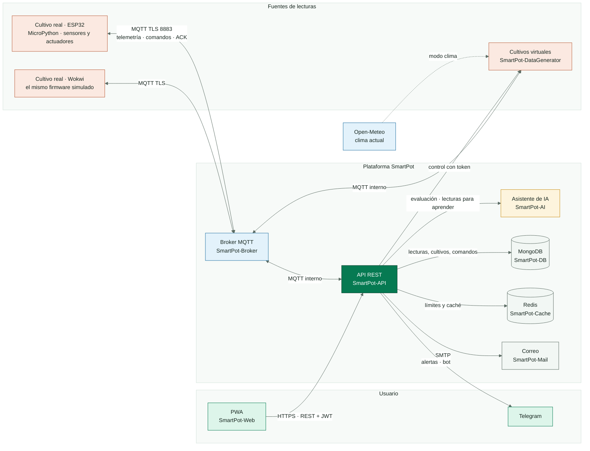

### 2.1 Componentes

| Componente | Repositorio | Tecnología | Responsabilidad |
| --- | --- | --- | --- |
| PWA | SmartPot-Web | React 19, TypeScript 6, Vite 8, Tailwind CSS 4 | Landing pública, creación de cultivos reales o virtuales, cultivo en vivo ilustrado, asistente, control y alertas; instalable |
| API | SmartPot-API | Java 21, Spring Boot 4.1, Spring Security, Paho MQTT | REST con JWT, puente MQTT, cuentas de los dispositivos, cultivos reales y virtuales, comandos, agente de automatización, canales de notificación (Telegram) y simulaciones |
| Asistente de IA | SmartPot-AI | Python 3.13, FastAPI, scikit-learn, uv | Diagnóstico, índice de salud, predicciones, acciones sugeridas y aprendizaje continuo con lecturas reales |
| Broker | SmartPot-Broker | Eclipse Mosquitto 2.1 con seguridad dinámica | MQTT con TLS 1.2+ y WebSocket; una cuenta por cultivo |
| Firmware | SmartPot-IoT | MicroPython 1.23 en ESP32, Wokwi | El dispositivo de un cultivo real: sensores, pantalla, telemetría y actuadores |
| Simulador | SmartPot-DataGenerator | Python 3.13, FastAPI, paho-mqtt, uv | Cultivos virtuales siempre encendidos: día y noche, manuales o con el clima real (Open-Meteo); demo y QA |
| Base de datos | SmartPot-DB | MongoDB 8 | Colecciones con validadores `$jsonSchema`, índices y datos demo opcionales |
| Caché | SmartPot-Cache | Redis 8 | Límite de peticiones, enfriamiento del agente y caché de perfiles |
| Correo | SmartPot-Mail | Mailpit | SMTP autenticado y bandeja web protegida |
| Plataforma | .github | Docker Compose, Kubernetes, GitHub Actions | Entornos, despliegue central, QA y documentación |

### 2.2 Decisiones de arquitectura

| Decisión | Motivo |
| --- | --- |
| MQTT entre el dispositivo y la plataforma | Conexión persistente y liviana para un ESP32, con QoS 1, mensajes retenidos y última voluntad para saber si el cultivo está en línea |
| Una cuenta MQTT por cultivo (usuario = id del cultivo) | Un dispositivo comprometido no puede leer ni escribir los tópicos de otro |
| La IA como servicio interno aparte | Python es el ecosistema natural de los modelos; la API sigue funcionando si la IA no responde |
| MongoDB | Las lecturas son documentos con variables opcionales; el índice por cultivo y fecha resuelve las consultas del historial |
| Imágenes endurecidas por servicio en GHCR | Cada servicio se publica y despliega por separado con SBOM y atestación de procedencia; Docker Hub queda como réplica de distribución |
| Telegram en la API, no en el dispositivo | El bot vive en un solo lugar, con los datos y los permisos de cada cuenta; el dispositivo solo habla MQTT |
| El simulador como servicio interno | Los cultivos virtuales corren siempre, sin pestaña abierta, con la clave que la API entrega por la red interna; la PWA nunca habla con el simulador |
| Real o virtual se elige al crear y no cambia | Un cultivo real recibe sus lecturas de su dispositivo y uno virtual, del simulador; mezclarlos confundiría el historial, el aprendizaje y la clave. Para cambiar, se crea otro cultivo |
| El aprendizaje solo usa cultivos reales | Las lecturas de los virtuales son sintéticas: sirven para aprender a usar SmartPot, no para entrenar los modelos |
| Aprendizaje en la IA con datos seudonimizados | La IA aprende de la serie de cada cultivo real sin saber a qué cuenta pertenece |

## 3. Flujo de una lectura

### En palabras simples

Cuando el dispositivo mide, la lectura llega al broker, la API la guarda y le pregunta al asistente cómo va el cultivo. Si hay algo que corregir y el modo automático está activo, la API manda el comando al dispositivo, que lo ejecuta y lo confirma.

### 3.1 Reglas del flujo

| Regla | Valor |
| --- | --- |
| Frecuencia del dispositivo | Cada 30 s (firmware) o 15–120 s (simulación) |
| Lecturas guardadas por cultivo | Máximo una cada 5 s; las demás se descartan |
| Validación | Cada variable debe estar dentro del rango físico del sensor; si no, la lectura completa se descarta |
| Evaluación del asistente | Asíncrona; como máximo una vez cada 5 minutos por cultivo (1 minuto en la demo) |
| Historial enviado a la IA | Las últimas 48 lecturas |
| Enfriamiento del agente | 10 minutos por actuador entre acciones automáticas |
| Vencimiento de un comando | 2 minutos sin confirmación → `EXPIRED` y alerta al dueño |
| Cultivo desconectado | El broker publica `offline` (última voluntad); la API marca el dispositivo y avisa |

<!-- diagrama: SmartPot_02_Reading_Sequence | titulo=Secuencia de una lectura con automatización | lamina=H -->
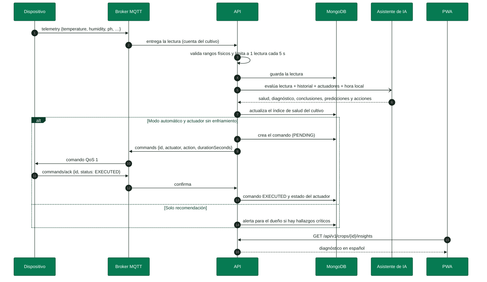

<!-- parte: PARTE II | Componentes -->

## 4. Contrato MQTT

### En palabras simples

Cada cultivo tiene una "dirección" propia en el broker, `smartpot/v1/{cropId}`, y su dispositivo solo puede usar la suya. Por ahí publica lo que mide y recibe las órdenes.

### 4.1 Tópicos

| Tópico | Sentido | QoS | Carga |
| --- | --- | --- | --- |
| `smartpot/v1/{cropId}/telemetry` | Dispositivo → API | 0 | `{"temperature":24.5,"humidity":61,"brightness":710,"ph":6.1,"tds":820,"atmosphere":1012.8,"soilMoisture":55}` |
| `smartpot/v1/{cropId}/commands` | API → dispositivo | 1 | `{"id":"…","actuator":"WATER_PUMP","action":"ACTIVATE","durationSeconds":30}` |
| `smartpot/v1/{cropId}/commands/ack` | Dispositivo → API | 1 | `{"id":"…","status":"EXECUTED","message":"Bomba encendida"}` |
| `smartpot/v1/{cropId}/status` | Dispositivo, retenido y última voluntad | 1 | `online` / `offline` |

### 4.2 Conexión del dispositivo

| Parámetro | Valor |
| --- | --- |
| Servidor | `mqtt.smartpot.app:8883`, MQTT sobre TLS 1.3 (mínimo 1.2) |
| Certificado | Firmado por la CA propia de SmartPot; el dispositivo lo verifica con `ca.crt`, que se distribuye con el firmware |
| Usuario | El id del cultivo |
| Contraseña | La clave del dispositivo: 24 bytes aleatorios en Base64 URL, mostrada una sola vez al crear un cultivo real o al rotarla; la de un cultivo virtual solo la conocen la API y el simulador |
| Client id | `smartpot-<cropId>`; el broker rechaza ids vacíos |
| WebSocket | `wss://mqtt.smartpot.app/mqtt` para clientes web |

> [!IMPORTANT]
> **Rotación de la clave.** Rotar la clave desde la PWA cambia la contraseña en el broker y desconecta la sesión anterior en el acto. El firmware debe actualizarse con la clave nueva.

### 4.3 Permisos en el broker

La API administra el broker con el plugin de **seguridad dinámica** de Mosquitto. Al conectarse crea el rol `device` y vuelve a crear la cuenta de cada cultivo a partir de la base de datos, así que el broker no necesita respaldo propio.

| Rol | Permisos |
| --- | --- |
| `device` | Publicar en `smartpot/v1/%u/telemetry`, `…/commands/ack` y `…/status`; suscribirse a `smartpot/v1/%u/commands` (`%u` = su propio usuario) |
| `admin` (API) | Publicar y suscribirse en `smartpot/v1/#` y usar los comandos de control de la seguridad dinámica |
| Anónimo | Rechazado |

## 5. API REST

### En palabras simples

La API es la única puerta de la aplicación. Todo lo que el usuario ve o hace pasa por aquí, siempre con su sesión y solo sobre sus propios cultivos.

### 5.1 Rutas

Base: `https://api.smartpot.app`. Las rutas de negocio viven bajo `/api/v1` y usan `Authorization: Bearer <token>`. La documentación interactiva está en `/docs`.

| Método | Ruta | Acceso |
| --- | --- | --- |
| GET | `/health` | Público |
| POST | `/api/v1/auth/register`, `/login` | Público |
| POST | `/api/v1/auth/password/forgot`, `/password/reset` | Público |
| GET | `/api/v1/crop-profiles` | Público |
| GET, PUT, DELETE | `/api/v1/users/me` y PUT `/users/me/password` | Sesión |
| GET, POST | `/api/v1/crops` (al crear: `kind` `REAL` o `VIRTUAL`, `form` y, si es virtual, `virtual` con el modo inicial) | Sesión |
| PUT | `/api/v1/crops/automation` (modo automático en varios cultivos) | Sesión, solo cultivos propios |
| GET, PUT, DELETE | `/api/v1/crops/{id}` y PUT `/crops/{id}/automation` | Dueño |
| GET, POST | `/api/v1/crops/{id}/device` y `/device/key` (solo cultivos reales) | Dueño |
| GET, POST | `/api/v1/crops/{id}/readings`, `/latest`, `/summary`, `/export` | Dueño |
| GET, POST, DELETE | `/api/v1/crops/{id}/actuators` | Dueño |
| GET, POST | `/api/v1/crops/{id}/commands` | Dueño |
| GET | `/api/v1/crops/{id}/insights` | Dueño |
| GET | `/api/v1/overview`, `/overview/series`, `/overview/fleet` (panel general) | Sesión |
| GET, POST | `/api/v1/commands` y `/commands/bulk` (historial de todos los cultivos y órdenes en bloque) | Sesión, solo cultivos propios |
| GET, PUT, DELETE | `/api/v1/notifications`, `/unread-count`, `/{id}/read`, `/read-all` | Sesión |
| GET, POST | `/api/v1/channels` y `/channels/telegram/link` (código de vinculación de un solo uso) | Sesión |
| PUT, POST, DELETE | `/api/v1/channels/links/{id}`, `/links/{id}/test` | Dueño del vínculo |
| POST | `/api/v1/channels/telegram/webhook` | Telegram, con secreto |
| GET, PUT, DELETE | `/api/v1/crops/{id}/virtual-device` (solo cultivos virtuales; PUT cambia o reanuda, DELETE pausa) | Dueño |
| GET | `/api/v1/virtual-devices/places?q=` | Sesión |
| GET | `/api/v1/ai/learning` (datos agregados por especie) | Sesión |

### 5.2 Reglas de la API

| Regla | Valor |
| --- | --- |
| Sesión | JWT HS256 con vencimiento de 7 días; la PWA lo guarda en `sessionStorage` o, con "Mantener sesión iniciada", en `localStorage` |
| Contraseñas | 8 caracteres a 72 bytes, con mayúscula, minúscula y número; BCrypt de costo 12 |
| Dueño | Un cultivo de otra cuenta responde 404, igual que uno inexistente, para no revelar qué ids existen |
| Límite de peticiones | 300 por minuto por IP y 10 por minuto en `/api/v1/auth/*`; responde 429 con `Retry-After` |
| Cultivos por cuenta | Máximo 20, y hasta 5 virtuales |
| Tipo del cultivo | `REAL` o `VIRTUAL` al crearlo; cambiarlo después responde 400 («Un cultivo no puede pasar de real a virtual ni al revés: crea uno nuevo»). La forma sí se puede editar |
| Errores | JSON en español: `{"status","error","message","path","timestamp","fields"}`; `fields` detalla cada campo inválido |
| Recuperación de contraseña | Responde 202 aunque el correo no exista; el enlace vence en 30 minutos y el token se guarda como hash SHA-256 |

### 5.3 Ciclo de vida de un comando

<!-- diagrama: SmartPot_05_Command_States | titulo=Estados de un comando -->
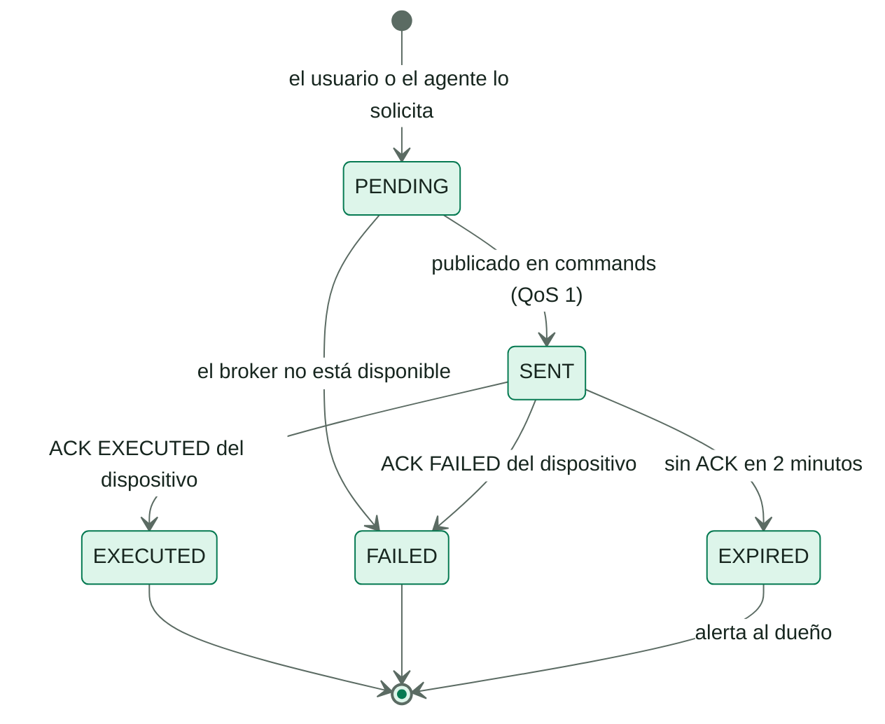

### 5.4 Notificaciones por Telegram

Cada notificación de la PWA se reenvía, en segundo plano, a los **canales externos** que la persona vinculó y solo con los tipos que eligió (alertas del cultivo, cultivo desconectado, acciones del asistente, comandos, novedades). Los canales implementan la interfaz `NotificationChannel`; sumar WhatsApp, correo o Slack es otra implementación sin tocar el resto. Hoy existe Telegram, centralizado en la API.

<!-- diagrama: SmartPot_14_Telegram_Sequence | titulo=Vinculación de Telegram -->
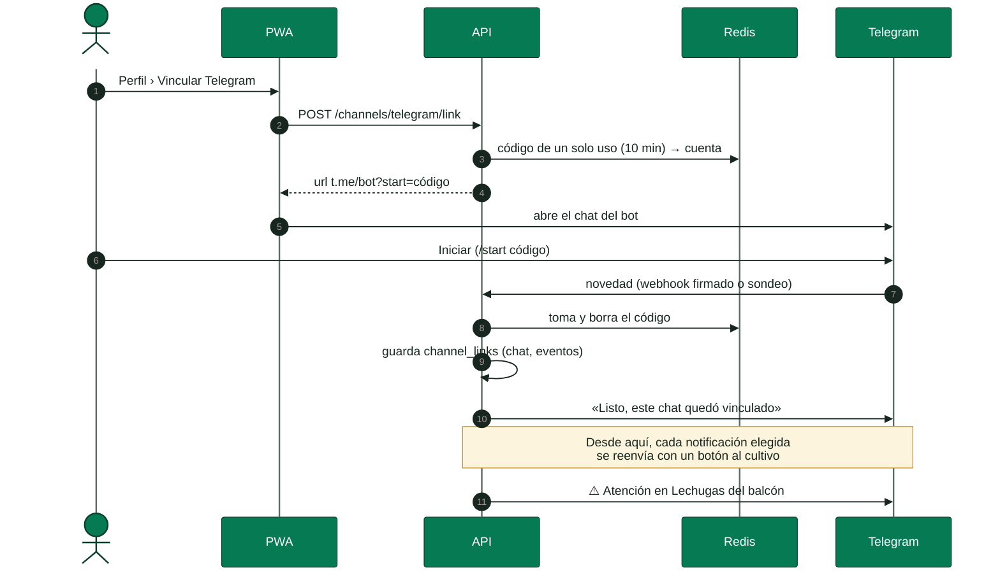

| Regla | Valor |
| --- | --- |
| Vinculación | Código aleatorio de 144 bits, de un solo uso, que vence en 10 minutos (Redis) |
| Recepción | `webhook` en producción, validado con `X-Telegram-Bot-Api-Secret-Token`; sondeo largo en local y en la demo |
| Comandos del bot | `/start <código>`, `/estado` (cultivos, conexión y salud), `/desvincular`, `/ayuda`; solo chats privados |
| Mensajes | HTML escapado con el título, el detalle y un botón al cultivo cuando la PWA está en `https` |
| Fallos | Si Telegram rechaza el chat (bloqueado o borrado) o falla 5 veces seguidas, el vínculo se pausa |

## 6. Asistente de IA

### En palabras simples

El asistente se comporta como un agrónomo que mira la última lectura y el historial reciente. Primero revisa variable por variable, después razona con reglas de experto, calcula un índice de salud de 0 a 100 y propone acciones concretas que el dispositivo puede ejecutar. Además, aprende con cada lectura que llega de los cultivos reales de la misma especie.

<!-- diagrama: SmartPot_03_AI_Assistant | titulo=Técnicas del asistente de IA -->
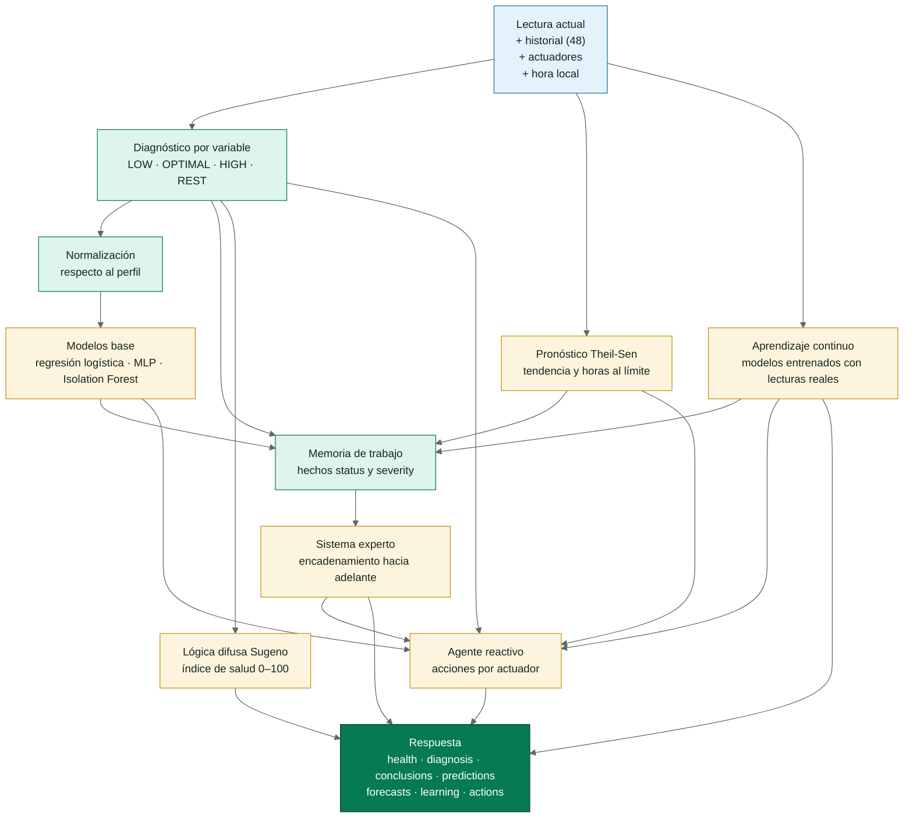

### 6.1 Diagnóstico por variable

Cada variable queda `LOW`, `OPTIMAL` o `HIGH` respecto al rango de la especie. La distancia al rango se mide en **tolerancias** (5 °C, 15 % de humedad, 300 lux, 0.8 de pH, 400 ppm y 15 % de sustrato); desde una tolerancia completa el hallazgo es **crítico**.

> [!TIP]
> **Descanso nocturno.** Entre las 22:00 y las 6:00 (hora de Colombia, configurable con `AI_TIMEZONE`) la luz baja no es un problema: la planta necesita su periodo de oscuridad. La variable queda como `REST`, no resta salud, la regla de crecimiento ahilado no se dispara y el agente apaga la luz de cultivo si quedó encendida.

### 6.2 Modelos base

Las variables se normalizan respecto al perfil (0 = mínimo ideal, 1 = máximo ideal), así un mismo modelo sirve para las seis especies. Se entrenan al arrancar con 4000 muestras sintéticas y semilla fija, y responden desde el primer minuto, antes de que exista ningún dato real (sección 6.8).

| Modelo | Técnica | Predice | Exactitud |
| --- | --- | --- | --- |
| Ventilación | Regresión logística | Probabilidad de que haga falta ventilar por calor y humedad | 89.5 % |
| Corrección de pH | Red neuronal MLP | Probabilidad de que haya que corregir el pH | 94.3 % |
| Lectura atípica | Isolation Forest + detección de saltos | Probabilidad de que la lectura sea anómala frente al historial | 100 % de detección en las pruebas |

### 6.3 Sistema experto

Un motor de encadenamiento hacia adelante dispara las reglas por prioridad, cada una una sola vez. Las conclusiones de primer nivel alimentan a las de segundo nivel.

| Regla | Se dispara cuando | Conclusión |
| --- | --- | --- |
| `heat_stress` | Temperatura alta y aire seco | Estrés térmico |
| `fungal_risk` | Humedad alta con temperatura templada o alta | Riesgo de hongos |
| `nutrient_lockout` | pH fuera de rango con nutrientes presentes | Bloqueo de nutrientes: corregir el pH primero |
| `root_rot_risk` | Sustrato encharcado y caliente | Riesgo de pudrición de raíz |
| `drought` | Sustrato críticamente seco | Sequía |
| `etiolation` | Poca luz de día con temperatura cálida | Crecimiento ahilado |
| `cold_stress` | Temperatura críticamente baja | Estrés por frío |
| `salt_stress` | Nutrientes críticamente altos | Exceso de sales |
| `ventilation_model` | El modelo estima ≥ 70 % de necesidad de ventilar | Recomendación de ventilar |
| `sensor_fault` | Lectura atípica y dos o más variables críticas | Posible falla de sensor: bloquea las acciones |
| `critical_state` | Dos o más variables críticas sin falla de sensor | Estado crítico |
| `compound_stress` | Estrés junto con riesgo o bloqueo | Estrés combinado |
| `drying_trend` | El pronóstico lleva el sustrato al mínimo en 3 h o menos | Secado acelerado: regar pronto |
| `heat_building` | El pronóstico lleva la temperatura al máximo en 3 h o menos | Calor en aumento |
| `learned_drying` | El modelo aprendido da ≥ 70 % de que el sustrato baje del mínimo en 1 h | Riego probable en la próxima hora |
| `learned_heat` | El modelo aprendido da ≥ 70 % de que la temperatura pase del máximo en 1 h | Calor probable en la próxima hora |
| `unusual_pattern` | El Isolation Forest de la especie marca la lectura como poco habitual | Combinación poco habitual: revisar sensores |
| `night_rest` | Luz baja durante el descanso nocturno | Descanso nocturno |
| `ideal_conditions` | Todas las variables en rango o en descanso | Condiciones ideales |

### 6.4 Índice de salud con lógica difusa

Cada desviación pertenece en distinto grado a los conjuntos **ideal**, **aceptable**, **desviada** y **crítica** (funciones trapezoidales). La inferencia Sugeno de orden cero da la salud de cada variable (100, 75, 45 y 10 puntos por conjunto) y el índice global las pondera por importancia agronómica: pH 1.3, temperatura 1.2, sustrato 1.2, nutrientes 1.1, humedad 0.9 y luz 0.8. Una regla de peor caso limita el índice cuando una variable es crítica.

| Índice | Nivel | Etiqueta |
| --- | --- | --- |
| 85–100 | `EXCELLENT` | Excelente |
| 70–84 | `GOOD` | Saludable |
| 50–69 | `FAIR` | Aceptable |
| 30–49 | `POOR` | En riesgo |
| 0–29 | `CRITICAL` | Crítico |

### 6.5 Agente reactivo

El agente no guarda estado: convierte el diagnóstico en acciones solo para los actuadores que el cultivo tiene. La API aplica el enfriamiento y ejecuta únicamente si el modo automático está activo; si no, las acciones quedan como sugerencias en la PWA.

| Situación | Acción |
| --- | --- |
| Sustrato seco | `WATER_PUMP` 15 s (30 s si es crítico) |
| Sustrato en rango, pero llegará al mínimo en menos de 1 h | `WATER_PUMP` 10 s (riego preventivo) |
| Poca luz de día | `UV_LIGHT` 15 minutos |
| Exceso de luz, o luz encendida de noche | Apagar `UV_LIGHT` |
| Calor, humedad alta o predicción de ventilación | `FAN` 10 minutos |
| Temperatura en rango, pero pasará el máximo en menos de 1 h | `FAN` 10 minutos (ventilación preventiva) |
| El modelo aprendido da ≥ 85 % de riego o calor en la próxima hora | `WATER_PUMP` 10 s o `FAN` 10 minutos (preventivo; el riego no se hace de noche) |
| Temperatura baja | Apagar `FAN` |
| Aire seco | `HUMIDIFIER` 5 minutos |
| pH alto | `PH_DOSER` 3 s |
| Nutrientes bajos sin bloqueo de pH | `NUTRIENT_DOSER` 3 s |
| Posible falla de sensor | Ninguna acción |

### 6.6 Pronóstico de tendencias

La API envía el historial con la hora de cada lectura. Con al menos 6 lecturas que abarquen 20 minutos, el asistente ajusta una recta por variable con el estimador de **Theil-Sen** (la mediana de las pendientes entre todos los pares de lecturas), que tolera lecturas atípicas mejor que los mínimos cuadrados. Con la pendiente por hora calcula el valor esperado en 3 horas y, si la tendencia empuja la variable fuera de su rango ideal, en cuántas horas cruzará el límite. La luz no se pronostica porque sigue el ciclo del día.

| Salida | Uso |
| --- | --- |
| `trend` | `RISING`, `FALLING` o `STABLE` (se mueve menos del 10 % del rango en 3 h) |
| `expectedIn3h` | Valor esperado dentro de 3 horas |
| `hoursToLimit` · `limit` | Horas hasta salir del rango y por qué lado (`MIN` o `MAX`), si ocurre en menos de 24 h |
| `confidence` | Fracción de pendientes que coinciden en el signo |

Los pronósticos alimentan las reglas `drying_trend` y `heat_building` y las acciones preventivas del agente. En la PWA aparecen en «Pronóstico de las próximas horas», junto con «De qué depende el índice», la salud de cada variable que explica el índice difuso.

### 6.7 Análisis de todos los cultivos

El panel general pide al asistente una mirada de conjunto (`POST /v1/fleet`):

| Técnica | Resultado |
| --- | --- |
| Índice difuso por cultivo | Ranking del que más atención necesita al que menos y salud promedio |
| Problemas compartidos | La misma variable fuera de rango en la mitad o más de los cultivos: probablemente es el entorno (la habitación, el agua, la solución) y no un cultivo |
| K-Means sobre variables normalizadas | Grupos de cultivos con condiciones parecidas; la cantidad de grupos se elige por el coeficiente de silueta y los grupos con la misma descripción se fusionan |
| Agente reactivo por cultivo | Acciones reunidas por actuador para aplicarlas en bloque con `/api/v1/commands/bulk` |

### 6.8 Aprendizaje continuo

Los modelos base nacen de datos sintéticos; el aprendizaje continuo los complementa con lo que de verdad pasa en los cultivos reales. Cada lectura de un cultivo real que llega por MQTT se encola en la API (las de los virtuales no) y viaja a la IA en lotes cada minuto (`POST /v1/learning/readings`). La IA la guarda en SQLite, en el volumen `ai_data`, con el id del cultivo **seudonimizado** con SHA-256; al borrar un cultivo, sus lecturas se olvidan.

<!-- diagrama: SmartPot_16_Learning | titulo=Aprendizaje continuo con lecturas reales -->
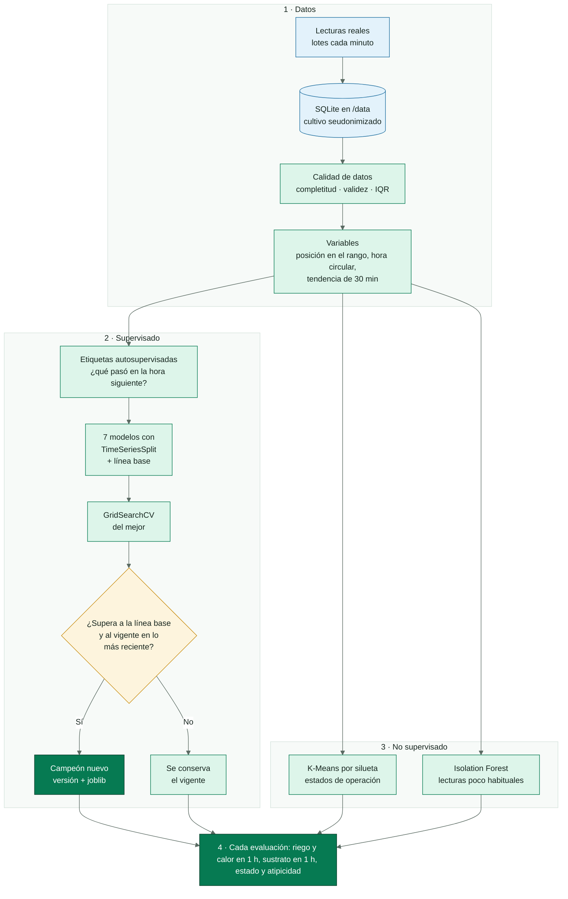

| Paso | Técnica |
| --- | --- |
| Calidad de datos | Completitud, validez física y atípicos por rango intercuartílico (k = 3), que se excluyen; puntaje DQS |
| Variables | Posición de cada variable en su rango ideal, hora del día circular (seno y coseno) y tendencia de la última media hora del sustrato y la temperatura |
| Etiquetas autosupervisadas | Lo que pasó en la hora siguiente a cada lectura: ¿el sustrato bajó del mínimo?, ¿la temperatura pasó del máximo?, ¿cuánto cambió la humedad del sustrato? |
| Comparación supervisada | Línea base, regresión logística, K vecinos, árbol de decisión, bosque aleatorio, gradient boosting y red neuronal; validación cruzada temporal (`TimeSeriesSplit`, 4 cortes) con F1 macro o error medio absoluto |
| Ajuste | `GridSearchCV` sobre el mejor candidato |
| Campeón y retador | Se evalúa en el 20 % de lecturas más recientes: reemplaza al modelo vigente solo si lo mejora y si supera a la línea base (la clase mayoritaria o «el sustrato no cambia») |
| No supervisado | Estados de operación con K-Means (k de 2 a 6 por silueta, con nombres legibles) e Isolation Forest entrenado con lecturas reales |

Cada especie entrena por separado desde 200 lecturas etiquetadas y se reentrena cada 300 lecturas nuevas, en un proceso aparte para no frenar las evaluaciones. Una tarea queda pendiente, con su razón, mientras falten datos o casos: si ningún cultivo ha tenido calor, todavía no se puede aprender a anticiparlo. Los modelos se guardan con joblib y se cargan al arrancar; si cambia la versión de scikit-learn, se reentrenan.

Cada evaluación trae la sección `learning`: estado de operación, si la lectura es habitual para la especie, probabilidad de riego o calor en la próxima hora y humedad esperada del sustrato, cada una con su modelo y su puntaje en las lecturas más recientes. La página **Aprendizaje** de la PWA muestra la calidad de los datos, la comparación de modelos, los estados y el detector de atípicos por especie (`GET /api/v1/ai/learning`, solo datos agregados).

## 7. Modelo de datos

<!-- diagrama: SmartPot_04_Data_Model | titulo=Colecciones de MongoDB | lamina=H -->
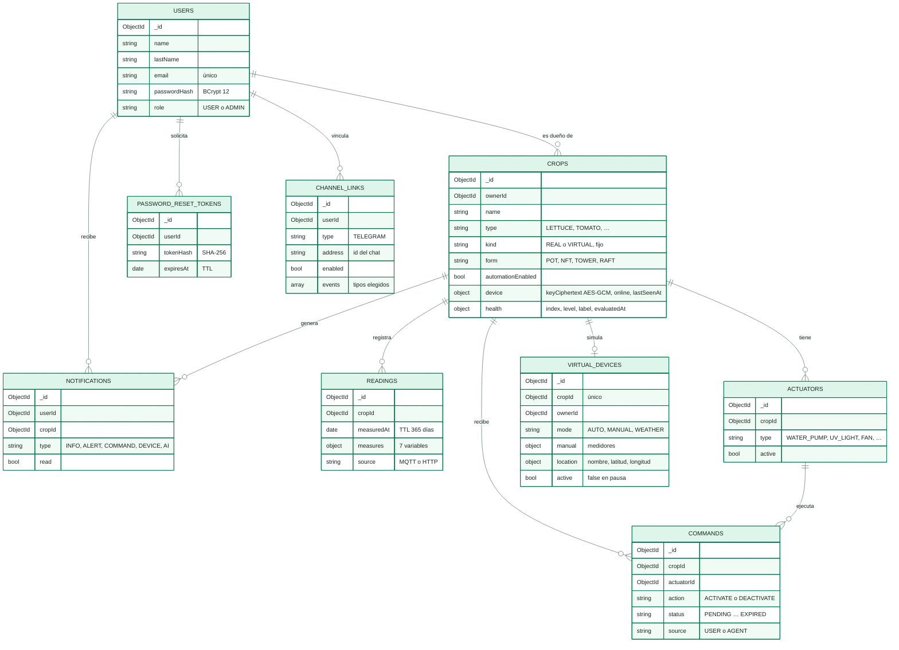

| Colección | Índices y vencimiento | Validación |
| --- | --- | --- |
| `users` | Correo único | Correo, hash, rol (`USER` o `ADMIN`) y fecha obligatorios |
| `crops` | Dueño + fecha de creación | Dueño, nombre, especie del catálogo y modo automático obligatorios; `kind` `REAL` o `VIRTUAL` y `form` `POT`, `NFT`, `TOWER` o `RAFT` |
| `readings` | Cultivo + fecha descendente; TTL de 365 días | Cultivo, fecha y medidas obligatorios; origen `MQTT` o `HTTP` (los rangos físicos los valida la API) |
| `actuators` | Cultivo + tipo, único | Tipo dentro del catálogo |
| `commands` | Cultivo + fecha; estado + envío para vencer los pendientes; TTL de 180 días | Acción, estado y origen (`USER` o `AGENT`) del catálogo |
| `notifications` | Usuario + fecha; TTL de 90 días | Tipo `INFO`, `ALERT`, `COMMAND`, `DEVICE` o `AI` |
| `channel_links` | Usuario + canal, único; canal + dirección, única | Canal `TELEGRAM`, chat, eventos elegidos y estado |
| `virtual_devices` | Cultivo, único | Solo de cultivos virtuales: modo `AUTO`, `MANUAL` o `WEATHER`, medidores, ubicación y `active` (`false` en pausa) |
| `password_reset_tokens` | Hash único; TTL por `expiresAt` | Hash, usuario y vencimiento obligatorios |

La API se conecta con un usuario propio (`smartpot`) con permisos `readWrite` solo sobre su base; el usuario administrador de MongoDB no se usa en la aplicación.

Los validadores viven en un solo archivo de SmartPot-DB (`schemas/collections.js`). Una base nueva los recibe al crearse; una existente, con la **migración** (`/opt/smartpot/migrate.js`), que el despliegue ejecuta después de actualizar los contenedores. Es idempotente: crea las colecciones que falten y pone o actualiza cada validador sin tocar los documentos. Si una colección tiene documentos antiguos que no cumplen el esquema, su validación queda en `moderate` para que se puedan seguir actualizando; si no, en `strict`.

Los cultivos creados antes de existir el tipo y la forma se completan solos al arrancar la API (`CropKindBackfill`, idempotente): los que tenían una simulación pasan a virtuales, el resto a reales, y los que no tienen forma quedan como maceta.

## 8. Aplicación web

### En palabras simples

La PWA es lo que ve el usuario: una página pública que explica SmartPot y, tras ingresar, un panel general con todos sus cultivos, el detalle de cada uno con su vista en vivo, un control general, un centro de acciones y lo que ha aprendido el asistente. Se instala como una app en Android, iOS y escritorio.

| Pantalla | Qué permite |
| --- | --- |
| Inicio público | Presentación, funciones, especies y preguntas frecuentes; indexable |
| Ingreso, registro y recuperación | Validaciones en español y "Mantener sesión iniciada" |
| Panel general | Salud promedio, cultivos en línea y comandos del día; ranking de salud, análisis de la IA de todos los cultivos, comparación de una variable entre cultivos y tabla de últimas lecturas frente al rango ideal |
| Mis cultivos | Tarjetas con tipo (real o virtual), especie y forma, estado en línea, salud y últimas lecturas |
| Nuevo cultivo | Tres pasos: real o virtual (se avisa que no cambia después); nombre, especie y forma con la vista previa de la ilustración y, si es virtual, cómo arranca la simulación; si es real, la clave y la guía de conexión |
| Control general | Modo automático por cultivo o para todos, atajos (regar, ventilar, luz) y órdenes personalizadas a varios cultivos con el resultado de cada uno |
| Acciones | Acciones sugeridas por la IA aplicables en bloque e historial de todas las órdenes, filtrado por estado y origen (persona o agente) |
| Detalle · Resumen | Lecturas actuales frente al rango ideal y gráfico de 24 h con la banda ideal |
| Aprendizaje | Lecturas reales por especie, calidad de los datos, comparación de modelos con su puntaje frente a la línea base, estados de operación y detector de atípicos |
| Detalle · Asistente IA | Índice de salud y de qué depende, diagnóstico, conclusiones, predicciones, pronóstico de las próximas horas, lo aprendido de cultivos reales y acciones ejecutables |
| Detalle · Control | Modo automático, actuadores y últimos comandos |
| Detalle · Historial | 6 h, 24 h o 7 días por variable y exportación CSV |
| Detalle · Cultivo en vivo | Para reales y virtuales: la forma del cultivo (maceta, tubos NFT, torre o balsa) con la especie y el color de su salud, el entorno (interior de día o de noche, o el clima del lugar) y cada actuador animado mientras está encendido, con su botón. Si el cultivo no está conectado no se ilustra. En los virtuales suma los controles de la simulación: modo, lugar, medidores, frecuencia, pausa y reanudación |
| Detalle · Dispositivo | Solo cultivos reales: estado, guía para el ESP32 físico (circuito, firmware y `config.py`) o para Wokwi, datos de conexión MQTT y rotación de la clave |
| Detalle · Ajustes | Nombre, especie y forma; el tipo real o virtual se muestra y no se puede cambiar |
| Alertas y perfil | Notificaciones, vinculación de Telegram con los avisos elegidos, datos personales, contraseña y borrado de la cuenta |

### 8.1 Identidad visual

| Token | Color | Uso |
| --- | --- | --- |
| `leaf-900` | `#0B3D2B` | Barra lateral, navegación, encabezados y color de tema de la PWA |
| `leaf-700` | `#067A52` | Acciones principales y cabeceras |
| `leaf-500` | `#00B074` | Verde de marca |
| `water-500` | `#2D9CDB` | Agua, información y la señal del logo |
| `sun-500` | `#F2B632` | Luz y advertencias |
| `clay-500` | `#D9734E` | La maceta de la ilustración y la temperatura |
| `danger-500` | `#D64545` | Errores |
| `ink` · `muted` · `line` · `surface` | `#17261F` · `#5B6B63` · `#D5E3DC` · `#F2F7F4` | Texto, bordes y superficies |

Tipografías: **Outfit** en títulos e **Inter** en el cuerpo, servidas desde la propia aplicación. Las comparativas entre cultivos usan 8 colores en orden fijo (`#009A64`, `#2D9CDB`, `#D9734E`, `#1F6FA0`, `#C98D12`, `#067A52`, `#7A5AC8`, `#B85A38`), validados para daltonismo y contraste entre vecinos; cada cultivo conserva su color mientras siga en la comparación.

### 8.2 SEO y PWA

- Metadatos, URL canónica, Open Graph, Twitter Card y datos estructurados `Organization`, `WebSite`, `SoftwareApplication` y `FAQPage`, con contenido estático para rastreadores sin JavaScript.
- `robots.txt` y `sitemap.xml`; `/app` no se indexa.
- Manifiesto con íconos normales y adaptables, accesos directos y botón "Instalar app".
- Service worker que guarda el app shell y los recursos con hash; la API y la configuración nunca se guardan en caché.

## 9. Cultivos reales y virtuales

Al crear un cultivo se elige una sola vez de dónde vienen sus lecturas:

| Tipo | Dispositivo | Credenciales | Qué ofrece la PWA |
| --- | --- | --- | --- |
| Real · ESP32 físico | Una placa con el firmware de SmartPot-IoT, sus sensores y actuadores | Clave mostrada una vez; rotación desde Dispositivo | Guía del circuito, `config.py` con la red WiFi y `ca.crt` |
| Real · simulado en Wokwi | El mismo firmware en un ESP32 del navegador | Las mismas del cultivo real | Enlace al proyecto de Wokwi y `config.py` con la red `Wokwi-GUEST` |
| Virtual | SmartPot-DataGenerator, siempre encendido | Ninguna que configurar: la API se la entrega al simulador | Modo día y noche, clima real o manual, pausa y reanudación |

Simulado en Wokwi y virtual son cosas distintas: Wokwi ejecuta el firmware real y cuenta como cultivo real; el virtual lo simula la plataforma. Los cultivos reales nacen con bomba, luz de cultivo y ventilador (los del firmware); los virtuales, con los seis actuadores. La **forma** (maceta, tubos NFT, torre vertical o balsa flotante) solo cambia la ilustración y se puede editar.

### 9.1 Dispositivo ESP32

| Componente | Pin | Escala |
| --- | --- | --- |
| DHT22 (temperatura y humedad) | GPIO 15 | °C y % |
| Luz | GPIO 34 | 0–2000 lux |
| pH | GPIO 35 | 0–14 |
| Nutrientes (TDS) | GPIO 32 | 0–3000 ppm |
| Humedad del sustrato | GPIO 33 | 0–100 % |
| Bomba de agua | GPIO 19 | `WATER_PUMP` |
| Luz de cultivo | GPIO 18 | `UV_LIGHT` |
| Ventilador | GPIO 5 | `FAN` |
| LCD 20×4 I2C | SCL 16 · SDA 17 | — |

El firmware sincroniza la hora por NTP, se conecta por TLS con `ca.crt`, publica cada 30 s y apaga cada actuador al cumplirse `durationSeconds`. La PWA genera el `config.py` de cada cultivo real, con la red WiFi y sus credenciales.

### 9.2 Wokwi

El mismo firmware corre en [Wokwi](https://wokwi.com) sobre un ESP32 simulado, con el `diagram.json` del repositorio. Es la forma de validar el firmware antes de pasar a hardware: se ejecuta **a mano**, en el navegador, mientras la pestaña está abierta, y el cultivo es **real** para la plataforma. La copia del proyecto debe quedar privada: quien vea `config.py` puede publicar como el cultivo.

### 9.3 Cultivos virtuales

SmartPot-DataGenerator es el simulador que corre siempre, desplegado con la plataforma. Cada cultivo virtual usa su propia cuenta en el broker, publica telemetría, obedece los comandos (la bomba sube la humedad del sustrato, el ventilador enfría y seca el aire, la luz de cultivo suma luz, los dosificadores corrigen el pH y los nutrientes) y responde su ACK como un dispositivo real. Sus lecturas pasan por la IA, las alertas y el modo automático, pero no por el aprendizaje continuo.

| Modo | Qué refleja |
| --- | --- |
| `WEATHER` | El clima actual del lugar elegido con [Open-Meteo](https://open-meteo.com), un servicio abierto y sin clave: temperatura, humedad, radiación solar convertida a la escala de luz del sensor, lluvia que moja el sustrato y presión. El sol y el aire seco secan más rápido |
| `MANUAL` | Los medidores que mueve la persona; los actuadores siguen actuando encima (por ejemplo, el agente riega y la humedad sube) |
| `AUTO` | Día y noche típicos de la especie en la hora local |

<!-- diagrama: SmartPot_15_Virtual_Crop_Sequence | titulo=Cultivo virtual con clima real -->
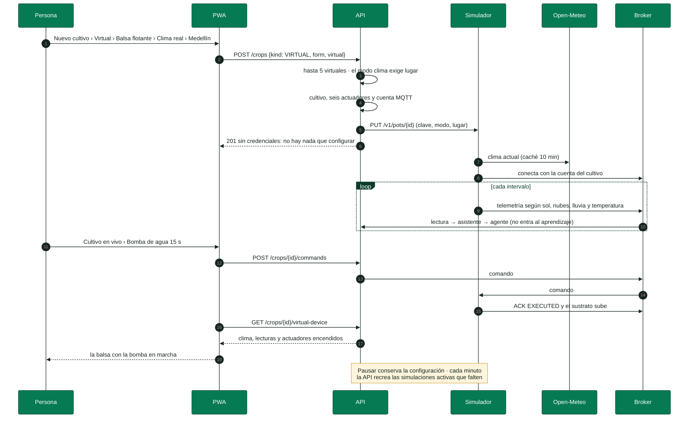

El simulador expone una API interna de control (`/v1/pots`, con token) que solo usa SmartPot-API. La configuración vive en `virtual_devices`: pausar la simulación la marca `active: false` y la retira del simulador sin perderla; reanudarla la vuelve a crear. Cada minuto la API recrea las simulaciones activas que falten y retira las pausadas o huérfanas; borrar el cultivo la elimina. Los cultivos fijos de `SIMULATOR_DEVICES` (datos demo y QA) son cultivos reales que el simulador hace publicar con su clave.

### 9.4 Cultivo en vivo

La pestaña **Cultivo en vivo** dibuja cada cultivo, real o virtual, como es:

| Pieza | Qué muestra |
| --- | --- |
| Forma | Maceta con depósito y riego por goteo; tubos NFT con colectores y retorno; torre con bolsillos escalonados; balsa flotante con raíces en la solución |
| Planta | La especie (lechuga, espinaca, albahaca, tomate, fresa o pimentón) con el color de su índice de salud |
| Entorno | Interior de día o de noche según la luz medida, o el clima del lugar en los virtuales con clima real |
| Actuadores | Solo los instalados: la bomba hace correr la solución (o burbujas en la balsa), la luz ilumina, el ventilador gira, el humidificador suelta bruma y los dosificadores gotean; cada uno con su estado y su botón |

Un actuador se ve encendido si quedó encendido sin límite o si su última orden por tiempo sigue corriendo; en los virtuales también cuenta lo que informa el simulador. Si el cultivo no está conectado (dispositivo sin señal o simulación en pausa) la escena no se dibuja y la PWA explica cómo conectarlo o reanudarlo.

<!-- parte: PARTE III | Operación -->

## 10. Seguridad

### En palabras simples

Cada pieza tiene solo los permisos que necesita. Las contraseñas y claves nunca viajan ni se guardan en claro, las bases de datos no se ven desde internet y cada dispositivo solo puede tocar lo suyo.

| Área | Control |
| --- | --- |
| Autenticación | JWT HS256, BCrypt 12, límite de peticiones por IP y respuestas que no revelan si un correo existe |
| Autorización | Control de dueño en cada ruta de cultivo; 404 para recursos ajenos |
| Dispositivos | Cuenta MQTT por cultivo, ACL con `%u`, clave de 192 bits cifrada con AES-256-GCM y mostrada una sola vez |
| Transporte | HTTPS con HSTS; MQTT sobre TLS 1.2+ con CA propia; WebSocket seguro |
| Web | CSP estricta con `connect-src` limitado a la API, `X-Frame-Options: DENY`, `nosniff`, `Referrer-Policy` y `Permissions-Policy` (geolocalización solo del propio sitio y solo cuando la persona la pide) |
| Servicio de IA | Solo en la red interna y con token de servicio comparado en tiempo constante; aprende con ids de cultivo seudonimizados y solo expone datos agregados |
| Simulador | API de control interna con token; recibe la clave de cada cultivo virtual solo por la red interna; sale a internet únicamente para el clima |
| Telegram | Códigos de vinculación de un solo uso y 10 minutos, webhook con secreto comparado en tiempo constante, solo chats privados y sin datos a chats no vinculados |
| Contenedores | Solo lectura, sin capacidades de Linux, `no-new-privileges`, usuarios sin privilegios, límites de CPU y memoria |
| Red | Solo el broker (8883) escucha fuera de `127.0.0.1`; MongoDB, Redis y la IA en una red sin salida; el simulador no publica puertos |
| Cadena de suministro | Dependabot, revisión de dependencias, CodeQL, SBOM y atestación de procedencia de cada imagen |
| Secretos | GitHub Secrets; el `.env` existe en el servidor solo durante el despliegue |

> [!NOTE]
> **Generación de secretos.** Las contraseñas, el secreto JWT, la llave AES, los tokens de la IA y del simulador y el secreto del webhook se derivan con HKDF-SHA512 a partir de ruido atmosférico de random.org mezclado con el generador criptográfico del sistema; ninguna de las dos fuentes por sí sola determina el resultado. Las llaves de los certificados usan la misma entropía.

## 11. Despliegue

### 11.1 Entornos

| Entorno | Carpeta | Imágenes | Uso |
| --- | --- | --- | --- |
| Demo | `docker/demo` | GHCR (principal) o Docker Hub (`compose.dockerhub.yaml`) | SmartPot completo con datos de ejemplo, dos cultivos reales que publica el simulador y cultivos virtuales |
| Desarrollo | `docker/dev` | Compiladas desde los repositorios locales | Programar con toda la plataforma |
| Producción | `docker/production` | GHCR con etiqueta configurable | Servidor con Nginx y HTTPS |
| Kubernetes | `kubernetes` | GHCR | Clústeres locales con Pod Security `restricted` |

### 11.2 Despliegue automático

<!-- diagrama: SmartPot_06_Deployment | titulo=Despliegue continuo -->
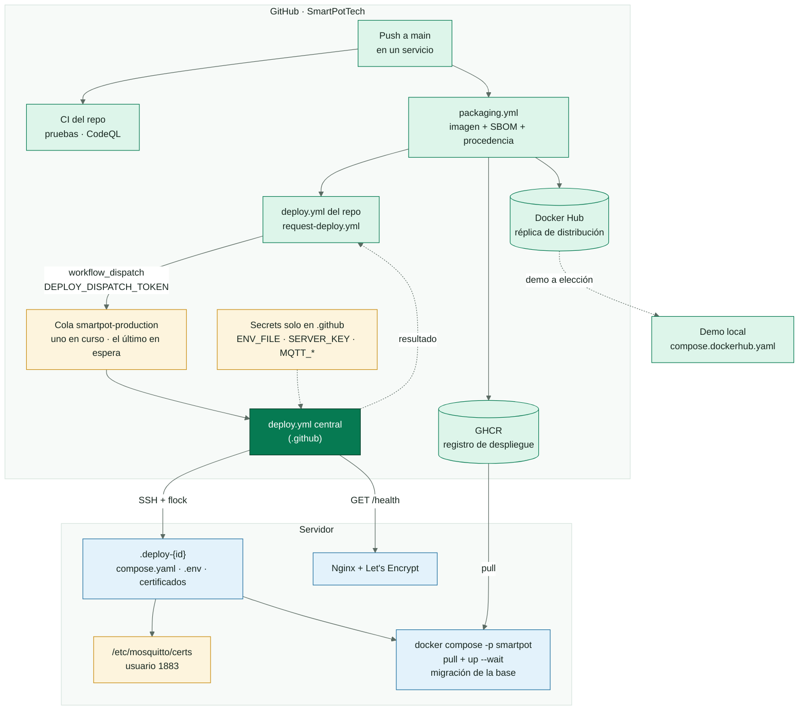

Cada servicio publica su imagen en `ghcr.io/smartpottech` (y en Docker Hub, como réplica, si tiene `DOCKER_USERNAME` y `DOCKER_PASSWORD`) y pide el despliegue al workflow central con `request-deploy.yml`, que espera el resultado. Solo `SmartPotTech/.github` se conecta al servidor, y su `deploy.yml` corre de a uno (`concurrency`): si llegan varios pedidos mientras despliega, queda en espera solo el más reciente, porque cada despliegue descarga todas las imágenes. El workflow valida el `ENV_FILE` (longitudes mínimas, llave AES de 32 bytes, variables por perfil), comprueba que el certificado del broker esté firmado por la CA y que la llave le corresponda, sube la configuración por SSH, instala los certificados con dueño `1883`, descarga las imágenes desde GHCR, actualiza los contenedores, aplica los esquemas de la base con la migración de SmartPot-DB y verifica `/health` desde internet. Los despliegues simultáneos esperan su turno con `flock`.

| Secret | Contenido |
| --- | --- |
| `SERVER_HOST`, `SERVER_PORT`, `SERVER_USER`, `SERVER_KNOWN_HOSTS` | Acceso SSH al servidor |
| `SERVER_KEY` | Llave privada SSH de despliegue |
| `DEPLOY_PATH` | Carpeta de producción en el servidor |
| `ENV_FILE` | `.env` completo de producción, incluidos `SIMULATOR_TOKEN` y, si hay bot, `TELEGRAM_BOT_TOKEN`, `TELEGRAM_BOT_USERNAME` y `TELEGRAM_WEBHOOK_SECRET` |
| `MQTT_CA_CERT`, `MQTT_SERVER_CERT`, `MQTT_SERVER_KEY` | Certificados del broker (opcionales) |
| `DEPLOY_DISPATCH_TOKEN` (en cada servicio) | Token con permiso **Actions: Read and write** solo sobre `.github`, para pedir el despliegue |
| `DOCKER_USERNAME`, `DOCKER_PASSWORD` (en cada servicio, opcionales) | Publicación en Docker Hub |

### 11.3 Red de producción

| Dominio | Destino |
| --- | --- |
| `smartpot.app` y `www.smartpot.app` | PWA (`www` redirige al dominio principal) |
| `api.smartpot.app` | API y `/docs` |
| `mqtt.smartpot.app:8883` | Broker con TLS directo |
| `mqtt.smartpot.app/mqtt` | WebSocket seguro a través de Nginx |
| `mail.smartpot.app` | Bandeja de Mailpit con usuario y contraseña |

<!-- diagrama: SmartPot_07_Networks | titulo=Redes y puertos en producción -->
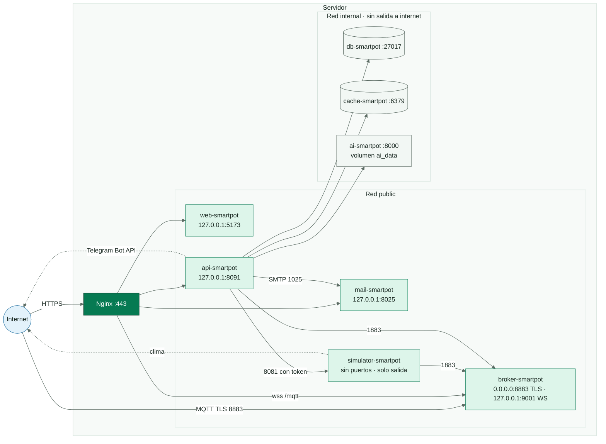

## 12. Calidad

<!-- diagrama: SmartPot_08_QA | titulo=Workflow de QA -->
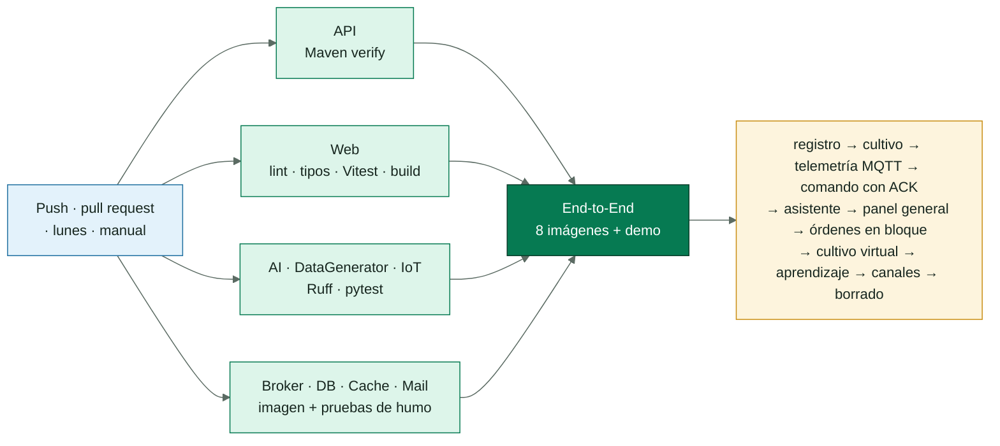

| Repositorio | Pruebas | Qué cubren |
| --- | --- | --- |
| SmartPot-API | 118 | Cifrado, JWT, contraseñas, MQTT, aprovisionamiento, comandos, cultivos, agente, caché, historial con hora para la IA, panel general, órdenes y automatización en bloque, envío de lecturas para el aprendizaje, canales y bot de Telegram, webhook firmado, tipo fijo y forma de los cultivos, simulación solo de virtuales con pausa, aprendizaje solo con reales y seguridad de los controladores |
| SmartPot-AI | 73 | Base de conocimiento, reglas, descanso nocturno, pronóstico Theil-Sen, acciones preventivas, análisis de flota, índice difuso, exactitud de los modelos, agente, contrato HTTP y aprendizaje continuo (seudonimización, calidad, etiquetas, modelos frente a la línea base, campeón y retador, persistencia) |
| SmartPot-Web | 52 | Cliente HTTP, sesión, validaciones, ingreso, componentes del cultivo, asistente con pronóstico y lo aprendido, comparación de modelos, canales de Telegram, cultivo en vivo (formas, actuadores, clima y conexión), creación real o virtual, guía de conexión, panel general y requisitos de SEO y PWA |
| SmartPot-DataGenerator | 23 | Modelo físico, modos manual y clima, lluvia y sol, caché del clima, contrato MQTT, comandos y API de control |
| SmartPot-IoT | 13 | Cliente MQTT, telemetría, comandos, actuadores y sensores con MicroPython simulado |
| SmartPot-Broker | 10 comprobaciones | Autenticación, ACL por cultivo, client ids, anónimos y TLS |
| SmartPot-DB, -Cache, -Mail | Pruebas de humo | Validadores, permisos, datos demo, comandos deshabilitados de Redis y autenticación SMTP |
| End-to-End | 35 comprobaciones | Registro, cultivo real con su forma, telemetría MQTT, clave incorrecta rechazada, comando con ACK, asistente, panel general, series, análisis de flota, orden y automatización en bloque, tipo que no cambia, cultivo virtual sin credenciales con seis actuadores publicando por MQTT, pausa de la simulación, aprendizaje continuo, canales y borrado |

## 13. Operación

| Tarea | Cómo |
| --- | --- |
| Estado | `GET https://api.smartpot.app/health` → base de datos, broker, caché, IA y simulador |
| Logs | `docker logs -f smartpot-api` (y `-broker`, `-ai`, `-web`) |
| Respaldo | `backup_smartpot.sh`: `mongodump` comprimido con 14 días de retención |
| Restauración | `mongorestore --drop --archive --gzip` sobre `smartpot-db` |
| Cambiar configuración | Editar el secret `ENV_FILE` y ejecutar **Deploy to Production** |
| Migrar la base | La ejecuta cada despliegue; a mano: `docker exec smartpot-db mongosh --quiet /opt/smartpot/migrate.js` (en la demo, `smartpot-demo-db`) |
| Renovar el certificado del broker | Antes de 825 días: `generate-certs.sh` con la CA existente y actualizar `MQTT_SERVER_CERT` y `MQTT_SERVER_KEY` |
| Rotar la clave de un cultivo real | Desde la PWA, pestaña Dispositivo; los virtuales no tienen clave que rotar |
| Aprendizaje | Página Aprendizaje de la PWA; `docker logs smartpot-ai` muestra cada entrenamiento. Lo aprendido vive en el volumen `ai_data` |
| Activar Telegram | Crear el bot con @BotFather, agregar `TELEGRAM_BOT_TOKEN`, `TELEGRAM_BOT_USERNAME` y `TELEGRAM_WEBHOOK_SECRET` a `ENV_FILE` y desplegar |
| Actualizar dependencias | Revisar y fusionar los pull requests semanales de Dependabot |

> [!WARNING]
> **Llave AES.** `SMARTPOT_AES_KEY` cifra las claves de los dispositivos. Si se pierde o se cambia, las cuentas MQTT no se pueden reconstruir y cada dueño debe rotar la clave de su cultivo real (y crear de nuevo los virtuales).

## 14. Glosario

| Término | Definición |
| --- | --- |
| ACK | Confirmación que envía el dispositivo al ejecutar o fallar un comando |
| Actuador | Salida del dispositivo que cambia el cultivo: bomba, luz, ventilador, humidificador o dosificadores |
| Aprendizaje autosupervisado | Etiquetas que salen de los propios datos: lo que pasó después de cada lectura |
| Campeón y retador | El modelo vigente solo se reemplaza si el nuevo lo supera en las lecturas más recientes |
| Broker | Servidor MQTT que recibe y reparte los mensajes entre los dispositivos y la API |
| Clave del dispositivo | Contraseña MQTT de un cultivo, generada por la API |
| Cultivo en vivo | Ilustración del cultivo con su forma, su planta y cada actuador encendido o apagado |
| Cultivo real | Cultivo cuyas lecturas envía un ESP32 con el firmware, físico o simulado en Wokwi |
| Cultivo virtual | Cultivo que simula SmartPot, siempre encendido, con su propia cuenta en el broker |
| Forma del cultivo | Maceta, tubos NFT, torre vertical o balsa flotante: cómo se ilustra |
| Encadenamiento hacia adelante | Técnica del sistema experto que parte de los hechos y dispara reglas hasta no poder concluir más |
| GHCR | GitHub Container Registry, donde se publican las imágenes y desde donde se despliega |
| Isolation Forest | Modelo que detecta datos atípicos aislándolos con árboles aleatorios |
| Línea base | Modelo trivial (la clase mayoritaria o «no cambia») que todo modelo debe superar para usarse |
| Lógica difusa | Razonamiento con grados de pertenencia en lugar de sí o no |
| Modo automático | Permiso del dueño para que el agente ejecute acciones sin preguntar |
| MQTT | Protocolo de mensajería liviano para dispositivos conectados |
| PWA | Aplicación web progresiva: se instala y funciona como una app nativa |
| QoS 1 | Nivel de MQTT que garantiza al menos una entrega |
| Seguridad dinámica | Plugin de Mosquitto para administrar usuarios, roles y permisos en caliente |
| Silueta | Medida de qué tan separados están los grupos de K-Means; elige cuántos grupos usar |
| Sondeo largo | Consulta que espera hasta que hay mensajes; alternativa al webhook sin dirección pública |
| TDS | Sólidos disueltos totales: concentración de nutrientes en ppm |
| Tolerancia | Unidad con la que se mide cuánto se aleja una variable de su rango ideal |
| Última voluntad (LWT) | Mensaje que el broker publica solo si el dispositivo se desconecta sin avisar |
| Validación cruzada temporal | Evaluación que siempre entrena con el pasado y prueba con el futuro |
| Webhook | Dirección a la que Telegram envía cada mensaje del bot, firmada con un secreto |
